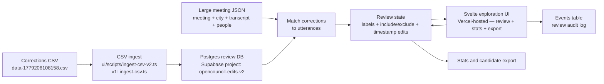

# Current State

Last updated: 2026-05-20

> An experimental branch `codex/file-backed-review-ui` removes the runtime
> DB dependency and switches the review unit to the utterance group. It does
> not replace the DB-backed flow on `main`; see
> [decisions/storage.md](docs/decisions/storage.md#2026-05-20---file-backed-prototype-on-codexfile-backed-review-ui-experimental-local-only).
>
> 2026-05-20 update on the same branch: multi-category labels, seed UX,
> direct-CDN audio with ±5 player pool, `/edit/[edit_id]` deep link, and
> clickable stats categories landed.
> See [decisions/ui.md](docs/decisions/ui.md#2026-05-20---multi-category-labels-seed-ux-direct-cdn-audio-branch-codexfile-backed-review-ui).

> **2026-06-16 update — finetuning prep now in scope alongside the review UI.**
> The provider benchmark (`bench.opencouncil.gr`) ran: Scribe v2 best (13.4% WER),
> zero-shot whisper-large-v3 (15.0%) is the finetune baseline to beat. Agreed
> split mechanics (temporal test set from 1 Jun, seeded automated train/val by
> meeting+speaker) and the path to a first end-to-end smoke finetune by mid-July.
> See [meeting 2026-06-16](docs/meetings/2026-06-16.md) and
> [decisions/data.md](docs/decisions/data.md). Review throughput continues (~1.4k
> reviewed; target ~6k by mid-July); the prefetch bug is the immediate fix.

> **2026-06-23 mentor sync — get concrete on training before midterm.**
> Priority #1: produce the **canonical split CSV** (meeting/speaker → train/val/test;
> TEST = June 2026+, VAL = orestiada + argos whole, TRAIN = the other 8 cities).
> **HIR metric likely dropped** — mentor pushback; WER (+CER) stays standard
> ([metric-hir](docs/decisions/metric-hir.md)). New open questions: training-unit
> granularity (utterances vs speaker segments), `humanReview` flag is unreliable
> (use edit-fraction distribution + threshold), reviewer curation bias. No-edit
> backbone ~50% confirmed. See [mentor-sync](docs/meetings/2026-06-23-mentor-sync.md)
> and [decisions/data.md](docs/decisions/data.md#open). Next calls: Thu 11:30 (team),
> Fri 13:00 (check-in).

This is the human and LLM entry point. Read this first, then follow links only as needed.

## Goal Right Now

Combine the corrections CSV with OpenCouncil transcript data to build an exploration UI that can:

- show `before_text` and `after_text` diff;
- play the relevant audio span;
- show meeting, city, speaker, and nearby utterances;
- classify the correction error type;
- mark whether the correction should be included or excluded from a future training/evaluation dataset;
- show aggregate stats over all corrections and over selected corrections.

## Current Flow



Update this diagram when the main project flow changes.

## Current Input Data

- v2 corrections export (with stable IDs): [data-1779206108158.csv](data-1779206108158.csv) — 393 970 rows
- Fields: v1 fields **plus** `utterance_id`, `meeting_id`, `city_id`
- v1 corrections export (kept for reference): [utterance-edits-may12-26.csv](utterance-edits-may12-26.csv)

Still missing from the CSV: `speakerSegmentId`, speaker/person metadata.

In the live DB (Supabase Postgres, project `opencouncil-edits-v2`): **287 605 corrections** — one row per `utterance_id`, latest edit only. The 106 365 superseded chain edits live only in the CSV, see [data/reports/latest-per-utterance.md](data/reports/latest-per-utterance.md).

## OpenCouncil Data Access

The meeting transcript endpoint returns one large JSON object containing:

- `meeting`
- `city`
- `transcript`
- `people`
- `parties`
- `subjects`
- `speakerTags`
- `taskStatus`
- `transcriptHiddenForReview`

The important structure for this project is:

```text
meeting/city metadata
  -> transcript[] speaker segments
    -> utterances[]
```

No new API endpoint needed — the large meeting JSON can be cached locally and CSV rows matched against it.

## Current Product Direction

Local exploration prototype, not production annotation software.

Implemented baseline under `ui/`:

- SvelteKit review app with diff, waveform/audio region controls, labels, notes, status buttons, keyboard navigation, stats, and JSONL export of included rows.
- Full CSV ingest scripts with content categorisation: `ui/scripts/ingest-csv-v2.ts` for the stable-ID export, `ui/scripts/ingest-csv.ts` for the v1 export.
- Dummy fixture seed script: `ui/scripts/seed-dummy.ts`.
- Supabase Postgres review state, with schema in `ui/drizzle/schema.ts`.
- Review audit history in the Postgres `events` table.

Still missing from the baseline:

- correction-to-utterance matching against cached meeting JSON;
- city, meeting ID, utterance ID, speaker/person, and surrounding utterance context;
- matched/ambiguous/unmatched confidence reporting.

Primary screen:

- meeting and city at top;
- current corrected utterance;
- red/green diff between `before_text` and `after_text`;
- audio playback controls for the utterance span;
- editable start/end timestamps;
- previous/next corrected utterance navigation;
- surrounding utterances for context;
- error-category select;
- include/exclude buttons for future training/evaluation dataset.

Secondary screen:

- distribution of all corrections by error category;
- distribution of included corrections by error category;
- counts by city, meeting, editor type, duration bucket, and include/exclude state.

## Next Concrete Step

Extend the implemented local prototype with meeting JSON matching:

- [x] Raw corrections can be ingested with content categories.
- [ ] Cached meeting JSON per meeting.
- [ ] Matched correction-to-utterance records.
- [x] Local labels: error category, include/exclude, timestamp adjustments, reviewer notes.
- [x] Aggregate stats generated from local labels.

Immediate todos:

- [ ] Get or define example meeting JSON URLs for rows in `data-1779206108158.csv`.
- [ ] Define matching confidence levels: exact, time-near, text-near, ambiguous, unmatched.
- [x] Decide review storage shape: Supabase Postgres for current state and audit events.
- [ ] Draft the first implementation plan for cached meeting JSON and correction matching.

See:

- [Roadmap](docs/roadmap.md)
- [Progress vs GSoC plan](docs/progress.md)
- [Decisions index](docs/decisions/_index.md)
- [OpenCouncil meeting JSON schema notes](docs/reference/opencouncil-meeting-json.md)
- [Exploration UI spec](docs/specs/exploration-ui.md)
- [Local data model](docs/specs/local-data-model.md)
