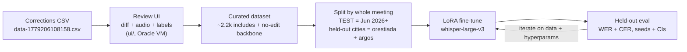

# Current State

Last updated: 2026-07-01

This is the human and LLM entry point. Read this first, then follow links only as needed.

## Where We Are Now

The project has moved from **dataset exploration** into **fine-tuning**. The review
UI is built and in use — it is now a *tool* that produces the curated dataset, not
the end goal. The current work is training whisper-large-v3 with LoRA on that
dataset and measuring it on held-out cities.

The first real GPU fine-tune (2026-06-24) beat the zero-shot baseline on both
corrected and ordinary speech, so the direction is validated. The immediate job is
to make that result trustworthy (fix decoding bugs, enlarge the val set, add seeds
and confidence intervals) and to confirm the sweep's hyperparameter pick on
large-v3.

## Goal Right Now

Produce a defensible fine-tuning result on held-out cities:

- fix the two decoding bugs from the first run (`clean_up_tokenization_spaces=False`,
  distinct pad token / attention_mask);
- enlarge the held-out val set so gains can be ranked with confidence;
- confirm the sweep's pick (`lr 1e-4, rank 32, 2 epochs`) on large-v3, not just the
  turbo proxy;
- report WER (+ CER) with seeds and meeting-clustered CIs.

Metric decision: **WER (+CER) is the standard**; HIR is likely dropped after mentor
pushback — see [decisions/metric-hir.md](docs/decisions/metric-hir.md).

## Current Flow

Update this diagram when the main project flow changes.

## Current Status (key numbers)

- **Review throughput:** ~5,016 reviewed / ~2,179 included. Target ~6k by mid-July.
- **Baseline (zero-shot whisper-large-v3):** provider benchmark WER 15.0%; on
  held-out cities val_corr WER 33.4, val_reg WER 27.1.
- **First GPU fine-tune (2026-06-24, LoRA):** val_corr WER 33.4→26.7 (−20%, CER −34%);
  val_reg WER 27.1→17.3 (−36%). Ordinary speech improved *more* than corrected
  speech — the correction-bias trap did not materialise. Smoke-grade only.
- **Sweep (turbo proxy):** every config beat baseline on both sets; LR/rank within
  eval noise; provisional pick `lr 1e-4, rank 32, 2 epochs`. Confirm on large-v3.

## Next Concrete Steps

- [ ] Re-run the large-v3 fine-tune with the decoding-bug fixes applied.
- [ ] Cache the clip build (the kernel rebuilt ~70 min on each restart).
- [ ] Enlarge the held-out val set (currently too small to rank configs).
- [ ] Add seeds + meeting-clustered CIs to the eval.
- [ ] Keep review throughput moving toward the ~6k dataset target.
- [~] Publish the reproducible HF dataset (`eval/hf_export/`, spec
  [hf-dataset-export](docs/specs/hf-dataset-export.md)). Pipeline built and run:
  `data/hf-dataset/public/` (train/val parquet+jsonl, card, split map). Pending
  before push: finish the boundary pass, eyeball `overlap-notes-report.md` +
  `boundary-audit.csv`, confirm license with OpenCouncil, then the **manual**
  `huggingface-cli upload` of `data/hf-dataset/public/` only.

See:

- [Roadmap](docs/roadmap.md)
- [Progress vs GSoC plan](docs/progress.md)
- [Decisions index](docs/decisions/_index.md) · [data decisions](docs/decisions/data.md)
- [Project map](docs/project-map.md)
- [Whisper hyperparameter sweep spec](docs/specs/whisper-hyperparam-sweep.md)
- [Error-division experiment](docs/specs/error-division.md)
- [Fine-tuning background](docs/reference/finetuning-101.md)

## Background — Review UI (built, in use)

The exploration/review UI was the earlier goal and is now a working tool feeding the
dataset. It runs under `ui/` (SvelteKit) and is self-hosted on the Oracle VM.
Features: red/green `before_text`/`after_text` diff, audio playback around the
utterance span, editable timestamps, error-category labels, include/exclude/uncertain
controls, reviewer notes, prev/next navigation, stats, and JSONL export of includes.

- v2 corrections export (stable IDs): `data-1779206108158.csv` — 393,970 rows, with
  `utterance_id`, `meeting_id`, `city_id`. v1 export kept for reference:
  `utterance-edits-may12-26.csv`.
- Live review state: Supabase Postgres (project `opencouncil-edits-v2`), one row per
  `utterance_id` (latest edit only); superseded chain edits live only in the CSV —
  see [decisions/data.md](docs/decisions/data.md#2026-05-19---keep-only-the-latest-edit-per-utterance).
- UI behaviour and data model: [specs/exploration-ui.md](docs/specs/exploration-ui.md),
  [specs/local-data-model.md](docs/specs/local-data-model.md),
  [ui/README.md](ui/README.md).

## Historical Timeline

Kept for context — these are the state-of-play notes as the project evolved. The
current state is the sections above; this block is history, not the current plan.

> **2026-05-20** — experimental branch `codex/file-backed-review-ui` removed the
> runtime DB dependency and switched the review unit to the utterance group; then
> landed multi-category labels, seed UX, direct-CDN audio with a ±5 player pool,
> `/edit/[edit_id]` deep link, and clickable stats categories. See
> [decisions/storage.md](docs/decisions/storage.md#2026-05-20---file-backed-prototype-on-codexfile-backed-review-ui-experimental-local-only)
> and [decisions/ui.md](docs/decisions/ui.md#2026-05-20---multi-category-labels-seed-ux-direct-cdn-audio-branch-codexfile-backed-review-ui).

> **2026-06-16** — fine-tuning prep entered scope alongside the review UI. Provider
> benchmark ran (Scribe v2 best 13.4% WER; zero-shot whisper-large-v3 15.0% is the
> baseline to beat). Agreed split mechanics (temporal test set from 1 Jun; seeded
> automated train/val by meeting+speaker). See [meeting 2026-06-16](docs/meetings/2026-06-16.md).

> **2026-06-23 mentor sync** — get concrete on training before midterm. Priority #1:
> the canonical split CSV (TEST = June 2026+, VAL = orestiada + argos whole, TRAIN =
> the other 8 cities). HIR likely dropped; WER (+CER) stays standard. New open
> questions: training-unit granularity, unreliable `humanReview` flag (use
> edit-fraction threshold), reviewer curation bias. See
> [mentor-sync](docs/meetings/2026-06-23-mentor-sync.md).

> **2026-06-24 — first real GPU fine-tune lands and works.** whisper-large-v3 + LoRA
> on 2,179 curated includes + no-edit backbone, held-out cities orestiada+argos.
> val_corr WER 33.4→26.7 (−20%, CER −34%); val_reg WER 27.1→17.3 (−36%). Smoke-grade;
> decoding bugs and small val to fix before re-test.
