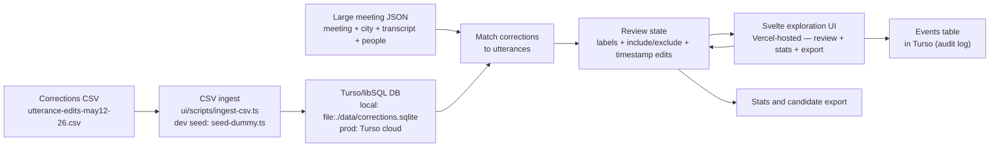

# Current State

Last updated: 2026-05-17

This is the human and LLM entry point. Read this first, then follow links only as needed.

## Goal Right Now

Organize the project around dataset exploration before training.

The immediate practical goal is to combine the corrections CSV with OpenCouncil transcript data so we can build an exploration UI:

- show `before_text` and `after_text` diff;
- play the relevant audio span;
- show meeting, city, speaker, and nearby utterances;
- classify the correction error type;
- mark whether the correction should be included or excluded from a future training/evaluation dataset;
- show aggregate stats over all corrections and over selected corrections.

## Current Flow



Update this diagram when the main project flow changes.

## Current Input Data

- Corrections export: [utterance-edits-may12-26.csv](utterance-edits-may12-26.csv)
- Rows: 379194
- Fields: `edit_id`, `edit_timestamp`, `edit_updated_at`, `before_text`, `after_text`, `edited_by`, `utterance_start`, `utterance_end`, `audio_url`, `youtube_url`, `meeting_name`, `meeting_date`

The CSV is useful but incomplete for the UI because it does not include stable `utterance_id`, `meeting_id`, `city_id`, `speakerSegmentId`, or speaker/person metadata.

## OpenCouncil Data Access

The meeting transcript endpoint returns one large JSON object containing:

- `meeting`
- `city`
- `transcript`
- `people`
- `parties`
- `subjects`
- `speakerTags`
- `taskStatus`
- `transcriptHiddenForReview`

The important structure for this project is:

```text
meeting/city metadata
  -> transcript[] speaker segments
    -> utterances[]
```

This means we probably do not need a new API endpoint for the first prototype. We can fetch/cache the large meeting JSON and match CSV corrections to utterances.

## Current Product Direction

Continue the local/prototype exploration UI, not production annotation software.

Implemented baseline under `ui/`:

- SvelteKit review app with diff, waveform/audio region controls, labels, notes, status buttons, keyboard navigation, stats, and JSONL export of included rows.
- Full CSV ingest script with content categorisation: `ui/scripts/ingest-csv.ts`.
- Dummy fixture seed script: `ui/scripts/seed-dummy.ts`.
- Local SQLite state: `ui/data/corrections.sqlite`.
- Label-change history path: `ui/data/events.jsonl` once review edits are made.

Still missing from the baseline:

- correction-to-utterance matching against cached meeting JSON;
- city, meeting ID, utterance ID, speaker/person, and surrounding utterance context;
- matched/ambiguous/unmatched confidence reporting.

Primary screen:

- meeting and city at top;
- current corrected utterance;
- red/green diff between `before_text` and `after_text`;
- audio playback controls for the utterance span;
- editable start/end timestamps;
- previous/next corrected utterance navigation;
- surrounding utterances for context;
- error-category select;
- include/exclude buttons for future training/evaluation dataset.

Secondary screen:

- distribution of all corrections by error category;
- distribution of included corrections by error category;
- counts by city, meeting, editor type, duration bucket, and include/exclude state.

## Clarified Decisions

- Do not block on finding the exact external query that produced the CSV.
- Do not block on a new context API endpoint.
- Use the large meeting JSON as the first source for utterance IDs, city/meeting IDs, speaker context, and nearby utterances.
- Range requests are not a decision point right now. The UI can start by using the audio URL and browser audio controls.
- Task version is not needed for the first exploration UI. It may matter later for rigorous baseline comparisons.

## Next Concrete Step

Extend the implemented local prototype with meeting JSON matching:

- [x] Raw corrections can be ingested into local SQLite with content categories.
- [ ] Cached meeting JSON per meeting.
- [ ] Matched correction-to-utterance records.
- [x] Local labels: error category, include/exclude, timestamp adjustments, reviewer notes.
- [x] Aggregate stats generated from local labels.

Current immediate todos:

- [ ] Get or define example meeting JSON URLs for rows in `utterance-edits-may12-26.csv`.
- [ ] Define matching confidence levels: exact, time-near, text-near, ambiguous, unmatched.
- [x] Decide local storage shape: SQLite tables plus JSONL event log.
- [ ] Draft the first implementation plan for cached meeting JSON and correction matching.

See:

- [Roadmap](docs/roadmap.md)
- [Progress vs GSoC plan](docs/progress.md)
- [Decisions index](docs/decisions/_index.md)
- [OpenCouncil meeting JSON schema notes](docs/reference/opencouncil-meeting-json.md)
- [Exploration UI spec](docs/specs/exploration-ui.md)
- [Local data model](docs/specs/local-data-model.md)
