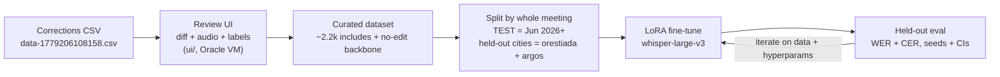

# Current State

Last updated: 2026-08-04

This is the human and LLM entry point. Read this first, then follow links only as needed.

## Where We Are Now

**The metric problem, found 2026-08-03/04.** The benchmark's "human reference" **is** the
published OpenCouncil transcript (WER 0.0008 between them, 223 of 227 windows identical).
So every WER in this project measures agreement with our own output, not accuracy. A
blinded listening audit then measured how wrong that output is: where Soniox and Scribe
independently emit a word the reference lacks, **70.5% of those words were really said**
(CI 62–79%, 120 clips, 90 meetings). That is **≥1.68% of reference words missing**, and the
penalty falls hardest on the systems that hear best — Scribe and Soniox are charged 1.68
WER points for being right, greek-whisper-v3-turbo only 0.53. Reports:
[the reference problem](docs/reports/2026-08-03-the-reference-problem.md),
[reference omissions](docs/reports/2026-08-04-reference-omissions.md).

**Overlap is settled and it is not the lever.** A preregistered paired experiment added a
real interjector to clean audio at natural prevalence: burden **0.16 WER points** against a
frozen gate of 2.0, so **DiCoW is not worth training for this corpus**
([report](docs/reports/2026-08-03-synthetic-overlap.md)). The observational screen had said
the top overlap quartile scores 10 points worse; adding overlap directly recovers 0.16.
Independently, speaker-turn density beats overlap as an error predictor and overlap adds
nothing on top of it. Acting on turn density naively does not pay either — cutting audio at
speaker changes is worth nothing measurable
([report](docs/reports/2026-08-03-segmentation.md)).

The project has moved from **dataset exploration** into **fine-tuning**. The review
UI is built and in use — it is now a *tool* that produces the curated dataset, not
the end goal. The current work is training whisper-large-v3 with LoRA on that
dataset and measuring it on held-out cities.

**Correction (2026-07-25):** the earlier "the fine-tune beats baseline" conclusion
did not survive a controlled test. Under a same-stack, same-normalization A/B, the
LoRA fine-tune does **not** beat base whisper, and slightly **regresses** on the
utterances it was trained to fix. The earlier gains were evaluation artifacts
(baselines served worse than our model). `int8` was ruled out as a cause. Full
postmortem and next directions:
[docs/handoff/2026-07-25-finetune-eval-postmortem.md](docs/handoff/2026-07-25-finetune-eval-postmortem.md).

**Root cause found (2026-07-31):** every GPU fine-tune trained on the wrong targets.
The collator stripped Whisper's leading `<|startoftranscript|>` only when it matched
`tokenizer.bos_token_id`, which is `<|endoftext|>` (50257), not `<|startoftranscript|>`
(50258) — so it never stripped. The model was trained to emit `<|startoftranscript|>`
and every content token sat one decoder position later than at inference, on every
sample of every run, including the sweep that picked the "confirmed" hyperparameters.
Fixed in `00d9235` with 13 tests.

**Measured 2026-08-01** (6 paired LoRA runs, `eval/ab_label_bug/`): the mechanism is
confirmed outright — the legacy model ranks `<|startoftranscript|>` **first** at
decoder position 0 in 50–95% of clips, against ~2000th for base — but the WER cost is
at the noise floor (+0.005, +0.001, −0.001 across seeds; sign not consistent). What is
consistent is likelihood: NLL worse in 3/3 seeds and far less stable. **Retrain
because the objective was wrong, not because the bug cost accuracy; skip the sweep
re-run.** Unexpectedly, the corrected adapter beats base whisper by ~5 WER points on
this held-out sample with 0/16 meetings worse — which does not overturn the postmortem
(different sample, same-stack eval, old-system references on val_reg) but does re-open
the question. Report:
[reports/2026-07-31-label-prefix-bug.md](docs/reports/2026-07-31-label-prefix-bug.md).

## Goal Right Now

The fine-tune is not the deliverable it looked like. Two things, in order:

- **Build a trustworthy controlled eval harness** (same stack, same normalization,
  held-out general + actually-corrected subsets, WER/CER/entity-recall, per-utterance
  head-to-head). Starter scripts: `eval/controlled_eval/`. Every future claim goes
  through this.
- **Try inference-time contextual biasing** (per-meeting roster + glossary via
  faster-whisper `initial_prompt`/`hotwords`) as an alternative to retraining. It
  targets names directly without the onset/spelling regressions the fine-tune added.

Metric decision: **WER (+CER) is the standard**; HIR is likely dropped after mentor
pushback — see [decisions/metric-hir.md](docs/decisions/metric-hir.md).

## Current Flow

```mermaid
flowchart LR
    CSV["Corrections CSV<br/>data-1779206108158.csv"]
    Review["Review UI<br/>diff + audio + labels<br/>(ui/, Oracle VM)"]
    Dataset["Curated dataset<br/>~2.2k includes + no-edit backbone"]
    Split["Split by whole meeting<br/>TEST = Jun 2026+<br/>held-out cities = orestiada + argos"]
    Finetune["LoRA fine-tune<br/>whisper-large-v3"]
    Eval["Held-out eval<br/>WER + CER, seeds + CIs"]

    CSV --> Review
    Review --> Dataset
    Dataset --> Split
    Split --> Finetune
    Finetune --> Eval
    Eval -->|iterate on data + hyperparams| Finetune
```

Update this diagram when the main project flow changes.

## Current Status (key numbers)

> **Superseded (2026-07-25):** the fine-tune "beat baseline" numbers below were
> measured against unfairly-served baselines. A controlled same-stack A/B shows no
> gain (regression on corrected utterances). Treat the deltas below as historical.
> See [handoff postmortem](docs/handoff/2026-07-25-finetune-eval-postmortem.md).

- **Review throughput:** ~5,016 reviewed / ~2,179 included. Target ~6k by mid-July.
- **Baseline (zero-shot whisper-large-v3):** provider benchmark WER 15.0%; on
  held-out cities val_corr WER 33.4, val_reg WER 27.1.
- **First GPU fine-tune (2026-06-24, LoRA):** val_corr WER 33.4→26.7 (−20%, CER −34%);
  val_reg WER 27.1→17.3 (−36%). Ordinary speech improved *more* than corrected
  speech — the correction-bias trap did not materialise. Smoke-grade only.
- **Sweep (turbo proxy):** every config beat baseline on both sets; LR/rank within
  eval noise; provisional pick `lr 1e-4, rank 32, 2 epochs`. Confirm on large-v3.

## Next Concrete Steps

Ordered by the postmortem's ranking. Retraining is **not** next — a trustworthy eval
and a no-retrain alternative come first.

- [x] **Fix the label-prefix bug** (`00d9235`, 13 tests). Every GPU entry point trained
  on targets shifted by one token; the CPU sweep was unaffected.
- [x] **Measure what the bug cost** (`eval/ab_label_bug/`, 6 paired runs, A40, ~$1.50).
  Mechanism confirmed; WER cost at the noise floor; likelihood cost consistent.
- [x] **Sweep re-run: decided against.** The bug's WER effect is smaller than the seed
  noise the sweep already could not resolve. Keep `r32 / lr 1e-4 / 2 epochs`, described
  as *selected under the legacy label schema, never revalidated*.
- [x] **Full corrected run** (2026-08-02, A40, ~12.8h, ~$5.6):
  [report](docs/reports/2026-08-02-fulltrain-corrected.md). Both baselines reproduce the
  old run to the decimal, so the comparison is clean. val_corr **37.37 / 29.01 / 17.27**
  vs the buggy run's 37.74 / 29.35 / 17.46; val_reg **10.39 / 4.82 / 3.36** vs
  10.46 / 4.87 / 3.43. Better on all six, by very little — exactly the magnitude the
  A/B predicted. One run vs one run, so not a significance claim. Adapter at
  `~/oc-asr-serve/adapter-fixed-2026-08-01`, **not published yet**.
- [ ] **Gate publication on the controlled harness.** Same sample, same stack, base vs
  the corrected adapter, corrected + general subsets. The training script's own eval
  cannot settle this: it scores in the stack the model trained in, and val_reg's
  references are the old system's output. Until then this is "the same model, trained
  correctly", not "a better model".
- [x] **Why the fine-tune loses to base — answered from the benchmark**
  ([report](docs/reports/2026-08-02-benchmark-diagnosis.md)). The per-city breakdown shows
  the adapter is worse in **4 of 4 cities where base whisper is already under 13% WER**
  (mean +1.7) and neutral-to-better on hard audio. Cause: **48.1% of training clips are
  corrections** (teaching a standing edit bias that costs on clean speech) and **51.9% are
  no-edit rows whose targets are the old pipeline's unverified output** (teaching
  imitation, including its errors). The old val_corr / val_reg pair measured exactly those
  two populations, which is why it reported gains. Same shape as the post-editor's
  over-editing tax. **More training on this data cannot fix it.**
- [x] **Combining ASR systems beats all of them, and the LLM is not what does it**
  ([report](docs/reports/2026-08-02-asr-fusion.md)). The benchmark's public `report.json`
  carries every provider's verbatim transcript per window next to the human reference, so
  this cost 500 sonnet calls and no GPU. The systems fail on **different** windows (oracle
  window selection 0.1016 vs Scribe's 0.1319), and a **reference-free consensus vote over
  three of them reaches 0.1211**, −0.0108 CI [−0.0142, −0.0074] over 147 meetings, with no
  model, no training and no prompt. Our own fine-tune, second-worst alone, is the most
  useful third voter, and the gain is *larger* on meetings outside its training data.
  The LLM arms answer the attribution question: given three hypotheses it scores 0.1174,
  **−0.0180 CI [−0.0228, −0.0132] against the same LLM with the same prompt given one**,
  negative in all ten cities. So the combination does the work. But the LLM given a single
  transcript is **worse than doing nothing** (0.1354 vs 0.1319, CI excludes zero), the same
  over-editing tax as the fine-tune and the post-editor, and it beats the free vote by only
  −0.0037 CI [−0.0080, +0.0008]. **The cheap half of the idea is most of the idea.**
- [x] **Overlap screen: rare, expensive, and the vote does not fix it**
  ([report](docs/reports/2026-08-03-overlap-screen.md)). pyannote community-1 over 232
  benchmark windows, CPU, 4h, no labels. Overlap is **2.2% of speech time on average**
  (median 0.3%, 43% of windows at zero), but it is a marker for **all seven** systems:
  in the top-overlap quartile error rates roughly double (Scribe +0.0994 CI [+0.061,
  +0.143]), and that quartile carries 19.9% of reference words but 26-34% of errors.
  If those windows behaved like zero-overlap ones Scribe would drop ~2.0 WER points,
  which bounds the category without predicting it. **The consensus vote's gain shrinks
  as overlap rises** (−0.0158 at zero to −0.0018 at high, interaction +0.0141 CI [+0.0041,
  +0.0249]): the systems fail together there, so fusion and overlap are separate problems.
  Reference-policy check is inconclusive (insertions rise faster than substitutions for
  3 of 7 systems; Soniox quintuples). **Descriptive only** - overlap is confounded with
  general difficulty and pyannote is unvalidated on Greek, so this neither justifies nor
  kills the DiCoW line.
- [ ] **Blinded listening audit, 50-100 overlap events.** Two Greek speakers, no ASR
  output visible, main and secondary speaker transcribed separately, then mark which
  audible words are in the benchmark reference. Answers whether WER can score an overlap
  fix at all, and validates pyannote's detection. Needs human time, no GPU.
- [ ] **Paired synthetic-overlap intervention.** Clean single-speaker audio, real
  interjector mixed in at set levels, both versions through the same systems, identical
  main-speaker reference. Causal for the manipulation, no new labels. The only cheap
  thing that estimates a burden rather than an association.
- [x] **pyannoteAI `exclusive` diarization: tested, rejected as a drop-in**
  ([report](docs/reports/2026-08-08-exclusive-diarization.md),
  [prereg](docs/specs/exclusive-diarization-preregistration.md)). Phase 1 passed all five
  frozen conditions (absorption 0.99, no fragmentation, regular timeline byte-identical
  with and without the flag in 95/95 items). Phase 2 failed the drop-safety gate on real
  windows: exclusive mode resolves overlap by **deleting** the shorter speaker's segment,
  and `findBestSpeakerForUtterance` drops any utterance no speaker fully covers, so
  10 utterances were lost against 1 recovered (+1.94 per 100 at the 95% bound, gate needed
  under +0.5). No issue, no PR. $1.20 of API spend.
- [?] **Follow-up: read both timelines instead of swapping them.** Post-hoc on the same
  data, assigning from the exclusive timeline with the regular one as coverage fallback
  keeps the guess-branch reduction (190 → 46) and drops one *fewer* utterance than the
  status quo. Exploratory, no gate, tuned on the cases it is scored against. Blocked on
  the blinded listening (~30 min, page built and served) that says whether the changed
  attributions are actually better; without it the follow-up is not worth designing.
- [ ] **Decide on the vote.** It is deployable today; the cost is three ASR bills instead of
  one. That trade, not the WER, is the question for OpenCouncil. Cheaper shape to explore:
  call the second and third systems only where the first is uncertain.
- [ ] **Fix the data, not the recipe.** Verify the 15,038 no-edit labels (review hours, not
  GPU hours) and make application selective rather than blanket. Also re-run the benchmark
  for our model through the RunPod serverless endpoint: 10 items returned HTTP 524 from the
  mini-PC, so 15.33 vs 15.02 is not strictly like for like.
- [ ] **Re-open "does the fine-tune beat base?"** The corrected adapter beat base by
  ~5 WER points on the A/B's held-out sample (0/16 meetings worse), which contradicts
  the postmortem. Same-sample, same-stack comparison through the harness before any
  claim.
- [~] **Controlled eval harness.** Generalize `eval/controlled_eval/` into one tool:
  same stack, same normalization, two held-out subsets (general + actually-corrected),
  WER + CER + entity recall, per-utterance head-to-head. Every future claim goes
  through it. Today: three ad-hoc scripts (`ab_general_utterances.py`,
  `ab_corrected_utterances.py`, `ab_hotwords.py`) that share a sample and a scorer by
  copy-paste; needs paths de-hardcoded and the scorer factored out.
- [~] **Inference-time contextual biasing (roster hotwords) — first real gain.**
  Two runs on 2026-07-25 (`ab_hotwords.py`, `ab_hotwords_names.py`).
  On the **name-focused** held-out subset (n=59, 114 gold names): base+hotwords lifts
  name recall **27.2% → 36.0% (McNemar p=0.021)** at no WER cost, and fine-tune+hotwords
  is the best config (WER 0.3072 vs base 0.3412, bootstrap CI excludes zero).
  On the **corrected** subset (n=50) biasing is a wash on base and only narrows the
  fine-tune's regression — the two subsets disagree, so nothing migrates until the
  harness reports them side by side.
  Report: [reports/2026-07-25-hotwords-biasing.md](docs/reports/2026-07-25-hotwords-biasing.md).
- [ ] Diagnose the training-vs-controlled discrepancy (why training reported −32% on
  val_corr while the controlled test regresses). ~1h, prevents repeating the mistake.
- [~] **Text post-editing over Scribe output — first controlled run (2026-07-29): best
  system yet.** claude-sonnet + per-meeting roster takes the corrected subset from
  0.155 → **0.119 WER** (CI excludes zero) and also improves base whisper (0.158 →
  0.137). Same run showed whisper-hotword biasing is *saturated* (oracle names buy no
  recall over the full roster) and ~half its gain is a generic prompt effect. See
  [reports/2026-07-29-lexical-thesis-experiments.md](docs/reports/2026-07-29-lexical-thesis-experiments.md).
  **Followed up 2026-08-01** ([report](docs/reports/2026-08-01-postedit-gate.md)): the
  output-validity gate turns out to be the result, not a safety net — ungated the gain
  is *not* significant (CI [−0.045, +0.014]), gated it is (0.1529 → 0.1144, CI
  [−0.049, −0.028]) on 98 held-out utterances. But the editor damages ~1 in 6
  already-correct utterances, so **break-even is at 20–24% of utterances actually
  needing correction**. The real WER-relevant fraction is **24.6%** (530k utterances,
  314 meetings, from `meeting-edit-fraction/distribution.tsv`) — a margin of +0.2 to
  +4.5 points, with 24–44% of individual meetings *below* the line. A blanket
  post-editor is therefore a coin flip and should not ship. **A selective one is the
  version worth building** — halving how often it touches a correct utterance moves
  break-even to ~14%, which 24.6% clears comfortably. `eval/controlled_eval/breakeven.py`.
- [ ] Only then: retrain the LoRA on **context windows** (not isolated cut utterances)
  to kill the onset drop — gated through the harness above.
- [ ] Enlarge the held-out val set; add seeds + meeting-clustered CIs.
- [ ] Keep review throughput moving toward the ~6k dataset target.
- [x] **Repo cleaned for GDPR (2026-07-21 DLE meeting):** PII-bearing data
  (ASR manifests / train / val / exports with utterance text) removed from the
  public GitHub repo **and its history** (filter-repo purge + force-push), branches
  consolidated to a single `main` (+ `gh-pages` publish site). Blog post published
  without the dataset. Only scripts + aggregate reports remain public. See
  [meeting 2026-07-21](docs/meetings/2026-07-21.md).
- [?] **HF publication is on legal hold (DPO advised against it, 2026-07-17).**
  See [decisions/data.md](docs/decisions/data.md#2026-07-17---hf-publication-on-legal-hold-dpo-pii-removal-is-harm-reduction-not-a-green-light).
  The dataset stays **private** (`opencouncil/transcription-corrections`). The
  blocker is legal (legal basis + updated municipal contracts), not technical:
  text-level PII removal does not anonymise the set because each row links the
  audio, which still carries the name/voice. A harm-reduction PII pipeline was
  built (`eval/pii_scan.py` NER candidate scan → `eval/pii_adjudicate.py` LLM
  adjudication, Codex-reviewed, deterministic keep/drop gate): **681 utterances
  (1.85%) flagged as private-third-party / special-category exposures** (644
  private individuals + 20 special-category), gated set at
  `data/hf-dataset/public-pii-adjudicated/` (36,846 → 36,165). But this does
  **not** unblock publication — the audio is still linked. Open for the DPO:
  whether elected names may stay, and OpenCouncil's liability for third parties
  who already scraped the public API onto HF.
- [~] Reproducible HF export pipeline (`eval/hf_export/`, spec
  [hf-dataset-export](docs/specs/hf-dataset-export.md)) is built and run: combined
  sample **36,846 rows / 28.6 h** (review includes + NB2 judged-keep leftover +
  no-edit backbone, all align-gated), one frozen speaker-disjoint split (**val
  21.3% of hours**), source-tagged; round-trip + publish-gate green. Kept for a
  future *negotiated* release only — held behind the legal hold above.

See:

- [If we built the acoustic model again](docs/specs/asr-v2-design.md) — what the evidence
  says we would change and why
- [Modeling decisions](docs/decisions/modeling.md) — biasing adopted, adapter not deployed
- [Roadmap](docs/roadmap.md)
- [Progress vs GSoC plan](docs/progress.md)
- [Decisions index](docs/decisions/_index.md) · [data decisions](docs/decisions/data.md)
- [Project map](docs/project-map.md)
- [Whisper hyperparameter sweep spec](docs/specs/whisper-hyperparam-sweep.md)
- [Error-division experiment](docs/specs/error-division.md)
- [Fine-tuning background](docs/reference/finetuning-101.md)

## Background — Review UI (built, in use)

The exploration/review UI was the earlier goal and is now a working tool feeding the
dataset. It runs under `ui/` (SvelteKit) and is self-hosted on the Oracle VM.
Features: red/green `before_text`/`after_text` diff, audio playback around the
utterance span, editable timestamps, error-category labels, include/exclude/uncertain
controls, reviewer notes, prev/next navigation, stats, and JSONL export of includes.

- v2 corrections export (stable IDs): `data-1779206108158.csv` — 393,970 rows, with
  `utterance_id`, `meeting_id`, `city_id`. v1 export kept for reference:
  `utterance-edits-may12-26.csv`.
- Live review state: Supabase Postgres (project `opencouncil-edits-v2`), one row per
  `utterance_id` (latest edit only); superseded chain edits live only in the CSV —
  see [decisions/data.md](docs/decisions/data.md#2026-05-19---keep-only-the-latest-edit-per-utterance).
- UI behaviour and data model: [specs/exploration-ui.md](docs/specs/exploration-ui.md),
  [specs/local-data-model.md](docs/specs/local-data-model.md),
  [ui/README.md](ui/README.md).

## Historical Timeline

Kept for context — these are the state-of-play notes as the project evolved. The
current state is the sections above; this block is history, not the current plan.

> **2026-05-20** — experimental branch `codex/file-backed-review-ui` removed the
> runtime DB dependency and switched the review unit to the utterance group; then
> landed multi-category labels, seed UX, direct-CDN audio with a ±5 player pool,
> `/edit/[edit_id]` deep link, and clickable stats categories. See
> [decisions/storage.md](docs/decisions/storage.md#2026-05-20---file-backed-prototype-on-codexfile-backed-review-ui-experimental-local-only)
> and [decisions/ui.md](docs/decisions/ui.md#2026-05-20---multi-category-labels-seed-ux-direct-cdn-audio-branch-codexfile-backed-review-ui).

> **2026-06-16** — fine-tuning prep entered scope alongside the review UI. Provider
> benchmark ran (Scribe v2 best 13.4% WER; zero-shot whisper-large-v3 15.0% is the
> baseline to beat). Agreed split mechanics (temporal test set from 1 Jun; seeded
> automated train/val by meeting+speaker). See [meeting 2026-06-16](docs/meetings/2026-06-16.md).

> **2026-06-23 mentor sync** — get concrete on training before midterm. Priority #1:
> the canonical split CSV (TEST = June 2026+, VAL = orestiada + argos whole, TRAIN =
> the other 8 cities). HIR likely dropped; WER (+CER) stays standard. New open
> questions: training-unit granularity, unreliable `humanReview` flag (use
> edit-fraction threshold), reviewer curation bias. See
> [mentor-sync](docs/meetings/2026-06-23-mentor-sync.md).

> **2026-06-24 — first real GPU fine-tune lands and works.** whisper-large-v3 + LoRA
> on 2,179 curated includes + no-edit backbone, held-out cities orestiada+argos.
> val_corr WER 33.4→26.7 (−20%, CER −34%); val_reg WER 27.1→17.3 (−36%). Smoke-grade;
> decoding bugs and small val to fix before re-test.
