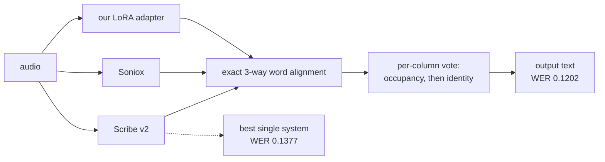

# GSoC 2026 Fine-tuning AI Transcription for Greek Municipal Councils — Final Report

**Contributor:** Angelos Papamichail (angelospk)
**Organization:** GFOSS — Open Technologies Alliance (eellak), for [OpenCouncil](https://opencouncil.gr)
**Project:** GSoC 2026 Fine-tuning AI Transcription for Greek Municipal Councils
**Repository (work product):** https://github.com/eellak/gsoc2026-opencouncil-stt
**Model:** https://huggingface.co/opencouncil/whisper-large-v3-el-council-lora

---

## Abstract

OpenCouncil publishes transcripts of Greek municipal council meetings. Transcription
quality decides how much human correction each meeting costs, so the project set out to
fine-tune `whisper-large-v3` on council speech and cut the error rate on the words that
matter — councillor names, place names, procedural vocabulary.

The adapter was built, published, and measured. It beats base `whisper-large-v3` on
unseen councils. It does not beat the commercial systems, and the proposal's headline
target — a 15–20% relative improvement in domain-term error rate — was not met.

The project's most valuable output turned out to be the measuring instrument rather than
the model. A frozen, preregistered evaluation harness caught three separate false wins
before they could be acted on, closed several expensive directions with evidence, and
produced one result larger than anything fine-tuning achieved: **composing the word-level
output of three ASR systems, with no LLM and no audio, beats every single system
including the one now running in production.**

This report states the negative results as plainly as the positive ones. That is
deliberate: the negative results are the reusable part.


*Word error rate on 391 held-out windows from 117 meetings, none of which appears in any
training set. Full method in [section 4](#4-what-the-project-added).*

---

## 1. The state of the art before GSoC

Before this project, OpenCouncil's pipeline had:

- **A commercial ASR provider** (Gladia) producing transcripts, followed by **manual
  human correction** through OpenCouncil's own review interface. The correction pairs
  from that interface were the only Greek council-speech supervision that existed.
- **No Greek-aware evaluation.** WER was not measured on a fixed set with a fixed
  normalizer. There was no way to say whether a change helped, and no baseline numbers
  for the Greek council domain published anywhere.
- **No domain-adapted model.** No fine-tune of any open ASR model on Greek municipal
  speech existed publicly, and no dataset of this domain was available.
- **No way to compare providers.** Choosing between ASR vendors was a judgement call
  rather than a measurement.

The proposal's targets were: a reproducible dataset, a LoRA adapter with ≥15% relative
domain-term WER improvement over Gladia, a production-ready pipeline, and a measurable
drop in Human Intervention Rate.

---

## 2. What I did

### 2.1 Dataset

Extracted training data from OpenCouncil's human-correction pairs: aligned audio windows
with corrected reference text, filtered for overlap and reference quality, and packed
into 30-second clips matching Whisper's input constraint. Several packing strategies were
built and screened against each other (contiguous, spliced, dense, overlap-clean).

**Publication is blocked on a legal question, not a technical one.** The recordings are
public meetings but the transcripts carry personal data; a data protection review was
required and was not completed within the programme. A PII detection pass over the corpus
flags 1.85% of rows. The extraction and packing code is in the repository and runs.

### 2.2 Model

LoRA rank 32 on `q_proj` and `v_proj` of `whisper-large-v3`, trained on RunPod GPUs, then
merged and converted to CTranslate2 for serving. Published to the HuggingFace Hub.

Several adapters exist and **some are known broken** — the repository's research ledger
records each one with a content hash and a validity status, because during the programme
a training-target bug silently invalidated every adapter produced before 2026-08-01.

### 2.3 Evaluation framework — the part that held everything else honest

- A **frozen evaluation set**: 39 validation windows from two training-disjoint councils,
  11,911 reference tokens, frozen before any arm it judged was decoded, plus **7 temporal
  holdout windows that remain sealed**. No experiment ever passed a gate that would have
  released them.
- A **frozen Greek-aware normalizer** and an external scorer with meeting-clustered
  bootstrap confidence intervals.
- **Preregistered gates** for every training run: paired seeds, deletion and insertion
  guards, leave-one-out stability, and a single-window domination check.
- A **human-verified gold set** for fidelity-to-audio, kept as a one-shot challenge set.
- Integration with OpenCouncil's own benchmark HTTP API, so any provider or self-hosted
  endpoint can be scored on the same windows through the same decoder stack.

Two quantities are tracked separately throughout and never merged: *fidelity-to-audio*
(WER against a human who listened — this decides quality) and *agreement-with-OpenCouncil*
(WER against our own published text — this records product compatibility and decides
nothing).

### 2.4 Serving

The merged model runs behind an OpenAI-compatible HTTP endpoint on a GPU pod, with a
long-form decode policy for whole meetings, verified byte-for-byte against the measured
experimental arm on pinned conformance windows.

---

## 3. The current state, honestly

| Deliverable | State |
|---|---|
| Preprocessed dataset | Built and used. **Not published** — data protection hold. |
| Fine-tuned model | **Published.** Beats base whisper-large-v3; loses to commercial systems. |
| Evaluation framework | **Delivered.** The strongest part of the project. |
| Production integration | **Partial.** Model serves; not merged into OpenCouncil. |
| Documentation | Delivered: 83-record machine-checked research ledger, ~85 dated reports. |
| Domain-term WER target | **Not met.** |
| Human Intervention Rate | **Never measured.** A plain miss, not a pending number. |

**No pull request was opened against the OpenCouncil product repository.** The work is a
research repository, a published model, and a serving endpoint. The integration path is
documented but was not upstreamed. This is stated rather than implied.

---

## 4. What the project added

### 4.1 The measurement that changed a production decision

The benchmark harness built here was used to compare every available ASR system on the
same Greek council audio through the same decoder stack. On that evidence OpenCouncil
moved production from Gladia to ElevenLabs Scribe v2 during the summer.

| | WER, benchmark's own metric |
|---|---|
| Gladia — the baseline named in the proposal | 0.2085 |
| Scribe v2 — what the product runs now | 0.1339 |

That is a **35.8% relative reduction in transcription errors in the product**. It is not
our model. The measurement that drove the decision is the project's.

### 4.2 The largest technical result: composition beats selection

`exp-2026-08-23-fusion-postjune`. Three ASR hypotheses are aligned word by word with an
exact 3-way multiple sequence alignment, then each column is decided by a hierarchical
vote — occupancy first (is there a word here at all), then identity. The output is a text
none of the three systems produced. **No LLM, no audio, no speaker information.**



On 391 held-out windows from 117 meetings, scored with this repository's own scorer.
(That scorer differs slightly from the benchmark application's, which trims
window-boundary words by cross-provider consensus, so Scribe reads 0.1377 here and 0.1339
in the table above. Every arm below is scored the same way, which is what makes the
comparison valid.)

| arm | WER |
|---|---|
| **composition of three systems** | **0.1202** |
| best single system (Scribe v2) | 0.1377 |
| whole-window consensus selection | 0.1325 |
| best whole hypothesis per window (an oracle, not a system) | 0.1206 |
| best entry per column (an oracle, not a system) | 0.0611 |

Paired meeting-clustered bootstrap over 117 meetings, 10,000 resamples: **−0.0175 against
Scribe v2, 95% CI [−0.0215, −0.0134]**. The result is not carried by a few windows — the
five largest contribute 15.5%, composition wins in 98 of 117 meetings, and dropping any
single meeting leaves the effect in [−0.0186, −0.0167].

Two consequences worth carrying forward:

- **Composition has reached the ceiling of selection.** Against the whole-window oracle it
  is +0.0004 with an interval straddling zero. No method that *picks* whole hypotheses can
  do better; further gain must come from composing.
- **Composition is nowhere near its own ceiling.** Choosing the best entry in every column
  gives 0.0611, roughly half. The transcripts jointly contain a far better text than the
  vote extracts. That gap, not more fine-tuning, is where the remaining accuracy is.

### 4.3 The fine-tuned model

The adapter beats base `whisper-large-v3` on councils it never trained on (−0.0161, 95%
CI [−0.0218, −0.0114]) and beats `gpt-4o-transcribe` and Gladia. It loses to Scribe v2 and
Soniox with intervals that exclude zero.

A second training recipe measured at the end of the programme cuts the **deletion rate**
from 0.0525 to 0.0313 — about 40% less of the meeting silently dropped — without lowering
overall WER (−0.0040, CI [−0.0078, +0.0002], which crosses zero). Under the rule fixed
before the numbers existed, that is **not** a promotion, and the adapter was not promoted.
It is recorded as a Pareto trade, not a win.

### 4.4 Negative results, with numbers

These closed expensive directions and are reusable by anyone working on this problem:

- **The domain-term target was not met.** Domain-term WER 0.4880 for our adapter against
  0.3280 for Soniox. Excluding two roll-call windows, our figure is indistinguishable from
  base whisper's.
- **Deletion-targeted retraining, external Greek corpora, and dense 30-second packing** all
  failed their preregistered screens. Five training arms were stopped at a screen instead
  of being promoted to a full run, each closed with its negative result recorded.
- **Chunking is not the cause of our gap to the best system.** The share of tokens we get
  wrong and Scribe gets right is flat across window position: 9.03, 10.02, 9.80, 9.25,
  9.01, 9.72, 9.95, 9.92, 10.03, 10.38 by decile.
- **Decoder-only retraining is bounded at under one WER point.** The errors a language
  model could fix without better acoustics are homophone misspellings, which in Greek are
  common (ω/ο, η/ι/υ/ει/οι are each one sound). They are 7.3% of our substitutions, worth
  0.0066 of the 0.0418 gap to Scribe.

### 4.5 What went wrong, and what it taught

Three measurement mistakes shaped this project more than any code did.

1. **A false win over base whisper (23–25 July).** The first benchmark reported that the
   fine-tune beat base `whisper-large-v3`. It did not — the two were served through
   different decoder stacks, and the gap was the stack. The corrected comparison did not
   land until 10 August. Eighteen days of work were steered by a wrong number.
2. **The reference was not the audio (4 August).** Scoring against published transcripts
   measures agreement with the product, not fidelity to speech. Under an audio-faithful
   reference the system ranking flipped.
3. **Steps are not epochs (22 August).** A recipe that won on all three seeds at 300 steps
   dissolved at 1,800. The arms had been matched on optimiser steps while their training
   packs differed in size, so they had seen 2.00 and 0.71 epochs. A causal claim already
   written into a report had to be withdrawn.

Against those, the one genuine code bug — every training target shifted by one token,
because Whisper's `tokenizer.bos_token_id` is `<|endoftext|>` and not
`<|startoftranscript|>`, so the guard meant to strip the prefix was never true — cost
**+0.0018 WER on average, with an inconsistent sign** across six paired runs.

**An invalid training objective cost roughly nothing. Three arithmetically correct numbers
cost weeks.** After the second of these, nothing was trained on a GPU until it had passed
a declared screen. That discipline is the reason the rest of the results can be trusted,
and it is the single most transferable thing this project produced.

---

## 5. Potential future work

Ranked by measured ceiling on the held-out set, not by appeal:

1. **Close the composition gap.** The vote reaches 0.1202; the per-column oracle on the
   same alignment is 0.0611. The vote decides cleanly on 91.4% of columns; on the 3.6%
   where all three systems disagree and no majority can form, **44.3% have two candidates
   within one or two characters** of each other. A character-tolerant tie-break is worth up
   to 0.0136 and costs no GPU. This is the best next experiment in the project.
2. **Two-system fusion for production.** Three ASR accounts per meeting is not affordable;
   two is. Two-system composition has never been measured. A frozen specification exists;
   a design review warns that majority voting is degenerate with two voters and that the
   only non-degenerate axis is occupancy.
3. **Fidelity-to-audio for the deletion result.** The clean-pack adapter deletes 40% less.
   Whether that is real speech recovered or plausible text written over silence needs the
   human-verified gold set, which was not spent on it.
4. **Why whole passages disappear.** 36% of what our adapter deletes vanishes in runs of
   five or more consecutive words, against Scribe's 19%. The cause is not established.
5. **Dataset publication**, once the data protection question is resolved. The blocker is
   legal, not technical.

Items 1, 4 and part of 3 run on already-cached data with no GPU cost.

---

## 6. Links

All links are on the public repository's default branch and require no special access.

**Work product (stable URL):**
https://github.com/eellak/gsoc2026-opencouncil-stt/blob/main/FINAL_REPORT.md

| what | where |
|---|---|
| Repository | https://github.com/eellak/gsoc2026-opencouncil-stt |
| Published model | https://huggingface.co/opencouncil/whisper-large-v3-el-council-lora |
| Research ledger (83 experiments, machine-checked) | [`research/ledger.json`](research/ledger.json) |
| Ledger consistency check | [`scripts/check-research-state.py`](scripts/check-research-state.py) |
| Frozen evaluation set | [`research/eval-freeze-2026-08/manifest.json`](research/eval-freeze-2026-08/manifest.json) |
| Scoring and experiment code | [`eval/controlled_eval/`](eval/controlled_eval/) |
| Composition experiment | [`eval/controlled_eval/exp_composition_postjune.py`](eval/controlled_eval/exp_composition_postjune.py) |
| Serving and long-form decode | [`serve/`](serve/) |
| Dated reports (~85) | [`docs/reports/`](docs/reports/) |
| Preregistrations | [`docs/specs/`](docs/specs/) |
| Evidence rules for training | [`docs/decisions/training-evidence.md`](docs/decisions/training-evidence.md) |
| Agent and research protocol | [`CLAUDE.md`](CLAUDE.md) |

**Detailed evidence behind this report:**

| topic | report |
|---|---|
| Full research report with every interval and caveat | [`docs/reports/2026-08-23-gsoc-final-report-DRAFT.md`](docs/reports/2026-08-23-gsoc-final-report-DRAFT.md) |
| Project timeline and the three measurement mistakes | [`docs/reports/2026-08-23-project-timeline.md`](docs/reports/2026-08-23-project-timeline.md) |
| Token-level analysis of the gap to Scribe v2 | [`docs/reports/2026-08-23-gap-to-scribe.md`](docs/reports/2026-08-23-gap-to-scribe.md) |
| Screen of the decoder-only proposal | [`docs/reports/2026-08-23-decoder-only-screen.md`](docs/reports/2026-08-23-decoder-only-screen.md) |
| The label-prefix bug and what it cost | [`docs/reports/2026-07-31-label-prefix-bug.md`](docs/reports/2026-07-31-label-prefix-bug.md) |

**Planning issues:**
[#3 endgame map](https://github.com/eellak/gsoc2026-opencouncil-stt/issues/3) ·
[#50 post-ASR architecture](https://github.com/eellak/gsoc2026-opencouncil-stt/issues/50) ·
[#48 and #49, evaluation-gate and budget-design flaws filed against our own process](https://github.com/eellak/gsoc2026-opencouncil-stt/issues/48)

**Upstream merges:** none. See [section 3](#3-the-current-state-honestly).

---

## 7. How to extend this work

```bash
git clone https://github.com/eellak/gsoc2026-opencouncil-stt
cd gsoc2026-opencouncil-stt
python3 scripts/check-research-state.py     # must print "ledger clean"
```

Read `CURRENT.md` for the live queue, then `research/ledger.json` for the authoritative
state of every experiment. Each record carries its question, conclusion, caveats and the
reports behind it, and records marked `SUPERSEDED` name what replaced them. Every number
in this report traces to one of those records.

The evaluation harness runs on cached benchmark output and needs no GPU. The composition
experiment reproduces from a downloaded `report.json` in about thirty minutes on fourteen
CPU cores.
