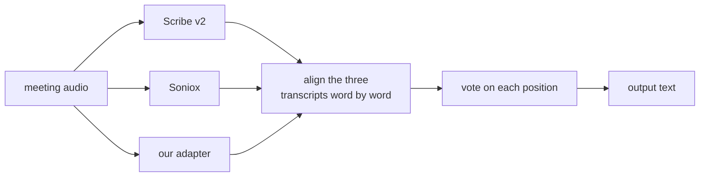

# GSoC 2026: fine-tuning AI transcription for Greek municipal councils

| | |
|---|---|
| **Contributor** | Angelos Papamichail ([angelospk](https://github.com/angelospk)) |
| **Organization** | GFOSS, Open Technologies Alliance, for [OpenCouncil](https://opencouncil.gr) |
| **Project** | GSoC 2026 Fine-tuning AI Transcription for Greek Municipal Councils |
| **Repository** | [eellak/gsoc2026-opencouncil-stt](https://github.com/eellak/gsoc2026-opencouncil-stt) |
| **Model** | [opencouncil/whisper-large-v3-el-council-lora](https://huggingface.co/opencouncil/whisper-large-v3-el-council-lora) |
| **Mentors** | OpenCouncil / GFOSS |

---

## Abstract

OpenCouncil publishes transcripts of Greek municipal council meetings. Every transcript goes through human correction before it is published, so transcription quality decides how much work each meeting costs. My project set out to fine-tune `whisper-large-v3` on council speech and cut the error rate on the words that cost the most to fix: councillor names, place names, and the procedural vocabulary that repeats in every session.

I built the dataset, trained two generations of LoRA adapters, and measured them against every ASR system available to the project on the same audio through the same decoder. Both adapters beat the open-source baseline they started from, and both clear the domain-term target my proposal set against Gladia. Neither beats the commercial systems the market moved to during the summer.

The substitution rate, the share of words heard as the wrong word, barely moved across two generations: 0.0784 for base whisper, 0.0764 for v1, 0.0772 for v2. The deletion rate halved, from 0.0955 to 0.0436. Fine-tuning on council speech brought fewer silent passages, not better word recognition.

Most of my summer went into finding out why and into building the measuring equipment that could tell a real improvement from an artifact of how I ran the test. That equipment produced the other useful result of the project: combining the word-level output of several ASR systems scores better than any of them alone. We plan to test that in production.


---

## 1. Before

OpenCouncil sent meeting audio to a commercial ASR provider, Gladia; then an LLM corrected the transcript text, and reviewers corrected the output by hand. Those correction pairs were the only supervision that existed for Greek council speech.

Three things were missing:

- No fixed way to measure quality. WER was not computed on a frozen set with a fixed Greek normalizer, so nobody could say whether a change helped.
- No domain-adapted model. No public fine-tune of any open ASR model existed for Greek municipal speech, and no dataset of this domain was available.
- No way to compare providers. Choosing between ASR vendors was a judgement call.

My proposal targeted a reproducible dataset, a LoRA adapter with at least 15% relative improvement in domain-term WER over Gladia, a pipeline ready for production, and a drop in how much reviewers had to intervene.

---

## 2. What I built

### 2.1 The review interface

Before any training I needed a way to look at the corrections, so I built a review app over the correction export, SvelteKit on top of SQLite. For one utterance it shows the before/after diff, plays the matching audio, and lets a reviewer fix the timestamps, tag the error category, and mark the row included, excluded or uncertain. Every label is appended to a JSONL event history. A second screen reports coverage per city.

That app produced the part of the training set with the best provenance: 4.71 hours, 5,054 utterances that a human opened, heard, and explicitly chose to include. Its coverage page is also where the per-city numbers in the June metric discussion came from.

### 2.2 The dataset

The training data comes from OpenCouncil's human-correction pairs. I aligned audio to the corrected reference text, filtered on reference quality and speaker overlap, and cut the result into clips that fit the 30-second window Whisper expects.

The dataset is built and in use. We are working out how to release it publicly without running into licensing questions, GDPR, or the rights attached to the recordings. The extraction and packing code is in the repository and runs today.

### 2.3 Two adapters

Both are LoRA rank 32 on the `q_proj` and `v_proj` projections of `whisper-large-v3`, trained on rented GPUs, merged and converted to CTranslate2 for serving. What changed is the data I fed them.

```
v1  (early August)         28,967 clips, one utterance each, 3.55 s on average

    |<---------------- 30-second Whisper window ---------------->|
    [ utterance ]..................................................
      3.5 s of speech, the rest padding

v2  (late August)          2,476 packs, one speaker, ~22 s of speech each

    |<---------------- 30-second Whisper window ---------------->|
    [ one continuous span, single dominant speaker, no overlap  ]
      cut at acoustic boundaries, reference is the meeting's own
      utterances in order
```

Building v1 I treated each corrected utterance as one training example, which is the obvious thing to do and is what the correction data looks like. Whisper always sees a 30-second window, so a 3.5-second clip meant the model spent most of every example looking at padding it would never see at inference. An audit of window occupancy in August is what sent me back to the data.

For v2 I dropped every clip where two people talk at once, then packed continuous spans of a single speaker until each window held about 22 seconds of speech. The training window started to look like the audio the model meets in production.

The change works in a specific way. v2 deletes 40% less of the meeting than v1 (0.0313 against 0.0525), so far fewer passages go missing. Overall WER moves by -0.0040 with a 95% confidence interval of [-0.0078, +0.0002]. Under the rule I fixed before running the comparison, that does not count as an improvement in WER, and I have not claimed one.

Two things changed at once between v1 and v2, overlap filtering and window occupancy, so I cannot say which of them did the work. Separating them needs another training run.

### 2.4 Measurement

I built an evaluation harness because I could not trust the numbers I was getting without one. It has a frozen evaluation set of 39 windows from two councils that appear in no training data, a frozen Greek normalizer, and an external scorer that reports meeting-clustered bootstrap confidence intervals rather than a single number.

The harness also talks to OpenCouncil's own benchmark API, so a self-hosted endpoint and a commercial provider can be scored on the same windows through the same decoder stack. Comparing two models across two different stacks produced a false result early in the project, and this is what stopped it happening again.

I recorded every experiment in `research/ledger.json` with its question, its conclusion, its caveats, and a link to the report behind it. A script checks the ledger for internal consistency. 83 records are in it.

### 2.5 Serving

The model is served two ways. A serverless GPU endpoint holds a CTranslate2 build of v2, scales to zero between calls so an idle month costs nothing, and refuses any request that does not carry the API key. It decoded a whole 51 minute council meeting in a single job: 543 utterances with word timestamps, covering 3046.8 of the recording's 3046.9 seconds. Every response carries the base and adapter commit hashes that produced it, so a transcript can always name its own model. Separately, a whole-meeting decode policy runs offline on CPU and reproduces the measured experimental arm byte for byte on the pinned conformance windows.

---

## 3. Where it stands

| Deliverable | State |
|---|---|
| Dataset | Built and in use. Public release depends on the licensing and GDPR questions above. |
| Fine-tuned model | Published. v2 beats base `whisper-large-v3`; both versions lose to the commercial systems. |
| Evaluation framework | Delivered, and used for every number in this report. |
| Serving | Delivered. A pay-per-use GPU endpoint behind an API key, which decoded a full 51 minute meeting in one job. |
| Production integration | Not done, and not the right call. See below. |
| Domain-term WER target | Met against Gladia, the baseline it was set against. |
| Human intervention rate | Dropped in June, after the mentors found problems with the metric itself. |

**On production integration.** During the summer OpenCouncil moved from Gladia to ElevenLabs Scribe v2. Scribe scores better than either of my adapters on our own benchmark, so putting my model in front of the correction queue would make the product worse. We do plan to put the fusion approach in section 4.5 into production. I am preparing it now, we will test it against the live pipeline, and if it holds up, it ships.

**On the human intervention rate.** I proposed it, the mentors found problems with the metric in June, and I dropped it. It measures the LLM correction pass as well as the ASR, so a prompt change moves it. It counts utterances, and utterances are something the ASR emits rather than something speech contains: a model that cut one utterance per word would score worse without making a single extra transcription error. Building it also meant an extra pass in the pipeline for a metric nobody else reports against. WER and CER stayed the standard. The concern underneath it stayed as a diagnostic: a fine-tune can introduce errors that the LLM pass then hides. I never ran the before-and-after measurement, because the model never sat in front of the correction queue. That is a plain miss.

**Upstream contributions.** None. No pull request was opened against the OpenCouncil product repository. This work is a research repository, a published model, and a serving endpoint.

---

## 4. Results

All numbers below come from 391 held-out windows across 117 meetings. No meeting in that set appears in any training data.

### 4.1 The models

| system | WER |
|---|---|
| ElevenLabs Scribe v2 | 0.1377 |
| Soniox | 0.1455 |
| **our adapter v2** | **0.1795** |
| our adapter v1 | 0.1867 |
| gpt-4o-transcribe | 0.1937 |
| `whisper-large-v3`, no fine-tuning | 0.1988 |
| Gladia, the baseline this project started from | 0.2085 |

v2 beats the base model it was fine-tuned from by 0.0161, with a 95% confidence interval of [-0.0218, -0.0114]. It also beats Gladia, which is what OpenCouncil used when the project began, and gpt-4o-transcribe. It loses to Scribe v2 and Soniox by margins whose intervals exclude zero.

We think it is the best open-weights model for Greek council speech today. The only open-weights system I scored on these windows is base `whisper-large-v3`, the model it was fine-tuned from, so the table above is not a ranking of open Greek ASR.

### 4.2 Domain terms

The proposal promised at least 15% relative improvement over Gladia on the words that cost reviewers the most time. I measured it on 250 occurrences of councillor surnames and place names across the 39 validation windows, with term lists committed before the metric first ran.

| system | DS-WER | against Gladia |
|---|---|---|
| Soniox | 0.3280 | +44.2% |
| ElevenLabs Scribe v2 | 0.3720 | +36.7% |
| our v2, seed 47 | 0.4360 | +25.9% |
| our v2, seed 29 | 0.4640 | +21.1% |
| our v1 | 0.4800 | +18.4% |
| our v2, seed 13 | 0.4840 | +17.7% |
| `whisper-large-v3`, not fine-tuned | 0.5400 | +8.2% |
| Gladia | 0.5880 | |

**Every version of the adapter clears the 15% target against Gladia**, which is the baseline the proposal named and the system OpenCouncil was running when the project started. The weakest seed comes in at +17.7% and the strongest at +25.9%.

Two things keep me from calling this a solved milestone. The three v2 rows differ only in the random seed and span 0.048, so the ordering between v1 and v2 here means little. And against the systems that matter today we make about half again as many domain-term errors as Soniox.

All four Whisper-family rows come from one decoding run on one GPU. An earlier version of this report gave v1 0.4880 from a machine I no longer have; 0.4800 is the controlled figure.

### 4.3 Training to test

Here we have three sets, in order of how much the model has seen them:

| | what it is | v1 | base whisper |
|---|---|---|---|
| **Training** | 300 rows drawn from the 28,967 v1 trained on | **0.1313** [0.1056, 0.1619] | 0.2728 [0.2311, 0.3211] |
| **Validation** | 39 windows, two councils absent from training | **0.1561** | 0.1857 |
| **Test** | 391 windows, 117 meetings, none in training | **0.1867** | 0.1988 |

The rise from 0.1313 to 0.1867 is what generalisation costs. The model fits its training data well without memorising it, and it holds most of that gain on councils and meetings it has never heard.

Splitting the training rows by whether a human edited them is the more interesting cut. On rows a reviewer corrected, v1 scores 0.2261 where base whisper scores 0.4471. On rows the reviewer left alone, v1 scores 0.0385 against 0.1020. The adapter learns the corrections rather than only the acoustics.

On validation, all three models were decoded on one machine, and that machine is the one the evaluation set was frozen against: this laptop, CPU, int8, 16 threads. The manifest states that a CUDA number may never be compared with these, so the comparison below is the only one of its kind in this report where every row shares a decoder.

| 39 validation windows | WER | deletions | insertions | substitutions |
|---|---|---|---|---|
| `whisper-large-v3`, not fine-tuned | 0.18571 | 0.09546 | 0.01184 | 0.07841 |
| our adapter v1 | 0.15607 | 0.05869 | 0.02099 | 0.07640 |
| **our adapter v2** | **0.14365** | **0.04357** | 0.02284 | 0.07724 |

Paired meeting-clustered bootstrap over the 32 meetings, 10,000 resamples:

| contrast | WER | deletions |
|---|---|---|
| v1 against base | −0.02964 [−0.06617, −0.00092] | −0.03677 [−0.08301, −0.00074] |
| v2 against base | −0.04206 [−0.07123, −0.01863] | −0.05188 [−0.09438, −0.01885] |
| v2 against v1 | −0.01243 [−0.02479, **+0.00084**] | −0.01511 [−0.02349, −0.00508] |

Read the substitution column. Base 0.07841, v1 0.07640, v2 0.07724. Fine-tuning moved it by less than a fifth of a point across two generations, and the v2-against-v1 contrast is +0.00084 with an interval straddling zero.

Almost everything the adapters gained came from deletions: 0.09546 down to 0.04357, a drop of more than half, confirmed against base and confirmed again between the two generations. Two generations of fine-tuning cut the silence and left the misheard words where they were.

A LoRA on `whisper-large-v3` for this domain buys coverage rather than recognition. I would want this table in front of me before funding another fine-tune aimed at substitution errors.

The v2-against-v1 WER contrast crosses zero here as it did on the test set, and its net gain of 148 error tokens has 56.1% of it in three windows. Its deletion contrast is the one that holds up.

Compare within a column, never across two. Each of the three sets was scored on its own decoding stack and against its own kind of reference: the training rows against the corrected labels the model was shown, validation against a frozen reference for two councils, test against OpenCouncil's published transcripts. Comparing two models inside one column is valid. Subtracting one column from another gives a direction, not a distance. An earlier version of this project reported a false win by ignoring exactly that, which is why the caveat is here rather than in a footnote.

I did not measure training WER for v2. Its packs are a different corpus, so the v1 sample is not v2's training data, and a fair version needs a training sample drawn from the v2 packs and another GPU run.

### 4.4 The gap to Scribe

I took the 4.18-point gap to Scribe apart word by word across all 110,694 reference tokens. The result surprised me:

- The gap is substitutions and deletions. On insertions we are ahead: our adapter writes fewer words that were never said.
- Greek has many words that sound identical and are written differently. Those account for 0.0066 of the 0.0418 gap, which puts a low ceiling on retraining the decoder to fix spelling.
- The largest recoverable group is words heard as entirely different words. That needs better acoustic modelling, which a LoRA on a frozen base does not give you.
- The gap does not depend on where a word sits in the 30-second window. Chunking is not the cause.

Three directions are closed, with the numbers that closed them.

### 4.5 Combining systems

While measuring providers against each other I noticed they fail on different words. I aligned three transcripts word by word and let each position be decided by a vote, first on whether anyone heard a word there at all, then on which word it was. No language model, no audio, no speaker information.



| | WER |
|---|---|
| combining three systems | 0.1202 |
| best single system, Scribe v2 | 0.1377 |
| best possible choice at every position, an upper bound rather than a method | 0.0611 |

The combined output scores 0.0175 better than the best single system, with a 95% confidence interval of [-0.0215, -0.0134]. It wins in 98 of the 117 meetings and no single meeting carries the result.

The third row is a bound, not a method: it assumes the right answer is known at every position, which is what transcription is trying to find out. It measures how much the three transcripts hold between them, and the vote extracts about half of that.

This is an idea, not a delivered system. It is where I would put the next month of work.

---

## 5. Future Work

1. **Test fusion against the live pipeline.** Three ASR accounts per meeting may cost too much, so the real question is whether two systems are enough. I have written the specification and measured nothing yet.
2. **Improve the vote.** It decides cleanly on 91% of positions. Where all three systems disagree, 44% of the time two of them are within a character or two of each other, which the current exact-match vote cannot see. Fixing that is worth up to 0.0136 and costs no GPU time.
3. **Find out why whole passages disappear.** 36% of what our adapter deletes vanishes in runs of five or more consecutive words, against 19% for Scribe. I did not find the cause.
4. **Separate the two changes between v1 and v2.** Overlap filtering and window occupancy moved together. One more training run would tell us which mattered.
5. **Test the open-weights claim.** Every number here comes from council audio and our own benchmark, and the only open model in it is the base the adapter was fine-tuned from. Scoring it against the other open Greek models on public sets, Common Voice and FLEURS `el_gr` among them, is what would turn what we think into something a reader can check.


---

## 6. Links

Everything below is public and needs no special access.

**This report:** https://github.com/eellak/gsoc2026-opencouncil-stt/blob/main/FINAL_REPORT.md

| | |
|---|---|
| Repository | [eellak/gsoc2026-opencouncil-stt](https://github.com/eellak/gsoc2026-opencouncil-stt) |
| Published model | [opencouncil/whisper-large-v3-el-council-lora](https://huggingface.co/opencouncil/whisper-large-v3-el-council-lora) |
| Experiment ledger, 83 records | [`research/ledger.json`](research/ledger.json) |
| Ledger consistency check | [`scripts/check-research-state.py`](scripts/check-research-state.py) |
| Frozen evaluation set | [`research/eval-freeze-2026-08/manifest.json`](research/eval-freeze-2026-08/manifest.json) |
| Scoring and experiments | [`eval/controlled_eval/`](eval/controlled_eval/) |
| The fusion experiment | [`eval/controlled_eval/exp_composition_postjune.py`](eval/controlled_eval/exp_composition_postjune.py) |
| Serving and whole-meeting decoding | [`serve/`](serve/) |
| Dated reports | [`docs/reports/`](docs/reports/) |
| Experiment preregistrations | [`docs/specs/`](docs/specs/) |

**Evidence behind this report:**

| | |
|---|---|
| Full research report, every interval and caveat | [`2026-08-23-gsoc-final-report-DRAFT.md`](docs/reports/2026-08-23-gsoc-final-report-DRAFT.md) |
| How the project went, month by month | [`2026-08-23-project-timeline.md`](docs/reports/2026-08-23-project-timeline.md) |
| The gap to Scribe, word by word | [`2026-08-23-gap-to-scribe.md`](docs/reports/2026-08-23-gap-to-scribe.md) |
| Whether a decoder-only fine-tune would help | [`2026-08-23-decoder-only-screen.md`](docs/reports/2026-08-23-decoder-only-screen.md) |

---

## 7. Using this

```bash
git clone https://github.com/eellak/gsoc2026-opencouncil-stt
cd gsoc2026-opencouncil-stt
python3 scripts/check-research-state.py     # prints "ledger clean"
```

Start with `CURRENT.md` for what is open, then `research/ledger.json` for the state of every experiment. Each record carries its question, conclusion and caveats, and records marked `SUPERSEDED` name what replaced them. Every number in this report traces back to one of them.

The evaluation harness runs on cached benchmark output and needs no GPU. The fusion experiment reproduces from a downloaded `report.json` in about half an hour on fourteen CPU cores.
