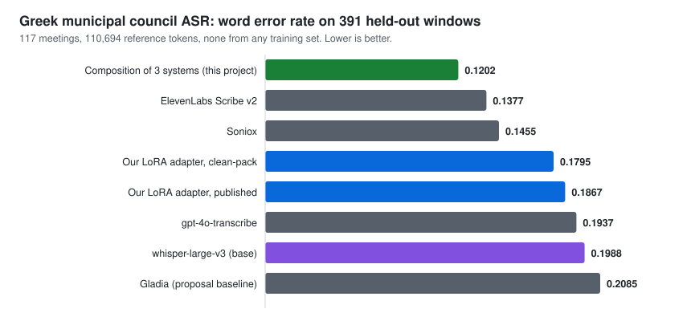
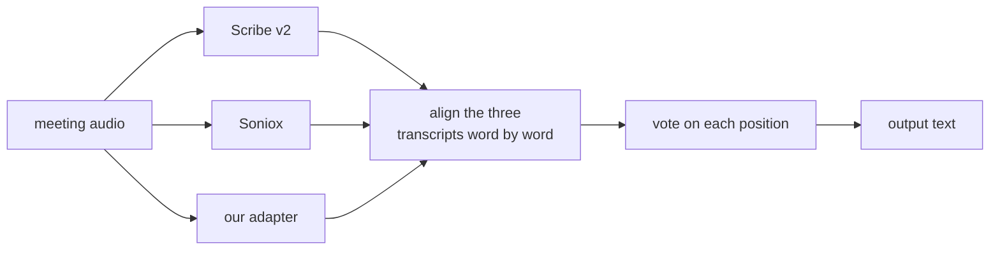

# GSoC 2026 Fine-tuning AI Transcription for Greek Municipal Councils

| | |
|---|---|
| **Contributor** | Angelos Papamichail ([angelospk](https://github.com/angelospk)) |
| **Organization** | GFOSS, Open Technologies Alliance, for [OpenCouncil](https://opencouncil.gr) |
| **Project** | GSoC 2026 Fine-tuning AI Transcription for Greek Municipal Councils |
| **Repository** | [eellak/gsoc2026-opencouncil-stt](https://github.com/eellak/gsoc2026-opencouncil-stt) |
| **Model** | [opencouncil/whisper-large-v3-el-council-lora](https://huggingface.co/opencouncil/whisper-large-v3-el-council-lora) |
| **Mentors** | OpenCouncil / GFOSS |

---

## Abstract

OpenCouncil publishes transcripts of Greek municipal council meetings. Every transcript
goes through human correction before it is published, so transcription quality decides
how much work each meeting costs. My project set out to fine-tune `whisper-large-v3` on
council speech and cut the error rate on the words that cost the most to fix: councillor
names, place names, and the procedural vocabulary that repeats in every session.

I built the dataset, trained two generations of LoRA adapters, and measured them against
every ASR system available to the project on the same audio through the same decoder.
The second adapter beats the open-source baseline it started from. Neither adapter beats
the commercial systems, and the domain-term target in my proposal was not reached.

Most of my summer went into finding out why, and into building the measuring equipment
that could tell a real improvement from an artifact of how I ran the test. That
equipment produced the other useful result of the project: combining the word-level
output of several ASR systems scores better than any of them alone. We plan to test that
in production.



---

## 1. Where things stood before GSoC

OpenCouncil sent meeting audio to a commercial ASR provider, Gladia, and reviewers
corrected the output by hand. Those correction pairs were the only supervision that
existed for Greek council speech.

Three things were missing:

- No fixed way to measure quality. WER was not computed on a frozen set with a fixed
  Greek normalizer, so nobody could say whether a change helped.
- No domain-adapted model. No public fine-tune of any open ASR model existed for Greek
  municipal speech, and no dataset of this domain was available.
- No way to compare providers. Choosing between ASR vendors was a judgement call.

My proposal targeted a reproducible dataset, a LoRA adapter with at least 15% relative
improvement in domain-term WER over Gladia, a pipeline ready for production, and a drop
in how much reviewers had to intervene.

---

## 2. What I built

### 2.1 The dataset

The training data comes from OpenCouncil's human-correction pairs. I aligned audio to
the corrected reference text, filtered on reference quality and speaker overlap, and cut
the result into clips that fit the 30-second window Whisper expects.

The dataset is built and in use. We are working out how to release it publicly without
running into licensing questions, GDPR, or the rights attached to the recordings. The
extraction and packing code is in the repository and runs today.

### 2.2 Two adapters, and what changed between them

Both are LoRA rank 32 on the `q_proj` and `v_proj` projections of `whisper-large-v3`,
trained on rented GPUs, merged and converted to CTranslate2 for serving. What changed is
the data I fed them.

```
v1  (early August)         28,967 clips, one utterance each, 3.55 s on average

    |<---------------- 30-second Whisper window ---------------->|
    [ utterance ]..................................................
      3.5 s of speech, the rest padding


v2  (late August)          2,476 packs, one speaker, ~22 s of speech each

    |<---------------- 30-second Whisper window ---------------->|
    [ one continuous span, single dominant speaker, no overlap  ]
      cut at acoustic boundaries, reference is the meeting's own
      utterances in order
```

Building v1 I treated each corrected utterance as one training example, which is the
obvious thing to do and is what the correction data looks like. Whisper always sees a
30-second window, so a 3.5-second clip meant the model spent most of every example
looking at padding it would never see at inference. An audit of window occupancy in
August is what sent me back to the data.

For v2 I dropped every clip where two people talk at once, then packed continuous spans
of a single speaker until each window held about 22 seconds of speech. The training
window started to look like the audio the model meets in production.

The change works, in a specific way. v2 deletes 40% less of the meeting than v1 (0.0313
against 0.0525), so far fewer passages go missing. Overall WER moves by -0.0040 with a
95% confidence interval of [-0.0078, +0.0002], which crosses zero. Under the rule I
fixed before running the comparison, that does not count as an improvement in WER, and I
have not claimed one.

Two things changed at once between v1 and v2, overlap filtering and window occupancy, so
I cannot say which of them did the work. Separating them needs another training run.

### 2.3 Measurement

I built an evaluation harness because I could not trust the numbers I was getting
without one. It has a frozen evaluation set of 39 windows from two councils that appear
in no training data, a frozen Greek normalizer, and an external scorer that reports
meeting-clustered bootstrap confidence intervals rather than a single number.

The harness also talks to OpenCouncil's own benchmark API, so a self-hosted endpoint and
a commercial provider can be scored on the same windows through the same decoder stack.
Comparing two models across two different stacks produced a false result early in the
project, and this is what stopped it happening again.

I record every experiment in `research/ledger.json` with its question, its conclusion,
its caveats, and a link to the report behind it. A script checks the ledger
for internal consistency. 83 records are in it.

### 2.4 Serving

The merged model runs behind an OpenAI-compatible HTTP endpoint on a GPU pod, protected
by an API key, with a decode policy for whole meetings rather than short clips. The
policy reproduces the measured experimental arm byte for byte on pinned conformance
windows.

---

## 3. Where the project stands

| Deliverable | State |
|---|---|
| Dataset | Built and in use. Public release depends on the licensing and GDPR questions above. |
| Fine-tuned model | Published. v2 beats base `whisper-large-v3`; both versions lose to the commercial systems. |
| Evaluation framework | Delivered, and used for every number in this report. |
| Serving | Delivered. Runs behind an API key, decodes whole meetings. |
| Production integration | Not done, and not the right call. See below. |
| Domain-term WER target | Not reached. |
| Human intervention rate | Dropped after discussion with the mentors. |

**On production integration.** During the summer OpenCouncil moved from Gladia to
ElevenLabs Scribe v2. Scribe scores better than either of my adapters on our own
benchmark, so putting my model in front of the correction queue would make the product
worse. We do plan to put the fusion approach in section 4.3 into production. I am preparing it
now, we will test it against the live pipeline, and if it holds up it ships.

**On the human intervention rate.** I proposed it as the operational metric and we let
it go. A single intervention rate does not tell you which errors cost a reviewer time,
and by the time our model could have sat in front of the queue the product had already
moved to a better provider. The mentors and I agreed it was not worth chasing.

**Upstream contributions.** None. No pull request was opened against the OpenCouncil
product repository. This work is a research repository, a published model, and a serving
endpoint.

---

## 4. Results

All numbers below come from 391 held-out windows across 117 meetings. No meeting in that
set appears in any training data.

### 4.1 The models

| system | WER |
|---|---|
| ElevenLabs Scribe v2 | 0.1377 |
| Soniox | 0.1455 |
| **our adapter v2** | **0.1795** |
| our adapter v1 | 0.1867 |
| gpt-4o-transcribe | 0.1937 |
| `whisper-large-v3`, no fine-tuning | 0.1988 |
| Gladia, the baseline this project started from | 0.2085 |

v2 beats the base model it was fine-tuned from by 0.0161, with a 95% confidence interval
of [-0.0218, -0.0114]. It also beats Gladia, which is what OpenCouncil used when the
project began, and gpt-4o-transcribe. It loses to Scribe v2 and Soniox by margins whose
intervals exclude zero.

### 4.2 Why we did not catch the commercial systems

I took the 4.18-point gap to Scribe apart word by word across all 110,694 reference
tokens. The result surprised me:

- The gap is substitutions and deletions. On insertions we are ahead: our adapter writes
  fewer words that were never said.
- Spelling is not the problem. Greek has many words that sound identical and are written
  differently, and those account for 0.0066 of the 0.0418 gap. Retraining the decoder to
  fix spelling has a small ceiling.
- The largest recoverable group is words heard as entirely different words. That needs
  better acoustic modelling, which a LoRA on a frozen base does not give you.
- The gap does not depend on where a word sits in the 30-second window. Chunking is not
  the cause.

I would rather record this than a vaguer version of it. Anyone continuing this work now
knows which three directions are dead and why.

### 4.3 Combining several systems

While measuring providers against each other I noticed they fail on different words. I
aligned three transcripts word by word and let each position be decided by a vote,
first on whether anyone heard a word there at all, then on which word it was. No
language model, no audio, no speaker information.



| | WER |
|---|---|
| combining three systems | 0.1202 |
| best single system, Scribe v2 | 0.1377 |
| best possible choice at every position, an upper bound rather than a method | 0.0611 |

The combined output scores 0.0175 better than the best single system, with a 95%
confidence interval of [-0.0215, -0.0134]. It wins in 98 of the 117 meetings and no
single meeting carries the result.

The third row is not something you can build. It assumes you already know the right
answer at every position, which is the thing transcription is trying to find out. It
tells you how much information the three transcripts hold between them, and the vote
currently extracts about half of it.

This is an idea, not a delivered system. It is the most promising thing I found, and it
is where I would put the next month of work.

---

## 5. What is left to do

1. **Test fusion against the live pipeline.** Three ASR accounts per meeting costs too
   much, so the real question is whether two systems are enough. I have written the
   specification and measured nothing yet.
2. **Improve the vote.** It decides cleanly on 91% of positions. Where all three systems
   disagree, 44% of the time two of them are within a character or two of each other,
   which the current exact-match vote cannot see. Fixing that is worth up to 0.0136 and
   costs no GPU time.
3. **Find out why whole passages disappear.** 36% of what our adapter deletes vanishes in
   runs of five or more consecutive words, against 19% for Scribe. I did not find the
   cause.
4. **Separate the two changes between v1 and v2.** Overlap filtering and window occupancy
   moved together. One more training run would tell us which mattered.
5. **Release the dataset**, once the licensing and GDPR questions are settled.

---

## 6. Links

Everything below is public and needs no special access.

**This report:**
https://github.com/eellak/gsoc2026-opencouncil-stt/blob/main/FINAL_REPORT.md

| | |
|---|---|
| Repository | [eellak/gsoc2026-opencouncil-stt](https://github.com/eellak/gsoc2026-opencouncil-stt) |
| Published model | [opencouncil/whisper-large-v3-el-council-lora](https://huggingface.co/opencouncil/whisper-large-v3-el-council-lora) |
| Experiment ledger, 83 records | [`research/ledger.json`](research/ledger.json) |
| Ledger consistency check | [`scripts/check-research-state.py`](scripts/check-research-state.py) |
| Frozen evaluation set | [`research/eval-freeze-2026-08/manifest.json`](research/eval-freeze-2026-08/manifest.json) |
| Scoring and experiments | [`eval/controlled_eval/`](eval/controlled_eval/) |
| The fusion experiment | [`eval/controlled_eval/exp_composition_postjune.py`](eval/controlled_eval/exp_composition_postjune.py) |
| Serving and whole-meeting decoding | [`serve/`](serve/) |
| Dated reports | [`docs/reports/`](docs/reports/) |
| Experiment preregistrations | [`docs/specs/`](docs/specs/) |

**Evidence behind this report:**

| | |
|---|---|
| Full research report, every interval and caveat | [`2026-08-23-gsoc-final-report-DRAFT.md`](docs/reports/2026-08-23-gsoc-final-report-DRAFT.md) |
| How the project went, month by month | [`2026-08-23-project-timeline.md`](docs/reports/2026-08-23-project-timeline.md) |
| The gap to Scribe, word by word | [`2026-08-23-gap-to-scribe.md`](docs/reports/2026-08-23-gap-to-scribe.md) |
| Whether a decoder-only fine-tune would help | [`2026-08-23-decoder-only-screen.md`](docs/reports/2026-08-23-decoder-only-screen.md) |

---

## 7. Using this work

```bash
git clone https://github.com/eellak/gsoc2026-opencouncil-stt
cd gsoc2026-opencouncil-stt
python3 scripts/check-research-state.py     # prints "ledger clean"
```

Start with `CURRENT.md` for what is open, then `research/ledger.json` for the state of
every experiment. Each record carries its question, conclusion and caveats, and records
marked `SUPERSEDED` name what replaced them. Every number in this report traces back to
one of them.

The evaluation harness runs on cached benchmark output and needs no GPU. The fusion
experiment reproduces from a downloaded `report.json` in about half an hour on fourteen
CPU cores.
