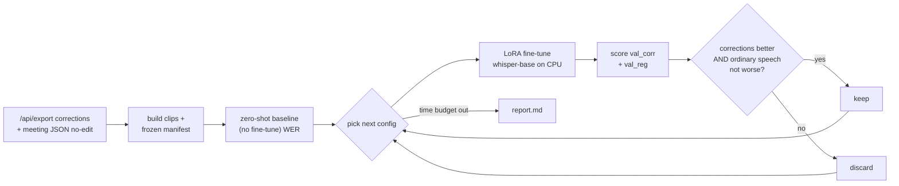

# Tiny-Whisper CPU auto-research — findings (Track 2)

_2026-06-23. A small Whisper model (`whisper-base`, 72M params), fine-tuned on
CPU on the mini PC, no GPU. About one hour of wall-clock, 16 training runs.
Method borrowed from [karpathy/autoresearch](https://github.com/karpathy/autoresearch):
change one thing, train, measure, keep or throw away, log it, repeat._

## What we actually did, in one paragraph

We have ~2,000 human corrections of council-meeting transcripts. The question
for the real (expensive, GPU) training run later is: **which data choices
actually make the model better?** Instead of guessing, we let a small model run
the experiment for us on the CPU we already own. Each run changes a single knob
(more data of this type, less of that, different learning rate…), fine-tunes,
and scores the result. The small model is a stand-in: it's too tiny to ship, but
findings about *data* carry over to the big model, while findings about *model
size* do not. So we only sweep data.



## A few terms, in plain words

- **WER** (word error rate): share of words the model gets wrong. Lower is
  better. 0.60 means roughly 60% of words are off in some way (these are hard,
  noisy Greek council clips, so the numbers are high).
- **val_corr**: our validation set of *corrected* utterances from two held-out
  cities (Orestiada, Argos). The hard cases, the ones humans had to fix.
- **val_reg**: a "regression" set of utterances from the same meetings that
  humans reviewed and *did not* change. Ordinary, already-fine speech. We watch
  it to make sure fine-tuning on hard cases doesn't quietly make normal speech
  worse.
- **LoRA**: a cheap way to fine-tune. Instead of moving all 72M weights, we train
  a tiny add-on (~0.4% of them). Fast, and easy to reset between runs.

## The three things worth remembering

1. **Fine-tuning on ~17 minutes of corrections makes ordinary speech a lot
   better, every single time.** `val_reg` drops from 0.674 to about 0.43 (~24
   points) on every run. The model isn't memorising fixes, it's learning the
   domain: council vocabulary, names, formatting. That helps the easy majority
   more than the hard tail.
2. **The hard corrected cases barely move, and the measurement is too noisy to
   rank anything.** `val_corr` stays around 0.61 no matter what we feed it. Worse:
   running the *same* config with different random seeds swings the score by 0.062,
   which is as much as the spread across *all* the different configs (0.064). So
   the "best" config winning by 0.003 is a coin flip. With only 56 validation
   clips, we can't tell data recipes apart yet.
3. **One worry didn't come true.** The standard fear is that training only on
   corrections teaches the model that "the obvious transcription is wrong" and
   degrades normal speech. It didn't. Normal speech got better, not worse.

## Setup

Data is frozen in `data/asr/manifest.jsonl`: 900 clips from 20 high-yield
meetings, built from the `/api/export` corrections plus a "no-edit backbone" of
reviewed-but-unchanged utterances (only from fully human-reviewed meetings).
Audio is decoded once per meeting, then sliced, 16 kHz mono, with a small
padding. Splits:

| split | clips | min | what it is |
|---|---|---|---|
| `train` | 279 | 16.9 | corrections, 8 training cities |
| `train_noedit` | 452 | 19.5 | no-edit backbone, for the "add more normal speech" knob |
| `val_corr` | 56 | 4.4 | corrections in the 2 held-out cities |
| `val_reg` | 70 | 4.9 | no-edit speech in the same held-out cities |

Recipe held fixed across every run so any change in score comes from the data,
not the setup: whisper-base, LoRA (rank 8, on the attention q/v projections),
encoder frozen, 40 steps, greedy decoding forced to Greek. Baseline with no
fine-tuning: `val_corr` 0.6071, `val_reg` 0.6736. A run is a "keep" only if
`val_corr` improves and `val_reg` doesn't get worse by more than 0.01.

## Results — all 16 runs

Round 1 changes one knob at a time. Round 2 combines the round-1 keepers. Sorted
by `val_corr`, lower is better.

| config | n_train | val_corr (Δ) | val_reg (Δ) | status |
|---|---|---|---|---|
| `sample_capped_oversample` | 180 | **0.6041** (−0.003) | 0.4321 (−0.242) | keep |
| `comp_backbone_1x` | 558 | 0.6056 (−0.002) | 0.4642 (−0.209) | keep |
| `comp_backbone_3x` | 731 | 0.6100 (+0.003) | **0.4283** (−0.245) | discard |
| `focus_acoustic` | 452 | 0.6115 (+0.004) | 0.4660 (−0.208) | discard |
| `sample_cat_balanced` | 2600 | 0.6145 (+0.007) | 0.4509 (−0.223) | discard |
| `base_ft` (corrections only) | 279 | 0.6174 (+0.010) | 0.4377 (−0.236) | discard |
| `r2_bb1x_balanced` | 2879 | 0.6189 (+0.012) | 0.4642 (−0.209) | discard |
| `r2_bb1x_capped` | 459 | 0.6248 (+0.018) | 0.4434 (−0.230) | discard |
| `r2_bb1x_capped_acoustic` | 639 | 0.6248 (+0.018) | 0.4321 (−0.242) | discard |
| `r2_bb1x_acoustic` | 731 | 0.6278 (+0.021) | 0.4453 (−0.228) | discard |
| `filters_strict` | 216 | 0.6381 (+0.031) | 0.4509 (−0.223) | discard |
| `lr_5e-5` | 279 | 0.6588 (+0.052) | 0.6057 (−0.068) | discard |
| `r2_bb1x_lr5e-5` | 558 | 0.6677 (+0.061) | 0.5377 (−0.136) | discard |

Same config, 3 random seeds (`sample_capped_oversample`): 0.6041, 0.6086, 0.6662.
That last seed is the whole problem in one number.

## Reading the results

The `val_reg` column is the real signal. Every fine-tune (except the
under-trained low-LR one) cuts ordinary-speech error by 21–25 points, and the
differences between recipes (0.428 vs 0.466) are small next to that gain.

The `val_corr` column is mostly noise. The spread across configs equals the
spread you get from just changing the random seed, so the ranking doesn't mean
much yet. Combining the two round-1 "winners" actually did slightly *worse* than
either alone, which is exactly what you'd expect if the differences were never
real to begin with.

The one clear negative: dropping the learning rate to 5e-5 with only 40 steps
just under-trains the model, and both scores suffer. Good to know, but learning
rate won't carry over to the big model anyway, so it's a dead end by design.

Per-category on the corrections (directional only, tiny counts): punctuation,
homophones and phonetic substitutions sit near the average; morphology-heavy
stuff (verb inflection, word boundaries) is the hardest. Every bucket has at most
27 clips, so treat this as a hunch, not a finding.

## What to carry into the big (large-v3 GPU) run

- **Keep the composition idea**: corrections plus a no-edit backbone. It's the
  one knob with a sensible story (helps ordinary speech, doesn't hurt the hard
  cases), and data-mixture choices are the kind that transfer to a bigger model.
  Start around 1× backbone; 3× pushed ordinary-speech error lowest but isn't
  necessary.
- Capped oversampling (don't let the most common error type dominate) is a fine
  default, but don't trust its ranking until the validation set is bigger.
- Drop the rest: error-type focus, strict filtering, low LR. None helped.
- Re-tune learning rate and steps on the GPU. They don't transfer from a 40-step
  CPU run.

## Next steps, in order

1. **Fix the validation set first. This is the real blocker.** Use the full
   human-corrected pool in the two held-out cities (~9,900 utterances) instead of
   56 clips, and add a second regression set from held-out meetings that
   contributed no corrections. Goal: get the seed-to-seed swing under 0.01.
2. **Then ≥3 seeds per config and bootstrap confidence intervals by default**,
   maybe meeting-level k-fold for a steadier read. With a real validation set,
   the recipe ranking finally becomes meaningful.
3. **Add more training data** (more meetings + the backbone) toward the 30–50 h
   "first useful checkpoint" range before reading mixture effects as real.
4. **Run large-v3 with LoRA on a GPU** using the composition recipe, and compare
   back to this baseline.

## Caveats

Everything here was capped to fit one hour: 20 meetings out of 272, 56 validation
corrections, one seed per config (only the finalist got 3), 40-step CPU runs, and
`val_reg` drawn from the same meetings as `val_corr` (so part of the ordinary-
speech gain is "same rooms, same speakers"). All of this inflates the noise and
is why the `val_corr` ranking is inconclusive. That was the trade for speed.
Nothing was dropped silently; the logs have the full trail.

Reproducibility: frozen `manifest.jsonl` (+ `dataset_stats.json`, source audio
hashes), full traces in `loop.log`, every run in `leaderboard.jsonl` and
`results.tsv`. Code is in `eval/autoresearch/`.

```
build:  python eval/autoresearch/prepare_asr.py
round1: python eval/autoresearch/loop.py   --budget-min 36
round2: python eval/autoresearch/round2.py --budget-min 13
```
