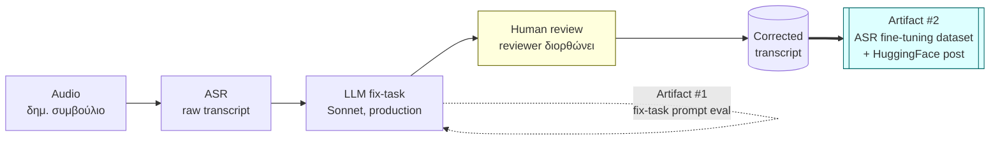
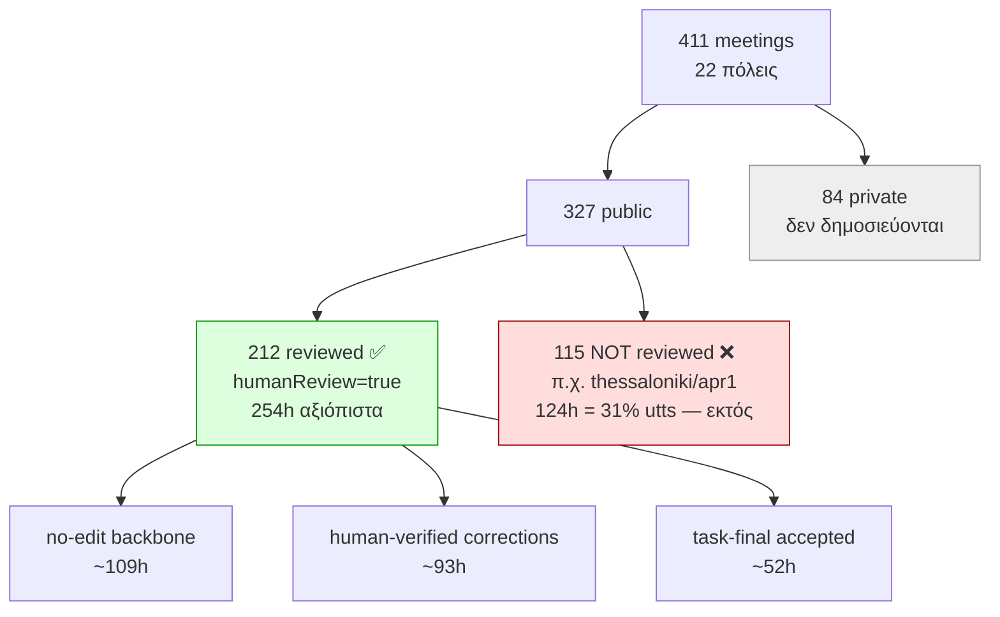
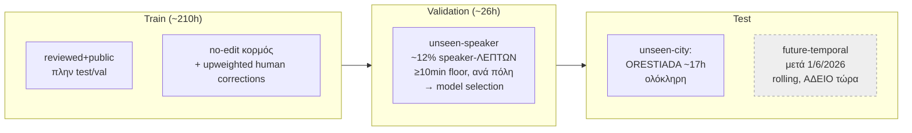

# OpenCouncil Greek ASR — dataset, metric & split report

**For the meeting of 2026-06-23.** Συνοπτική παρουσίαση των αποφάσεων, της
έρευνας του Σαββατοκύριακου, και των ευρημάτων πάνω στα πραγματικά δεδομένα.
Πηγές: `eval/` harness, `ui/static/coverage.json`, `docs/specs/dataset-split-and-publish-plan.md`,
`docs/decisions/metric-hir.md`.

> **Ατζέντα παρουσίασης (8 λεπτά, με τη σειρά):**
> 1. *Δύο artifacts, όχι ένα* (§1) — fix-task vs ASR dataset· το meeting αφορά το 2ο.
> 2. *Το metric: HIR = 28.1%* (§2) — αυτό θέλουμε να ρίξουμε· FPY = 1−HIR.
> 3. *Η παγίδα `humanReview`* (§3) — γιατί αποκλείουμε thessaloniki & 115 meetings.
> 4. *Τι έχουμε* (§4) — 254h reviewed, 544 speakers, 0 cross-city → split εύκολο.
> 5. *Πρόταση split* (§5) — **TEST=orestiada**, val 12% λεπτών, γιατί όχι το Notion.
> 6. *Open questions* (§8) — task_only, no-edit audit, normalization → συζήτηση.

---

## 1. Two things, not one

Ξεκαθαρίζουμε μια σύγχυση: δουλεύουμε **δύο διαφορετικά artifacts**.

- **#1 fix-task** = το LLM που καθαρίζει το ASR (ήδη production). Εκεί έτρεξε το
  glossary A/B του Σαββατοκύριακου.
- **#2 ASR fine-tuning dataset** = `(audio, corrected_text)` ζεύγη για fine-tune
  του ακουστικού μοντέλου. **Αυτό είναι το "post" + το split** που συζητάμε.

Το #1 τροφοδοτεί το #2 μόνο ως triage: μας λέει ποια λάθη τα πιάνει ήδη το LLM
(χαμηλή αξία ως ASR target) vs ποια είναι γνήσια ακουστικά (υψηλή αξία).

---

## 2. Το metric που προτείνουμε — Human Intervention Rate (HIR)

Το πραγματικό κόστος του project είναι **ο χρόνος του reviewer**. Ένας αριθμός το
παρακολουθεί:

> **HIR = (utterances που διόρθωσε άνθρωπος) / (σύνολο utterances)** σε ένα
> πλήρως reviewed meeting. Όσο πιο χαμηλό, τόσο καλύτερα. Στόχος: **να το ρίξουμε**.

Θετική εκδοχή (πιο "sexy"): **First-Pass Yield = 1 − HIR** = το ποσοστό που το
pipeline πετυχαίνει χωρίς κανένα ανθρώπινο άγγιγμα.

**Baseline σήμερα (212 reviewed meetings, ~395k utterances):**

| | τιμή |
|---|---|
| **Micro HIR** | **28.1%** (Wilson CI 28.0–28.3%* — *approx., assumes independence; clustered CI wider) |
| First-Pass Yield | ~71.9% |
| Macro HIR (μέσος/meeting) | 30.1% (διάμεσος 28%, p10 19% → p90 45%) |

Δηλ. σήμερα **~28 στα 100 utterances χρειάζονται ανθρώπινη διόρθωση** μετά το
αυτόματο pipeline. Πλήρης ορισμός + μαθηματική θεμελίωση: [metric-hir.md](../decisions/metric-hir.md).

---

## 3. Η κρυφή παγίδα στα labels — το `humanReview` gate

Ερώτηση από Discord: το `thessaloniki/apr1_2026` έχει >10 human-reviewed
utterances αλλά **δεν** είναι διορθωμένο εξ ολοκλήρου — το αποκλείουμε;
**Ναι.** Και βρήκαμε καθαρό, γενικό σήμα: `taskStatus.humanReview`.

Κρίσιμο γιατί: σε ένα μη-ολοκληρωμένο meeting, ένα `no-edit` utterance **δεν**
σημαίνει «το ASR ήταν σωστό» — σημαίνει «κανείς δεν το κοίταξε». Αν τα βάλουμε ως
ground truth, μαθαίνουμε λάθη στο μοντέλο.

⚠️ Ακόμα και τα `no-edit` σε reviewed meetings θέλουν **residual-WER audit**
(δείγμα + άνθρωπος) πριν τα εμπιστευτούμε 100% — δεν αυτοματοποιείται.

---

## 4. Τι έχουμε πραγματικά — dataset coverage

571k utterances από 327 public meetings, **~378h**, **544 ταυτοποιημένοι speakers**
(90.5% των utterances). Top πόλεις:

| πόλη | public | private | reviewed | ώρες | speakers | HIR |
|---|---|---|---|---|---|---|
| chania | 105 | 0 | 41 | 115.3 | 42 | 22.5% |
| athens | 44 | 13 | 44 | 74.9 | 122 | 33.1% |
| sparta | 37 | 2 | 37 | 28.6 | 35 | 25.5% |
| chalandri | 21 | 1 | 12 | 25.2 | 31 | 21.2% |
| zografou | 16 | 38 | 14 | 20.2 | 31 | 23.7% |
| samothraki | 10 | 0 | 10 | 18.7 | 16 | 37.9% |
| vrilissia | 10 | 22 | 10 | 18.4 | 28 | 25.3% |
| orestiada | 14 | 1 | 14 | 17.0 | 26 | 25.6% |
| argos | 32 | 1 | 20 | 16.7 | 32 | 28.5% |

(+ μακριά ουρά πόλεων με 1 meeting). Πλήρης πίνακας: `ui/static/coverage.json`
→ και νέο **stats page στο UI** (βλ. §7).

**Δύο ευρήματα που κάνουν το split εύκολο:**
1. **90.5%** utterances έχουν ταυτοποιημένο speaker → speaker-disjoint εφικτό.
2. **0 speakers** εμφανίζονται σε >1 πόλη → split ανά πόλη = **αυτόματα
   speaker-disjoint**, μηδέν cross-city leakage.

---

## 5. Πρόταση split (public-only, με strata)

- **TEST = orestiada (ολόκληρη)** — unseen city, ~17h, HIR 25.6% (αντιπροσωπευτικό),
  αυτόματα speaker+meeting-disjoint. Όχι samothraki (HIR 38% outlier).
- **Άλλαξε** από το Notion: βγάλαμε **Vrilissia** (private) → **Chalandri**· val
  με **λεπτά** όχι πλήθος speakers, **~12%** όχι 30%· unseen-city στο TEST όχι val.
- **Future-temporal test άδειο επίτηδες** — June meetings μπαίνουν αργότερα. Policy παγωμένο.
- Composition (Grok best-practice): ~**70–80% clean / 20–30% corrected**,
  **exclude/down-weight task-only**, **LoRA** αντί full fine-tune + rehearsal με
  γενικά ελληνικά (HParl) για να μη «ξεχάσει» το μοντέλο.

---

## 6. Έρευνα Σαββατοκύριακου — fix-task eval (τι μάθαμε)

A/B 1000 corrections, on-box Sonnet: **το glossary block ΔΕΝ βοηθάει συνολικά**
(52.8% → 51.3% edit-application). Βοηθάει **μόνο** στο `named_entity` (+9.9pp).
Held-out prompt-tuning: **στατιστικά μη σημαντικό** (HIR −2.0pp, McNemar p=0.44,
CI περνά το 0).

Routing που προέκυψε: `accent/punctuation` → rule-based normaliser·
`acronym` → κράτα για ASR finetune (ακουστικό)· τα υπόλοιπα → review.
→ **Συμπέρασμα:** το prompt-tuning μόνο του δεν δίνει αξιόπιστο κέρδος· η μόχλευση
είναι στο **ASR fine-tune** + στοχευμένο glossary μόνο για entities.

---

## 7. Τι ζητήθηκε & τι παραδίδουμε

| αίτημα | κατάσταση |
|---|---|
| thessaloniki/apr1 — αποκλεισμός; | ✅ Ναι· γενικός κανόνας `humanReview=false` → out |
| Metric ορισμός | ✅ HIR (= 28.1% baseline), [metric-hir.md](../decisions/metric-hir.md) |
| UI stats page (πόλεις/private/public) | 🔧 σε εξέλιξη — `/stats/coverage`, διαβάζει `coverage.json` |
| Report για το meeting | ✅ αυτό το έγγραφο |
| Speaker IDs από transcript | ✅ τραβήχτηκαν (544 speakers) |

---

## 8. Αποφάσεις — ξεκαθαρισμένα vs ανοιχτά

**Ξεκαθαρισμένα:** metric = HIR· test = temporal (rolling, άδειο τώρα)· train/val =
speaker+meeting-disjoint· `humanReview=true` gate για backbone & metric· βγάζουμε
Vrilissia, βάζουμε Chalandri· glossary όχι γενικό win· likely Whisper-v3-large + LoRA.

**Ανοιχτά για συζήτηση:**
- Residual-WER audit στα no-edit (χρειάζεται άνθρωπο) — πόσο εμπιστευόμαστε τον κορμό;
- task-only: exclude εντελώς ή weak/down-weighted tier;
- Audio normalization (per-meeting vs per-interval);
- Headline HIR: micro ή macro; κατώφλι "reviewed";
- Ablations: (A) label-source A/B/C/D, (B) generalization matrix — βλ. plan §reviewer-notes.

---

*Λεπτομερές σχέδιο + Grok/Codex reviews: [dataset-split-and-publish-plan.md](../specs/dataset-split-and-publish-plan.md).*
