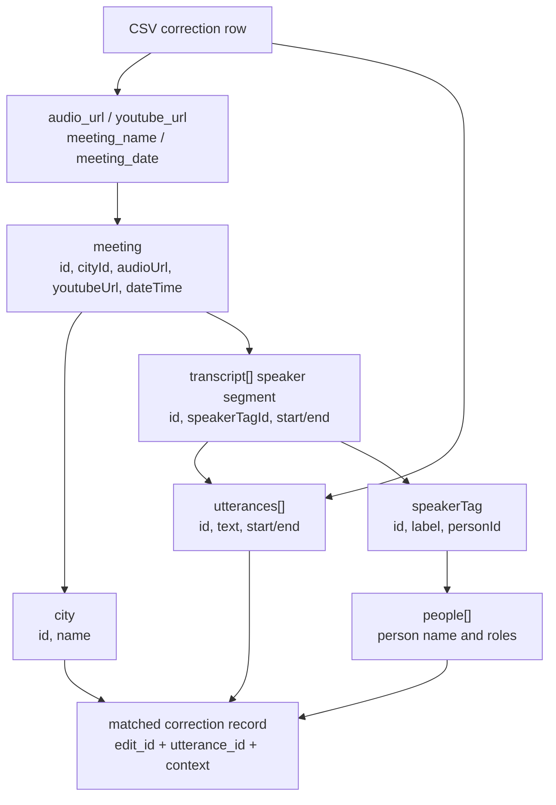

# OpenCouncil Meeting JSON

This note summarizes the large meeting JSON shape provided by the OpenCouncil transcript endpoint.

## Top-Level Shape

```text
{
  meeting,
  transcript,
  city,
  people,
  parties,
  subjects,
  speakerTags,
  taskStatus,
  transcriptHiddenForReview
}
```

For the dataset exploration UI, the most important fields are `meeting`, `city`, `transcript`, `people`, and `speakerTags`.

## Join Path



Update this diagram if the matching strategy changes or a dedicated endpoint/export replaces the large JSON join.

## Meeting

Useful fields:

- `id`
- `name`
- `dateTime`
- `youtubeUrl`
- `videoUrl`
- `audioUrl`
- `muxPlaybackId`
- `cityId`
- `administrativeBodyId`
- `administrativeBody`

Use for:

- matching CSV rows to a meeting;
- displaying meeting metadata;
- finding audio for playback.

## City

Useful fields:

- `id`
- `name`
- `name_en`
- `name_municipality`
- `timezone`
- `authorityType`

Use for:

- display;
- grouping stats;
- balanced sampling later.

## Transcript

The `transcript` array contains speaker segments.

Speaker segment fields:

- `id`
- `startTimestamp`
- `endTimestamp`
- `meetingId`
- `cityId`
- `speakerTagId`
- `speakerTag`
- `utterances`
- `topicLabels`
- `summary`

Use for:

- finding surrounding utterances;
- deriving speaker context;
- navigating previous/next utterances.

## Utterance

Useful fields:

- `id`
- `startTimestamp`
- `endTimestamp`
- `text`
- `drift`
- `speakerSegmentId`
- `uncertain`
- `lastModifiedBy`
- `discussionStatus`
- `discussionSubjectId`

Use for:

- matching CSV correction rows;
- displaying current transcript text;
- editable timestamp review;
- possible filtering by uncertain/discussion state.

## Speaker Tags and People

`speakerTag` gives a speaker label and `personId`.

`people` contains person records with:

- `id`
- `name`
- `name_short`
- `roles`
- `voicePrints`

Use for:

- displaying speaker/person names;
- grouping error patterns by speaker if useful;
- domain vocabulary analysis.

## Subjects

Subjects are useful later for domain/topic analysis, but they are not required for the first correction review screen.

Potential use:

- show agenda subject near the correction;
- analyze whether some subject types have more transcription errors;
- derive legal/administrative vocabulary.

## Matching CSV Rows to Utterances

Recommended first-pass matching:

1. Match meeting by `audio_url` to `meeting.audioUrl`, or `youtube_url` to `meeting.youtubeUrl`.
2. If needed, use `meeting_name` and `meeting_date` as fallback.
3. Within that meeting, find utterances whose `startTimestamp` and `endTimestamp` are close to CSV `utterance_start` and `utterance_end`.
4. Compare CSV `after_text` with `utterance.text`.
5. Assign a match confidence:
   - `exact`: meeting + timestamps + `after_text`/`utterance.text` match.
   - `time_near`: meeting + timestamps match, text differs.
   - `text_near`: meeting + similar text, timestamps differ slightly.
   - `ambiguous`: multiple plausible utterances.
   - `unmatched`: no plausible utterance.

This avoids needing a new API endpoint for the first prototype.
