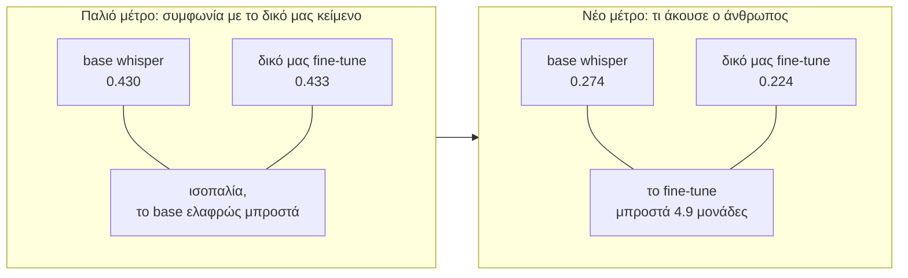

# Όταν αλλάζει η αναφορά, το fine-tune σταματάει να χάνει

2026-08-04. 32 παράθυρα των 20 δευτερολέπτων από 32 συνεδριάσεις που δεν έχει δει ποτέ
κανένα μοντέλο μας. Τα άλλα 16 μένουν κλειδωμένα. Base whisper και το δικό μας fine-tune,
τοπικά σε CPU, χωρίς GPU και χωρίς κόστος.

## Το ερώτημα

Επί μήνες μετράμε τα μοντέλα συγκρίνοντάς τα με το **δημοσιευμένο κείμενο της
OpenCouncil**. Χθες μάθαμε ότι αυτό το κείμενο διαφωνεί με έναν άνθρωπο που ακούει τον ήχο
κατά [17.5%](2026-08-04-audio-faithful-reference.md). Άρα το προφανές ερώτημα: αλλάζει το
συμπέρασμα αν βαθμολογήσουμε με βάση αυτό που **ακούγεται** αντί για αυτό που **γράψαμε**;

## Η απάντηση

| | παλιό μέτρο | νέο μέτρο |
|---|---|---|
| δημοσιευμένο κείμενο | (είναι το μέτρο) | 0.175 |
| base whisper | 0.430 | 0.274 |
| **δικό μας fine-tune** | 0.433 | **0.224** |

Στο μέτρο που χρησιμοποιούσαμε, τα δύο μοντέλα είναι ισόπαλα και το base είναι οριακά
μπροστά. Στο μέτρο του τι πραγματικά ειπώθηκε, **το fine-tune είναι 4.9 μονάδες
μπροστά**.

Το διάστημα εμπιστοσύνης είναι [−14.3, +0.6] μονάδες, δηλαδή περιλαμβάνει το μηδέν. Με 32
κλιπ και 1.236 λέξεις αυτό ήταν αναμενόμενο και το είχαμε γράψει από πριν: αυτό το σύνολο
μετράει τη **μετατόπιση** ανάμεσα στις δύο μετρικές, δεν διαχωρίζει μοντέλα που απέχουν μία
μονάδα. Τέσσερις μονάδες είναι στο όριο του τι μπορεί να δει.

Οπότε το σωστό είναι: **η κατεύθυνση αντιστρέφεται, το μέγεθος δεν είναι ακόμη
επιβεβαιωμένο.**

## Γιατί έχει σημασία

Το [postmortem του Ιουλίου](../handoff/2026-07-25-finetune-eval-postmortem.md) είχε
συμπεράνει ότι το fine-tune δεν νικάει το base. Αυτό μετρήθηκε με αναφορά το δημοσιευμένο
κείμενο, και αυτό ακριβώς μιμείται το fine-tune, αφού το 51.9% των δεδομένων εκπαίδευσης
είναι το ίδιο κείμενο.

Με άλλα λόγια, το παλιό μέτρο ρωτούσε «ποιο μοντέλο μοιάζει περισσότερο στον αγωγό μας;»
και το fine-tune δεν κέρδιζε ούτε σε αυτό. Το νέο ρωτάει «ποιο μοντέλο ακούει καλύτερα;» και
εκεί κερδίζει.

## Τι δεν λέει

Δεν λέει ότι το fine-tune νικάει το base γενικά. Ένα σύνολο, μία γλώσσα, ένας ακροατής,
διάστημα που περιλαμβάνει το μηδέν, και 20δευτερα παράθυρα χωρίς συμφραζόμενα που είναι
δυσκολότερα και για τα δύο μοντέλα από ό,τι τα δίλεπτα του benchmark. Γι' αυτό και τα
απόλυτα νούμερα εδώ, 0.22 και 0.27, είναι πολύ ψηλότερα από τα 0.13 με 0.15 του benchmark.

Δεν λέει ούτε ότι το δημοσιευμένο κείμενο είναι κακό. Στο ίδιο μέτρο βγάζει 0.175, δηλαδή
είναι καλύτερο και από τα δύο μοντέλα. Είναι ανθρώπινα διορθωμένο, απλώς όχι τέλειο, και το
πρόβλημα ήταν πάντα ότι το χρησιμοποιούσαμε ταυτόχρονα ως στόχο εκπαίδευσης **και** ως
κριτή.

## Τι ακολουθεί

Τα 16 κλειδωμένα κλιπ μένουν σφραγισμένα μέχρι να υπάρχει κάτι τελικό να ελεγχθεί.

Για να γίνει το 4.9 μονάδων ισχυρισμός αντί για ένδειξη, χρειάζεται περίπου δεκαπλάσιο
δείγμα: δύο με τρεις ώρες ανθρώπινης μεταγραφής αντί για δύο. Είναι το ίδιο τίμημα που
αναφέρθηκε χθες, τώρα όμως ξέρουμε ακριβώς τι αγοράζει.

---

## Η αλυσίδα

Οι αναφορές του Αυγούστου διαβάζονται με τη σειρά. Η τρέχουσα είναι σημειωμένη.

- [Γιατί το fine-tune χάνει από το base](2026-08-02-benchmark-diagnosis.md)
- [Ο συνδυασμός συστημάτων και τι τον κάνει](2026-08-02-asr-fusion.md)
- [Η επικάλυψη ως δείκτης λαθών](2026-08-03-overlap-screen.md)
- [Το αιτιακό πείραμα: η επικάλυψη κοστίζει 0.16](2026-08-03-synthetic-overlap.md)
- [Κόψιμο στις αλλαγές ομιλητή](2026-08-03-segmentation.md)
- [Η αναφορά είναι το δικό μας κείμενο](2026-08-03-the-reference-problem.md)
- [Επτά στις δέκα λέξεις που έλειπαν ειπώθηκαν](2026-08-04-reference-omissions.md)
- [200 ώρες συνεδριάσεων που δεν έχουμε αγγίξει](2026-08-04-public-meetings.md)
- [Διαφωνία με τον ήχο: 17.5%](2026-08-04-audio-faithful-reference.md)
- **Η κατάταξη αντιστρέφεται** (εδώ)
- [Σύνοψη: τι κάναμε και γιατί μετράει](2026-08-04-what-we-learned.md)
- [Το σχέδιο παράδοσης GSoC](../specs/gsoc-delivery-plan.md)
