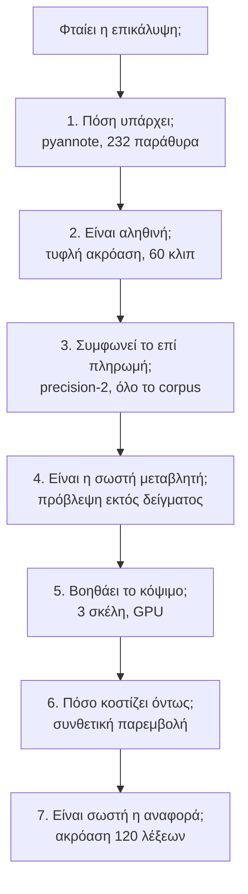
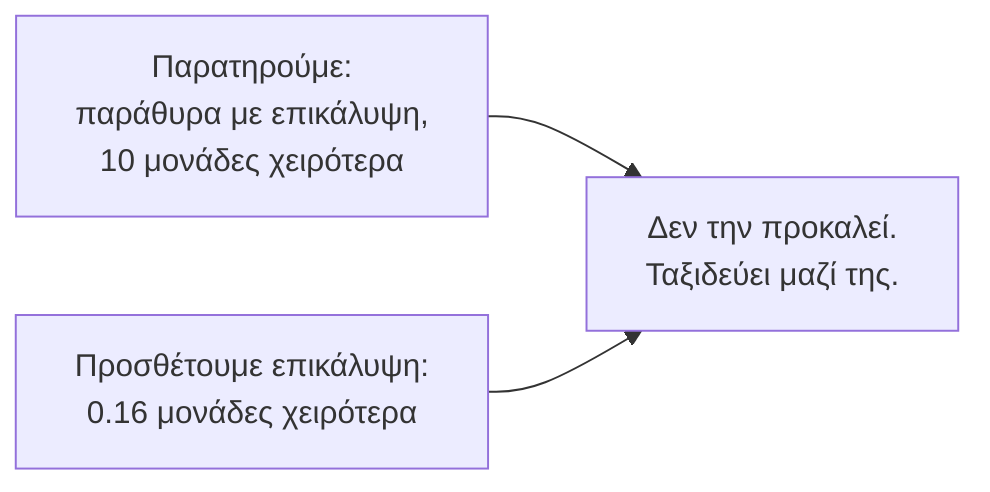
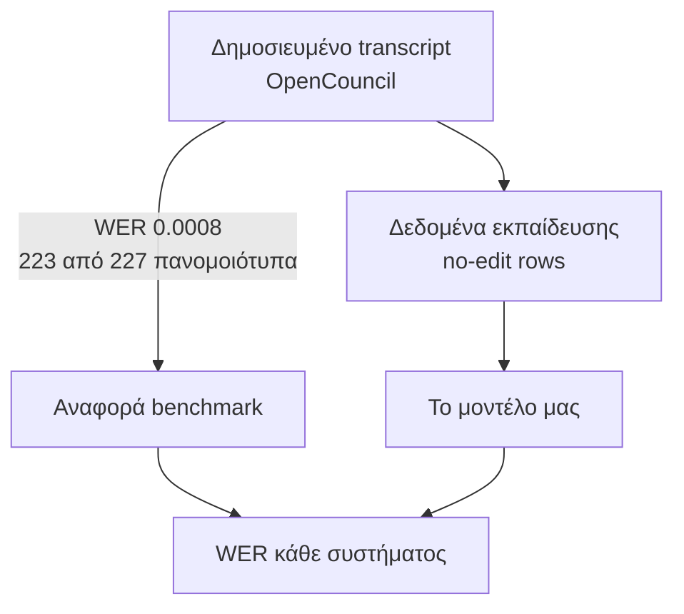

# Δύο μέρες κυνηγούσαμε την επικάλυψη και βρήκαμε ότι το μέτρο μας ήταν χαλασμένο

2026-08-04. Σύνοψη επτά πειραμάτων. Σελίδα με τα διαγράμματα:
[claude.ai/code/artifact/7db0fba4](https://claude.ai/code/artifact/7db0fba4-1229-40b9-ae7a-5be98f711c12)
(ιδιωτική μέχρι να μοιραστεί). Τα αναλυτικά είναι σε ξεχωριστές αναφορές. Εδώ είναι η
ιστορία, και γιατί έχει σημασία.

## Η ερώτηση

Φταίει η ταυτόχρονη ομιλία που το ASR μας κάνει λάθη; Αν ναι, υπάρχει ακριβή απάντηση,
εκπαίδευση Whisper με πληροφορία διαρισμοποίησης, και έπρεπε να ξέρουμε αν αξίζει πριν την
ξεκινήσουμε.

## Τι βρήκαμε

Η επικάλυψη είναι σπάνια, μόλις 2.2% του χρόνου ομιλίας, αλλά φαίνεται πολύ ένοχη. Τα
παράθυρα του υψηλού τεταρτημορίου βγάζουν περίπου 10 μονάδες WER χειρότερα, και στα επτά
συστήματα. Μοιάζει με απόδειξη. Είναι συσχέτιση, και τα ίδια παράθυρα είναι επίσης πιο
θορυβώδη και πιο γρήγορα.

Ο ανιχνευτής πάντως δεν φταίει. Σε τυφλή ακρόαση 60 κλιπ, όπου το pyannote είπε «μιλάνε δύο
μαζί», μιλούσαν δύο μαζί. Σαράντα στα σαράντα. Το επί πληρωμή precision-2 συμφώνησε κι αυτό
40/40 και επιβεβαίωσε 19 από τα 20 καθαρά. Δεν υπάρχει τίποτα να αγοράσουμε εκεί.

Η επικάλυψη όμως δεν είναι η σωστή μεταβλητή. Τη συγκρίναμε με την πυκνότητα εναλλαγών
ομιλητή ως προβλεπτικούς δείκτες, εκτός δείγματος. Η πυκνότητα εναλλαγών προσθέτει
πληροφορία που η επικάλυψη δεν έχει. Και η επικάλυψη, αν ήδη ξέρεις τις εναλλαγές,
χειροτερεύει την πρόβλεψη. Τα διαστήματα αποκλείουν το μηδέν και στις δύο κατευθύνσεις.

Το φθηνό φάρμακο δεν πλήρωσε. Κόψαμε τον ήχο στις αλλαγές ομιλητή αντί σε αυθαίρετα σημεία,
με σκέλος ελέγχου που κόβει το ίδιο πλήθος κομματιών μακριά από κάθε αλλαγή. Διαφορά
0.0015, με διάστημα που περιέχει άνετα το μηδέν. Το πού κόβεις δεν έχει σημασία.

Και μετά η αιτιακή απάντηση. Βάλαμε πραγματικό δεύτερο ομιλητή μέσα σε καθαρό ήχο, στη
φυσική του συχνότητα, με την αναφορά αμετάβλητη. Κόστος: 0.16 μονάδες WER. Η πύλη που
είχαμε παγώσει πριν από το πείραμα ζητούσε 2.0.

Το χάσμα ανάμεσα στο 10 και στο 0.16 ήταν το πραγματικό εύρημα εκείνης της μέρας. Η
ταυτόχρονη ομιλία δεν προκαλεί τα λάθη που συμβαίνουν στα παράθυρα με ταυτόχρονη ομιλία.
Το DiCoW έκλεισε πριν ξοδέψουμε ώρα GPU πάνω του.

## Μια λεπτομέρεια που δεν έδενε

Το Soniox έβγαζε πέντε φορές περισσότερες περιττές λέξεις στα παράθυρα με επικάλυψη. Ή
παραληρούσε, ή έλεγε αλήθεια που η αναφορά μας δεν είχε. Το κυνηγούσαμε δύο μέρες σαν
παραξενιά ενός παρόχου.

Τελικά έλεγξα κάτι που κανείς δεν είχε σκεφτεί να ελέγξει. Τι ακριβώς είναι η «ανθρώπινη
αναφορά» του benchmark;

Είναι το ίδιο κείμενο. Η αναφορά είναι το δημοσιευμένο transcript. Άρα κάθε WER στο project
μετράει απόσταση από τη δική μας έξοδο, όχι από αυτό που ειπώθηκε. Και εκπαιδεύουμε πάνω
στο ίδιο κείμενο. Ο κύκλος κλείνει στον εαυτό του και δεν το είχε δει κανείς.

## Πόσο λάθος είναι

Δεν χρειάστηκαν ώρες μεταγραφής. Όπου το Soniox και το Scribe βγάζουν ανεξάρτητα την ίδια
λέξη που η αναφορά δεν έχει, η λέξη είναι υποψήφια παράλειψη. Δύο συστήματα να φαντάζονται
την ίδια ελληνική λέξη στο ίδιο σημείο είναι απίθανο. Πήραμε 120 τέτοιες λέξεις, ένα κλιπ
δέκα δευτερολέπτων η καθεμία, μία ερώτηση: ακούγεται;

| απάντηση | πλήθος |
|---|---|
| ναι | 79 |
| όχι | 33 |
| δεν ξέρω | 8 |

Το 70.5% ήταν πραγματικές, με διάστημα από 62% έως 79%. Στο σύνολο του corpus αυτό είναι
1.68% των λέξεων της αναφοράς που ειπώθηκαν και λείπουν. Και είναι κατώτατο όριο, γιατί
μετράει μόνο ό,τι έπιασαν και τα δύο κορυφαία συστήματα.

Το πρόστιμο δεν μοιράζεται δίκαια. Κάθε τέτοια λέξη, όταν ένα σύστημα τη μεταγράφει σωστά,
χρεώνεται ως λάθος:

| σύστημα | άδικο πρόστιμο σε μονάδες WER |
|---|---|
| Scribe | 1.68 |
| Soniox | 1.68 |
| δικό μας | 1.00 |
| whisper-large-v3 | 0.94 |
| Gladia | 0.84 |
| greek-whisper-v3-turbo | 0.53 |

Όσο καλύτερα ακούει ένα σύστημα, τόσο περισσότερο το τιμωρεί το benchmark μας.

## Γιατί έχει σημασία

Το μέτρο μας δεν είναι ακρίβεια, είναι συμφωνία με το προϊόν μας. Θεμιτή μετρική, αλλά τη
διαβάζαμε ως ακρίβεια επί μήνες. Κάθε σύγκριση μοντέλων που κάναμε κουβαλάει μια μετατόπιση
που τώρα ξέρουμε, και δεν είναι ίδια για όλα τα συστήματα.

Πιο σοβαρό: εκπαιδεύουμε το μοντέλο να παραλείπει. Τα no-edit rows είναι το δημοσιευμένο
κείμενο. Αν αυτό χάνει 1.7% των λέξεων, συγκεντρωμένες εκεί που μιλάει παραπάνω από ένας,
τότε διδάσκουμε στο μοντέλο να μην ακούει αυτόν που διακόπτει. Είναι μαθημένη συμπεριφορά,
όχι θόρυβος, και περισσότερα δεδομένα του ίδιου είδους τη βαθαίνουν.

Το καλό είναι ότι η ίδια μέθοδος που το μέτρησε είναι και μέθοδος επιδιόρθωσης. Όπου δύο
ανεξάρτητα συστήματα συμφωνούν σε λέξη που λείπει, είναι 70% πιθανό να είναι πραγματική.
Επιστρέφοντάς τες στα transcripts διορθώνονται μαζί οι στόχοι εκπαίδευσης και η αναφορά του
benchmark, με κόστος περίπου ένα ανθρώπινο δευτερόλεπτο ανά λέξη.

## Δύο πράγματα για το πώς δουλεύουμε

Τα σκέλη ελέγχου έσωσαν πείραμα. Στην τμηματοποίηση, τα κομμένα σκέλη βγήκαν 6 μονάδες
χειρότερα από το ολόκληρο παράθυρο, και αυτό ήταν δικό μας σφάλμα στο ράψιμο των κομματιών,
όχι εύρημα για το Whisper. Το κατάλαβα μόνο επειδή το σκέλος ελέγχου κουβαλούσε το ίδιο
σφάλμα και ακυρωνόταν στη σύγκριση. Χωρίς αυτό θα είχα γράψει ανοησία με σιγουριά.

Και οι παγωμένες πύλες δούλεψαν. Το συνθετικό πείραμα είχε κατώφλι γραμμένο πριν υπάρξουν
δεδομένα, και απέτυχε κατά δώδεκα φορές. Αν το κατώφλι είχε γραφτεί μετά, το 0.16 «με
κατεύθυνση που συμφωνεί με τη θεωρία» θα ήταν πολύ εύκολο να παρουσιαστεί ως ενθαρρυντικό.

## Τι μένει ανοιχτό

Δεν ξέρουμε ακόμη τι κάνει δύσκολα εκείνα τα παράθυρα. Η πυκνότητα εναλλαγών είναι ο
καλύτερος δείκτης που έχουμε και η αφελής αξιοποίησή της δεν πλήρωσε.

Η ακρόαση έγινε από έναν άνθρωπο, τον ίδιο που έχτισε το project. Το 70% αρκεί για να
ξέρουμε ότι το πρόβλημα υπάρχει και είναι μεγάλο. Δεν αρκεί για να ξαναγράψουμε δεδομένα με
βάση του.

Το επόμενο φθηνό βήμα είναι το αντίστροφο ερώτημα. Από τις 33 που δεν ειπώθηκαν, υπάρχει
μοτίβο που τις προβλέπει χωρίς ακρόαση; Αν ναι, η επιδιόρθωση γίνεται αυτόματη.

## Κόστος

| | |
|---|---|
| GPU | 0.62 ευρώ, μία A4500, δύο πειράματα |
| API | 12 λεπτά ήχου και 9.3 ώρες σε precision-2 |
| LLM | 500 κλήσεις sonnet στο πείραμα σύντηξης |
| ανθρώπινος χρόνος | περίπου 1.5 ώρα ακρόασης |

## Αναλυτικά

- [Η επικάλυψη ως δείκτης](2026-08-03-overlap-screen.md)
- [Το συνθετικό πείραμα](2026-08-03-synthetic-overlap.md)
- [Η τμηματοποίηση](2026-08-03-segmentation.md)
- [Το πρόβλημα της αναφοράς](2026-08-03-the-reference-problem.md)
- [Οι παραλείψεις της αναφοράς](2026-08-04-reference-omissions.md)
- [Η σύντηξη συστημάτων](2026-08-02-asr-fusion.md)
