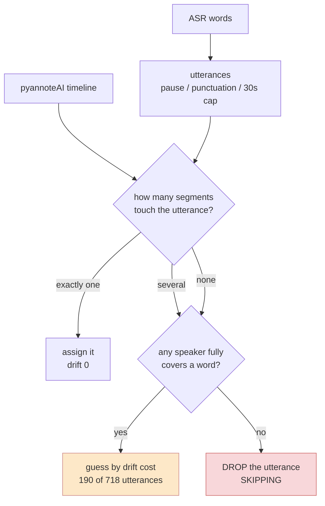
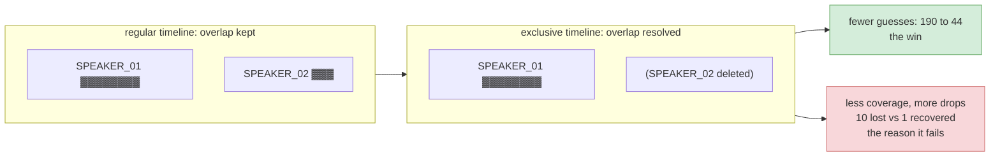

# pyannoteAI `exclusive` diarization: passes the screen, fails the production gate

Preregistered in [`docs/specs/exclusive-diarization-preregistration.md`](../specs/exclusive-diarization-preregistration.md),
frozen 2026-08-07 before any Phase 1 job was submitted. Freeze record
`~/.cache/oc-overlap/exclusive_freeze.json`, sha256
`27e5c2667516a41779ed9cabe4624dde44db2868ed1ca67f0b60217cb7ed6733`.

**Verdict: no issue, no PR.** Phase 1 passed all five conditions. Phase 2 failed the
drop-safety condition on the objective counts alone: the one-sided 95% upper bound on
net lost utterances is +1.94 per 100, where the frozen gate required below +0.5. Under
the preregistration that ends it. `exclusive: true` is not proposed to
`schemalabz/opencouncil-tasks`.

The useful part is why it fails, because the failure points at a change that would
work.

## What the experiment was actually looking at

Production never takes speakers from the diarizer directly. It builds utterances from
ASR words, then asks the timeline who covers them. Every number below lives in that
question.

The guess branch is what the experiment set out to shrink. Production picks a speaker
by a distance heuristic there, because the timeline is ambiguous. The drop branch is
what ended it.

Exclusive mode does not redraw the boundary between two speakers. It deletes the
shorter one. That one behaviour causes both the win and the failure: fewer competing
segments means fewer ambiguous utterances, but also less timeline, and production
reads missing timeline as a missing utterance.

## What exclusive mode actually does

Phase 0, three arm-C synthetic mixtures, each submitted with and without the flag.

`output.exclusiveDiarization` is a list of `{speaker, start, end}`, the same shape as
`output.diarization`, returned alongside it by a single call. Overlaps are resolved by
deleting the shorter speaker's segment and leaving the longer speaker's segment uncut.
In `win_argos_dec23_2025_581922` the regular timeline has `SPEAKER_01` from 72.905 to
76.185 with `SPEAKER_02` from 73.025 to 74.525 sitting inside it. The exclusive
timeline has only the `SPEAKER_01` span. Segment counts never rose (46 to 46, 42 to
41, 52 to 45) and main-speaker segments outside the event were untouched (35/35,
18/18, 21/21).

Deletion, not splicing. Everything below follows from that.

## Phase 1, synthetic screen: pass

95 items across three conditions (arm A exclusive, arm C exclusive, arm C unflagged)
gives 285 jobs. Zero failures, $1.18 of API spend against a $20 cap.

| condition | frozen threshold | result | |
|---|---|---|---|
| main-speaker absorption (arm C, exclusive) | ≥ 0.80 | 0.990 [0.968, 1.000] | pass |
| absorption beats the status quo | ≥ regular | 0.990 vs 0.958 | pass |
| fragmentation medians | ≤ 1.2 | 1.00 and 1.00 | pass |
| fraction of items above 1.2 | ≤ 0.10 | 0.011 and 0.011 | pass |
| merge simulation, guess + drop | ≤ regular | 211 vs 238 | pass |

The interval is a cluster bootstrap over the 72 target meetings. One item failed on
label mapping and was scored worst-case, as preregistered. None were excluded.

The regular timeline came back byte-identical with and without the flag in 95 items
out of 95. Phase 0 could only suggest that over three; it now holds across the corpus,
which is what makes the one-call-per-item design and the paired Phase 2 comparison
legitimate.

The merge simulation already showed the shape of the problem, before any Phase 2
number existed: guesses fell from 73 to 17 while drops rose from 165 to 194. Net
better, so the gate passed, but the trade was visible from the start.

## Phase 2, real windows and production's own logic: fail

25 highest-turn-density benchmark windows, 718 Whisper utterances, replayed twice
through a port of `findBestSpeakerForUtterance` pinned to `opencouncil-tasks` commit
`5ff16a3c`. The port is checked differentially against the real TypeScript under
`tsx`: 2,009 fixtures, exact agreement on branch, speaker and drift, including the
`reduce`-without-initial-value behaviour and the `Set`-ordering tie-break. This is
their algorithm, not a description of it.

### The good number

Guess-branch utterances fall from 190 to 44. Three quarters of the cases where
production currently picks a speaker by drift heuristic instead of reading it off the
timeline stop being ambiguous. On the corpus's most contested audio that is a large
effect, and it is not in dispute: it is a deterministic property of the two timelines,
with no human judgment involved.

### The number that ends it

| paired outcome | count |
|---|---|
| both variants keep the utterance | 696 |
| both drop | 11 |
| regular drops, exclusive keeps (recovery) | 1 |
| regular keeps, exclusive drops (regression) | 10 |

Net +1.25 lost utterances per 100, window-clustered one-sided 95% upper bound +1.94.
The gate required below +0.5. It misses by a factor of four, and the point estimate
alone is already over the threshold, so more windows would not fix this.

The mechanism is the one Phase 0 identified. `findBestSpeakerForUtterance` drops an
utterance when no speaker fully covers any of its words. Deleting the overlapped
speaker's segments removes coverage. Usually the survivor covers the words anyway,
696 times out of 718, but when the deleted segment was the one covering an utterance's
words, that utterance stops being attributable and `applyDiarization.ts` discards it.
Exclusive mode buys attribution certainty by throwing away timeline, and production's
skip rule turns missing timeline into missing transcript.

### Attribution quality

51 utterances got a different speaker under the two timelines. 50 were sampled per the
frozen seed and 49 built (one had no usable voice anchor). The blinded listening
package is prepared and served, and the result will be appended here.

It cannot change the verdict, since gate 3 failed on counts that need no listener. It
decides something else, and after the repair below it decides more than it did when it
was built: whether the drop from 190 guesses to 44 is a real quality gain, and
therefore whether the both-timelines variant is worth proposing at all. If those 51
changed attributions are no better than the status quo's, the hybrid is churn.

The instrument runs exactly as preregistered rather than being re-cut now that the
gate is known to fail.

## What this does and does not say

Licensed by these numbers: exclusive mode resolves overlap by deletion; it does not
fragment the timeline; it removes three quarters of the drift-heuristic guesses; and
as a drop-in flag it costs about one utterance per hundred on contested audio.

Not licensed, and not claimed anywhere above: any WER effect (not measured, and the
overlap screen put the causal WER cost of overlap at 0.16 points, so there was never
much to find); any behaviour on `/identify` with voiceprints, which is what production
actually calls, since this ran on `/diarize`; any statement about Scribe words, since
faster-whisper stood in for them and the absolute drop count is therefore not
production's count; and anything about the roughly 98% of speech time with no overlap.
The 25 windows were selected to be the worst case in the corpus, deliberately.

The Whisper-for-Scribe substitution is the main threat to the headline number. Both
variants saw the identical utterance set, so the paired comparison is internally
valid, but a different segmenter would produce a different absolute rate of lost
utterances. The direction, where deletion costs coverage and lost coverage becomes
drops, is a property of production's skip rule and does not depend on which ASR
produced the words.

## The repair, measured (post-hoc, not preregistered)

The failure is not in exclusive mode. It is in the interaction between deletion and a
skip rule that reads "no covering segment" as "no utterance". Decouple those and the
trade disappears: assign from the exclusive timeline, and when it yields nothing, fall
back to the regular one. Both timelines arrive in the same API response, so this costs
nothing extra.

That is one line in the replay, and the data to test it was already on disk:

| | drops | guess branch |
|---|---|---|
| regular (status quo) | 12 | 190 |
| exclusive (the failed proposal) | 21 | 44 |
| both, exclusive first | 11 | 46 |

The fallback fires 10 times in 718 utterances.

Read the two columns differently, because they are not the same kind of claim. The
drop column is **arithmetic, not evidence**: the hybrid discards an utterance only
when both timelines discard it, so its drop count can never exceed the regular one.
11 versus 12 is a theorem with a worked example, and the bootstrap interval on it
means nothing. Do not sell it as a measured improvement.

The guess column is the empirical part. 190 down to 46 is a real property of these
timelines, and it is the only thing the hybrid actually buys.

`eval/controlled_eval/exclusive_hybrid_probe.py`. This is exploratory and carries no
gate. It was written after Phase 2 had already failed, on the same data that produced
the failure, and a rule tuned on the cases it is scored against will always flatter
itself. What it establishes is that a follow-up experiment is worth designing, not
that the change is safe to ship.

One thing it does not settle: the hybrid's entire value is that its 51 changed
attributions are better than the status quo's. That is exactly what the blinded
listening answers, and it is the only thing standing between this and a real
proposal.

### Held-out replication, and how much smaller the effect gets

Ranks 26 to 50 by turn density, 538 utterances, windows the rule was never tuned on.
The prediction was committed before the run (`exclusive_holdout_check.py`): a genuine
effect should reduce the guess branch by 60% or more.

| | top-25 windows | held-out 26-50 |
|---|---|---|
| guess reduction | 76% (190 to 46) | **78% (36 to 8)** |
| guess rate under the status quo | 26.5% of utterances | **6.7%** |
| utterances whose speaker changes | 7.1% (51 of 718) | **1.1% (6 of 538)** |
| drops (regular / hybrid) | 12 / 11 | 14 / 13 |

The mechanism replicates almost exactly. The amount of work it does does not.

Turn density in the top-25 runs from 41.5 down to 23.3 per minute; ranks 26 to 50
span 23.1 to 20.9, against a corpus median of 17.2 over 232 windows. One rank step
outside the extreme tail and the guess rate falls by a factor of four, and the number
of attributions the change actually touches falls by a factor of six.

So the honest size of the prize is: a real and free mechanism, doing meaningful work
on a thin tail of unusually contested meetings and very little elsewhere. Both things
are true and the second is the one that gets left out of a pitch.

## Artefacts

Scripts under `eval/controlled_eval/`: `exclusive_diar_api.py`, `_probe.py`, `_run.py`,
`_analyze.py`, `exclusive_cost_check.py`, `oc_merge_port.py`, `oc_merge_oracle.mts`,
`test_oc_merge_port.py`, `exclusive_phase2_asr.py`, `_run.py`, `_replay.py`,
`_analyze.py`, `build_exclusive_audit.py`, `exclusive_hybrid_probe.py`,
`exclusive_freeze.py`. Aggregates in `results_exclusive_phase1.json`,
`results_exclusive_phase2.json` and `results_exclusive_hybrid_probe.json`. Raw API
output, timelines and transcripts stay under `~/.cache/oc-overlap/` and never enter
git.
