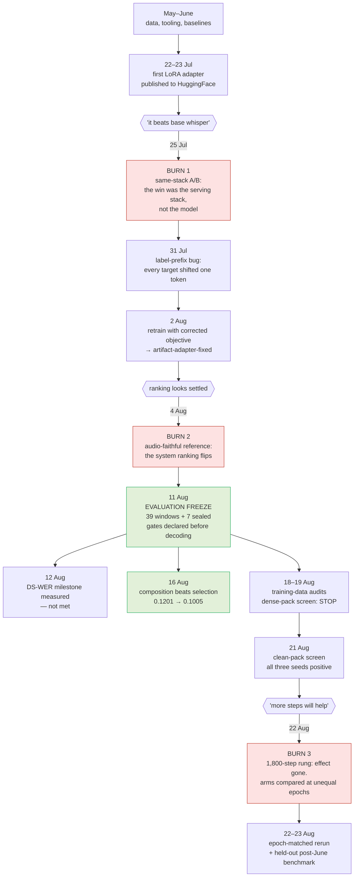

# What actually happened, June to August 2026

A timeline of the GSoC work on Greek council ASR: the experiments that mattered,
the three measurement mistakes that redirected it, and what each one produced.

Every row traces to a record in [`research/ledger.json`](../../research/ledger.json)
or a dated report in [`docs/reports/`](.). Dates are the dates work closed, not the
dates it was written up.

## The shape of it

## The three burns

Each one was a number that said the work was going well when it was not. None of
them was a coding bug in the usual sense; all three were measurement mistakes.

### 1. The false win over base whisper (23–25 July)

The first benchmark run reported that the fine-tune beat base whisper-large-v3.
It did not. The two models were served through different decoder stacks, and the
gap was the stack. `exp-2026-07-23-benchmark-first` is marked SUPERSEDED for
exactly this reason.

**Cost:** the corrected comparison did not land until 10 August
(`exp-2026-08-10-benchmark-fixed-adapter`) — eighteen days in which a wrong
result shaped what got tried next.

**Produced:** the rule that no two systems are ever compared across two stacks.

### 2. The reference was not the audio (4 August)

Scoring against OpenCouncil's own published transcripts measures agreement with
the product, not fidelity to what was said. When an audio-faithful reference was
built instead, the system ranking flipped (`exp-2026-08-04-ranking-flips`).

**Produced:** the two metrics were split and never merged again — *fidelity-to-audio*
decides, *agreement-with-OpenCouncil* records product compatibility and decides
nothing. Also the human-verified gold set (`exp-2026-08-16-gold-set`).

### 3. Steps are not epochs (22 August)

A clean-pack recipe won on all three seeds at 300 steps. Scaling to 1,800 steps
dissolved the effect. The arms had been matched on optimiser steps while their
training packs differed in size, so they had seen 2.00 and 0.71 epochs
respectively — the comparison was never like-for-like.

**Produced:** the epoch-matched 619-step rerun, and a causal claim withdrawn from
a report that had already been written.

### The one bug that was a bug, and cost almost nothing

On 31 July every fine-tune to date was found to have trained on targets shifted by
one token. `WhisperTokenizer.bos_token_id` is `<|endoftext|>` (50257), not
`<|startoftranscript|>` (50258) — the guard that was supposed to strip the prefix
was never true.

Six paired LoRA runs measured what it cost: **+0.0018 WER on average, with an
inconsistent sign**. It was worth a retrain because the objective was wrong, not
because it had damaged accuracy.

This is the contrast worth keeping: an invalid training objective cost roughly
nothing, while three arithmetically correct numbers cost weeks.

## What the gate changed

After the second burn, nothing was trained on a GPU until it had passed a
declared screen. The gate (`docs/decisions/training-evidence.md`) requires, in
order:

1. An evaluation set frozen **before** any arm it judges is decoded.
2. The decode config frozen before a number is seen — no adopting whichever beam size wins.
3. Paired seeds, with the deletion rate watched alongside WER, because a model that
   lowers WER by omitting hard passages looks better and is worse.
4. A single-window domination check. One window had already supplied 67% of a
   headline effect once.
5. Seven temporal holdout windows that stay sealed. No experiment ever passed a
   gate that would have released them.

Five training arms were stopped at a screen instead of being promoted to a full run:
`exp-2026-08-10-packed-training`, `exp-2026-08-18-clean-data-filter-census`,
`exp-2026-08-19-dense-screen-300`, `exp-2026-08-19-overlap-clean-selection`, and
`exp-2026-08-22-clean-pack-medium`. Each is CLOSED with its negative result recorded,
not left open as an untested idea.

## Results the timeline produced

| finding | where | status |
|---|---|---|
| Composition beats selection: word-level fusion of three ASR hypotheses, 0.1201 → 0.1005 | `exp-2026-08-16-composition-over-selection` | strongest positive result of the project |
| DS-WER on domain terms: ours 0.4880 vs Soniox 0.3280 | `exp-2026-08-12-ds-wer` | proposal milestone, **not met** |
| Name errors are 90 substitutions to 28 deletions — the name is present, wrong by a character or two | `exp-2026-08-11-error-analysis` | redirected the work toward decoding, not more data |
| Deletion-targeted training, external Greek packs, dense 30s packing | Aug 13–19 | all negative, all recorded |
| Clean-pack contiguous recipe wins on all three seeds by **deleting less** | `exp-2026-08-22-epoch-matched-armb` | positive, epoch-matched |

## The uncomfortable one

The project's own benchmark is what convinced the team that no fine-tune of
whisper-large-v3 was going to close the gap, and OpenCouncil moved production to
ElevenLabs Scribe v2 during the summer.

On the 391-window held-out post-June set, in agreement-with-OpenCouncil WER:

| system | WER |
|---|---|
| Gladia — the baseline named in the proposal | 0.2085 |
| Scribe v2 — what the product runs now | 0.1339 |

That is a **35.8% relative reduction in transcription errors** in the product.
It is not our model. The measurement that drove the decision is ours.
