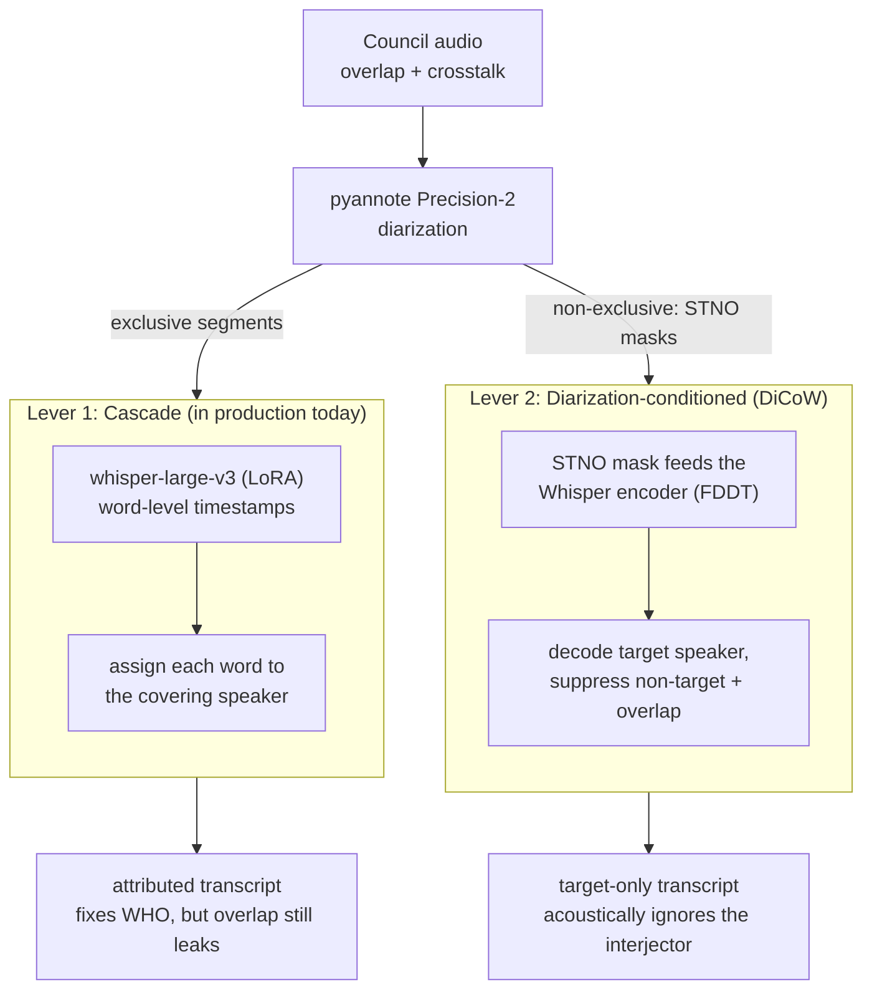
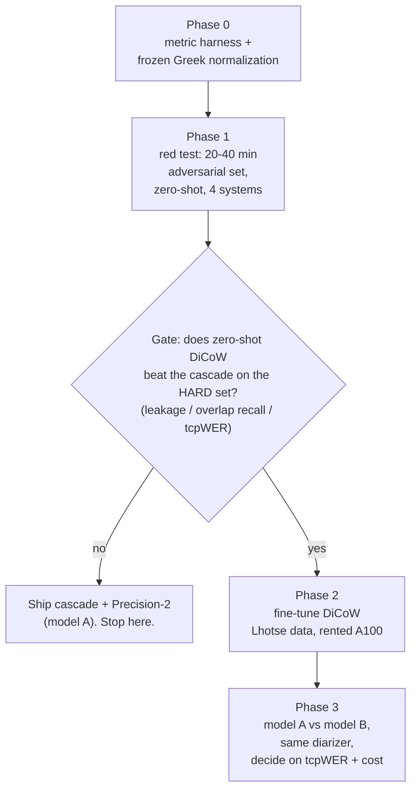

# Diarization-Conditioned & Speaker-Attributed ASR: Review and Integration Plan

Date: 2026-06-27
Status: research note, feeds a future (optional) roadmap phase. Not committed work.

---

## Σύνοψη στα Ελληνικά (TL;DR)

Ερώτημα: μπορούμε να εκμεταλλευτούμε ένα καλό diarization ώστε το Whisper να μεταγράφει **μόνο**
τον target ομιλητή κάθε segment, αγνοώντας crosstalk/overlap; Και να το μετρήσουμε σωστά;

- **Το diarization μόνο του δεν αρκεί.** Το pyannote λέει «ποιος/πότε», δεν κάνει το Whisper να
  κωφεύει ακουστικά στον διπλανό. Το cascade (pyannote → segments → Whisper) διορθώνει *ανάθεση*,
  όχι την επικάλυψη.
- **Το crosstalk το λύνει το diarization-conditioning** → **DiCoW / SE-DiCoW** (Brno): παίρνει την
  έξοδο του pyannote ως STNO μάσκες και τις περνά μέσα στον encoder. Έτοιμα βάρη + κώδικας, δέχεται
  οποιοδήποτε pyannote `Annotation`.
- **Μετρική:** tcpWER / cpWER (MeetEval) + δική μας μετρική «leakage». Όχι DER ως decision metric
  (δεν έχουμε frame-level ground truth).
- **Precision-2:** αφού πληρώνουμε ήδη pyannote, βελτιώνει cascade *και* DiCoW, και λύνει το
  licensing (DiariZen = CC BY-NC· pyannote premium + DiCoW = εμπορικά καθαρό).
- **Δεν υπάρχει Greek benchmark** για target-speaker ASR: το κενό/ευκαιρία μας.

Σχέδιο: πρώτα μετρική + μικρό «δύσκολο» test set, **zero-shot** δοκιμή DiCoW. Ακριβό full
fine-tune **μόνο αν** περάσει αυτό το φτηνό gate. Στο τέλος, model A (cascade) vs model B (DiCoW),
ίδιος diarizer.

---

## 1. The problem and the two levers

Council audio is the hard case: many speakers, a chair cutting over a councillor, two people at
once, off-mic muttering, applause. Our fine-tuned `whisper-large-v3` (LoRA) already beat the
zero-shot baseline on plain speech (val WER 33 to 27), but plain Whisper has no notion of "who."
Hand it an overlap and it transcribes whatever is loudest, or blends both. That is the wall.

There are two distinct levers, and they are not interchangeable.

**Lever 1 (cascade)** runs diarization and Whisper separately, then assigns each word to whichever
speaker's segment covers it. This is what OpenCouncil runs today, and what pyannoteAI's own
[meeting-transcription guide](https://www.pyannote.ai/blog/multi-speaker-meeting-transcription-pyannoteai-whisper)
describes. It fixes attribution and boundaries. It does not make Whisper ignore an overlapping
voice, and pyannote says so directly: the guide lists "overlapping speech poorly handled" and
"timestamp drift 100-300 ms" as known limits.

**Lever 2 (conditioning)** feeds the diarizer's output into the recognizer's encoder as a per-frame
mask and trains the recognizer to attenuate non-target and overlap acoustically. This is the part
that zones out the interjector, and it needs a specific architecture (DiCoW), not just a sharper
diarizer in front of vanilla Whisper.

The rest of this note is mostly about Lever 2, since Lever 1 is already in production and its
limits are known. But the plan keeps both, because Lever 1 is the baseline we have to beat.

---

## 2. The metric question (settle this first)

The field has converged on one metric family, computed with one toolkit
([MeetEval](https://github.com/fgnt/meeteval)). These are the ones that matter for us:

| Metric | What it measures | Needs |
|---|---|---|
| **WER / CER** | Pure recognition, speaker ignored | transcript only |
| **cpWER** | Concatenated min-permutation WER: best speaker assignment, then WER. Penalizes recognition *and* attribution | per-speaker transcript |
| **tcpWER** | cpWER with a time collar (papers use 5 s). The standard joint "who/what/when" score | per-speaker transcript + times |
| **Δcp** = cpWER − WER | The penalty from attribution errors alone. Cheap proxy | derived |
| **DER** | Diarization Error Rate (missed + false-alarm + confusion time). The diarizer's own score | frame-level reference |

We have corrected utterance transcripts with start/end times and speaker labels. That is enough for
cpWER and tcpWER, but **not** for true DER, which needs frame-level reference activity. So DER must
not be a deployment-decision metric for us. If we report a transcript-span agreement number, we name
it honestly and do not call it DER.

The thing the brief actually asked for, "what fraction of words landed on the wrong speaker," is not
one off-the-shelf number. cpWER/tcpWER expose part of it. For the crosstalk goal, add a small
**custom leakage suite** on a hand-checked overlap set:

- **target leakage** = non-target words inserted into the target transcript ÷ reference target words
- **overlap recall** = target words correctly recovered inside marked overlap regions
- **empty-target false-alarm** = words hallucinated for a speaker who is silent in the window

A 5-second collar can hide leakage, so these three are what tell us whether conditioning actually
helps.

---

## 3. The literature

Eight papers, all January 2026, grouped by *how* they use the speaker signal.

### Group A: condition Whisper on diarization (our lane)

**[SE-DiCoW](https://huggingface.co/papers/2601.19194)** (Brno + JHU) is the anchor. DiCoW turns
diarization into per-target **STNO masks** (Silence, Target, Non-target, Overlap, at 50 Hz) and
injects them through **FDDT**: a small learnable affine transform per STNO class, at every encoder
layer. So it modulates the encoder rather than masking raw audio. SE-DiCoW adds the fix for the case
that bites us most: when two speakers fully overlap, their masks look identical, so it scans the
recording for the segment where the target is *most active* (self-enrollment, no speaker registry)
and feeds that via cross-attention. Result: **−52.4 % macro tcpWER vs original DiCoW on EMMA**, over
75 % on Libri3Mix-clean, with public weights (`BUT-FIT/SE_DiCoW`, `BUT-FIT/DiCoW_v3_3`). We can
reuse the whole approach, plus its STNO-mask noise augmentation, which makes the model robust to a
real, imperfect diarizer. Caveat: English-only eval, a big oracle-vs-real diarization gap, and its
bundled DiariZen front-end caps at 2 concurrent speakers.

**[TellWhisper](https://huggingface.co/papers/2601.03712)** (Inner Mongolia U + Tencent): same goal,
more invasive. A Time-Speaker Rotary Positional Encoding bakes "when" and "who" into encoder
self-attention, fed by a WavLM+Conformer activity estimator. That estimator beats pyannote 3.1 on
DER by a wide margin (AMI 22.6 to 13.6), and the system edges DiCoW on real meetings. No code
released, so it is "borrow ideas," not "check out and run." Capped at 4 speakers.

**[Joint ASR + Speaker-Role Diarization (child-adult)](https://huggingface.co/papers/2601.17640)**
(USC): the closest template for fine-tuning *Whisper itself* via Serialized Output Training (decoder
emits role tags + timestamps + text), with a frame-level diarization head and state-machine forced
decoding for always-valid output. Built for a fixed 2-role inventory, so the role head does not
transfer to open-set councils, but the SOT format and forced decoding do.

### Group B: audio-LLM alternatives (different stack, borrow one thing each)

These replace Whisper with an LLM-over-audio. We will not adopt them, but each has one reusable idea:

- **[VibeVoice-ASR](https://huggingface.co/papers/2601.18184)** (Microsoft): single-pass 60-min
  transcription, strong numbers (avg tcpWER 15.66). **Reuse:** its boundary-refinement trick (split
  segments at punctuation-end word timestamps to align with turns) cuts cascade drift cheaply.
  Overlap is explicitly unsolved.
- **[MOSS Transcribe-Diarize](https://huggingface.co/papers/2601.01554)** (MOSI.AI): **reuse** its
  simulated-mixture recipe (2-12 speakers, controlled overlap, noise/reverb) to synthesize Greek
  multi-speaker training audio when real data is thin, plus Δcp as an attribution proxy.
- **[TagSpeech](https://huggingface.co/papers/2601.06896)** (UIUC): **reuse** its metric protocol,
  and note one validating result: its own pyannote-3.1 + whisper-large-v3 cascade beats every
  end-to-end system on DER, so our cascade baseline is genuinely strong.

### Group C: the front-end itself

- **[Personal-VAD self-augmentation](https://arxiv.org/abs/2601.12769)** (ICASSP 2026): refines a
  short target-enrollment embedding from the mixed audio until it matches full enrollment. Same idea
  as SE-DiCoW; useful later if we need a lightweight target-presence gate.
- **[Spatial features in diarization](https://arxiv.org/abs/2601.02231)** (HSCMA 2026): multi-channel
  spatial cues add less than expected, because WavLM features already carry the speaker info. Council
  audio is single-channel, so we lose nothing here; the WavLM-family diarizers (pyannote, DiariZen)
  are the right tool.

---

## 4. What the field agrees on, and the Greek gap

1. **Conditioning beats cascade on overlap.** Gluing a transcript to diarized segments after the
   fact cannot recover a voice that was acoustically buried. You have to tell the recognizer who to
   listen to *while* it recognizes.
2. **tcpWER/cpWER via MeetEval is the common language.** If our numbers are not in it, they compare
   to nothing.
3. **The diarizer is usually the bottleneck.** SE-DiCoW's oracle-vs-real gap and TellWhisper's gains
   from a better activity estimator both say so. This is why the front-end quality (Precision-2)
   matters so much.
4. **Beyond 2-3 simultaneous speakers is unsolved everywhere.** Powerset diarizers cap at 2-3,
   serialized-output LLMs drop secondary speech.

For our choice between encoder-conditioning (DiCoW) and decoder-serialization (SOT, audio-LLMs):
conditioning keeps Whisper's recognition strength and is lighter to train, which fits a low-resource
Greek setting where we have already invested in Whisper.

**The gap:** none of these papers evaluates Greek. BUT's DiCoW took 2nd at the MLC-SLM 2025
multilingual challenge (16.75 % tcpWER), confirming DiCoW keeps Whisper's multilingual ability, but
that challenge's 11 languages did not include Greek. So there is no published target-speaker number
for Greek council speech. We cannot assume the English gains transfer, which is why the plan gates
the expensive step behind a cheap Greek test.

---

## 5. How to exploit pyannote, concretely

We already pay for pyannote, so the lever is Precision-2.

**It helps both paths.** For the cascade, cleaner segments mean fewer misattributed words at turn
edges (community-1 already cuts AMI-SDM DER 22.7 to 19.9; Precision-2 goes further). For
conditioning, it matters more: SE-DiCoW's headline gains assume a near-oracle diarizer, and the
closer Precision-2 gets to oracle, the more of that gain we capture. A premium front-end is the
lever that makes conditioning worth doing.

**It also clears the licensing blocker.** DiCoW's default companion DiariZen is CC BY-NC 4.0
(non-commercial), unusable in production. pyannote premium is a commercial licence we already hold,
DiCoW code is Apache-2.0, and its weights are CC BY 4.0. So pyannote premium + DiCoW is commercially
clean.

**The integration differs by path in one key way:**

- *Cascade:* use `exclusive: True` (one speaker per word), transcribe with our LoRA Whisper asking
  for word timestamps, assign each word to the covering speaker. Add VibeVoice's punctuation-anchored
  boundary refinement to cut drift. Keep this as **model A**.
- *DiCoW:* use **non-exclusive** output, because the Non-target and Overlap channels of the STNO mask
  are the whole point. Feeding exclusive (non-overlapping) diarization to DiCoW erases the overlap
  signal we are trying to exploit. Convert the API response `[{speaker, start, end}, ...]` to a
  pyannote `Annotation` locally and hand it to DiCoW's pipeline, which builds the STNO masks at 50 Hz
  and decodes per target speaker.

**Compare honestly:** hold the diarizer fixed. Precision-2 + cascade vs Precision-2 + DiCoW, so we
measure the architecture, not the diarizer.

**Current facts worth pinning:**

- `pyannote-audio` is v4.0.3 (Dec 2025). Open recommended model is now
  `pyannote/speaker-diarization-community-1` (supersedes `3.1`); premium is Precision-2 via the
  pyannoteAI API. Powerset segmentation detects up to 3 concurrent speakers (community-1), where
  DiariZen caps at 2, so pyannote may handle our crosstalk better on that axis.
- DiCoW assets: `BUTSpeechFIT/DiCoW` (inference, accepts any pyannote `Annotation`),
  `BUTSpeechFIT/TS-ASR-Whisper` (training: Lhotse manifests, CTC pre-heat, full fine-tune, no native
  LoRA), weights `BUT-FIT/DiCoW_v3_3` and `BUT-FIT/SE_DiCoW`.
- Alternative open path to keep on the radar: NVIDIA Sortformer / Streaming Sortformer (4-speaker,
  arrival-time-order) if DiCoW disappoints on Greek.

---

## 6. The plan: gated, cheapest-signal-first

The expensive DiCoW fine-tune sits behind a cheap zero-shot gate. We prove it is worth training
before we train it.

### Phase 0: metric harness + frozen normalization (about 1 week)

- [ ] Stand up MeetEval; wire WER, cpWER, tcpWER (5 s collar), Δcp.
- [ ] **Freeze a Greek normalization spec** (casing, accents/diacritics, punctuation, numbers,
      enclitics, common abbreviations) and pin it before any experiment. Apply it identically to
      prediction and reference. This is the most common way to fool yourself with WER.
- [ ] Define the reference format: `{session_id, speaker, start, end, words(normalized)}` per
      utterance. Enough for cpWER/tcpWER, not DER.

### Phase 1: the red test + zero-shot gate (about 1-2 weeks): the decision point

Sourcing the data without new tooling (the part that worried us): let the diarizer find the overlap
for us.

- [ ] **Auto-find:** run pyannote (non-exclusive) over a sample of meetings and keep the time windows
      where two or more speakers overlap. No hand-hunting through audio.
- [ ] **Light manual pass (~half a day):** listen to 30-60 short windows (20-40 min total) and tag
      each: `clean` / `interruption` / `sustained-crosstalk` / `chair-over-councillor` /
      `rapid-turns` / `noise`. Deliberately over-sample the hard tags; random sampling would
      under-represent exactly what we care about.
- [ ] **Paired references:** for each overlap window, write what speaker A says and what B says
      separately (we already have the corrected text per utterance; just split it per speaker). Add
      an empty target for a speaker who is diarized but silent in the window.
- [ ] Evaluate four systems zero-shot, no training:
      1. oracle-crop + our LoRA Whisper (recognition ceiling),
      2. Precision-2 cascade + our LoRA Whisper (= model A),
      3. Precision-2 (non-exclusive) + `BUT-FIT/DiCoW_v3_3`,
      4. Precision-2 (non-exclusive) + `BUT-FIT/SE_DiCoW`.
- [ ] Score tcpWER, cpWER, and the leakage suite.

**Gate:** fine-tune DiCoW only if zero-shot already shows at least one of: lower leakage on overlap
at similar WER, better overlap recall, fewer wrong-speaker insertions, or better tcpWER **on the
hard set specifically**. If it only helps easy windows or tanks Greek recognition, stop and ship the
cascade.

### Phase 2: conditional DiCoW fine-tune (about 2-3 weeks, only if Phase 1 passes)

- [ ] Build Greek training data in Lhotse manifests. Clean single-speaker crops mostly teach normal
      ASR, not target-speaker suppression, so mix in simulated overlaps (MOSS-style) and real
      crosstalk windows.
- [ ] Fine-tune via `TS-ASR-Whisper` (CTC pre-heat, then DiCoW FT). This is full fine-tune and needs
      an A100/H100 40-80 GB. Kaggle T4/P100 can run zero-shot eval but not this training, and the
      minipc and oracle-vm have no suitable GPU, so budget a rented A100. This is the real cost gate.

### Phase 3: head-to-head + deploy decision (about 1 week)

- [ ] Same fixed diarizer, compare model A vs model B on a larger held-out Greek set (held-out
      cities, June-2026+ temporal test).
- [ ] Decide on tcpWER, leakage, and inference cost. DiCoW runs a per-speaker pass plus an enrollment
      scan, so it is meaningfully heavier than a cascade; a small tcpWER win may not justify the
      latency.

Total: about 5-7 weeks, but only ~3 weeks (Phase 0-1) is committed up front. Phases 2-3 are
conditional.

---

## 7. What to expect (honestly)

- **Model A (Precision-2 cascade):** near current val WER on clean speech; overlap leakage persists.
  The gain over today's `pyannote-3.1` cascade is mostly cleaner boundaries, not solved overlap.
- **Zero-shot DiCoW on Greek:** genuinely uncertain, which is why it is a gate. DiCoW inherits
  Whisper's Greek but its conditioning was trained on English overlap. Likely outcome: better overlap
  behaviour (less leakage, more overlap recall) but possibly worse raw Greek WER than the LoRA model.
  The gate is designed to read this trade-off.
- **Fine-tuned DiCoW (if it passes):** anchored on MLC-SLM (16.75 % multilingual tcpWER) and
  SE-DiCoW's large relative gains, a Greek-fine-tuned DiCoW could plausibly beat the cascade's tcpWER
  on overlap-heavy slices, with Precision-2 as the multiplier. But there is no Greek prior, so treat
  any number before we measure it as a hypothesis.
- **Where it still fails:** 4+ simultaneous speakers. No system here handles that, and our diarizer
  caps at 3. Full-table crosstalk stays the residual error.

---

## 8. Risks & open questions

- **Timestamp drift vs the 5 s collar.** Loose council timestamps can let a 5 s collar hide
  attribution errors; watch the strict-collar and leakage metrics too.
- **Speaker-identity instability.** Metadata names will not line up with acoustic clusters,
  especially the chair, interruptions, and off-mic speech. cpWER tolerates label-permutation, but
  mapping to *named* councillors is a separate, harder step.
- **Greek normalization.** Freeze it first, or WER noise dominates everything.
- **Segment-boundary oracle bias.** Cropping with reference timestamps hands the cascade an unfair
  advantage; evaluate both oracle and real (diarizer-derived) segmentation.
- **Does the Precision-2 API return overlapping segments?** Needed for DiCoW masks. Verify in Phase 0.
- **Compute for Phase 2.** Full DiCoW FT needs an A100/H100 we do not have on hand.

---

## 9. References

**Papers (all Jan 2026):**

1. SE-DiCoW: Self-Enrolled Diarization-Conditioned Whisper, [2601.19194](https://huggingface.co/papers/2601.19194) (BUT-FIT + JHU)
2. TagSpeech, [2601.06896](https://huggingface.co/papers/2601.06896) (UIUC)
3. Joint ASR and Speaker-Role Diarization (child-adult), [2601.17640](https://huggingface.co/papers/2601.17640) (USC)
4. MOSS Transcribe-Diarize, [2601.01554](https://huggingface.co/papers/2601.01554) (MOSI.AI)
5. TellWhisper, [2601.03712](https://huggingface.co/papers/2601.03712) (Inner Mongolia U + Tencent)
6. Adaptive Speaker-Embedding Self-Augmentation for Personal VAD, [2601.12769](https://arxiv.org/abs/2601.12769) (ICASSP 2026)
7. On the Role of Spatial Features in Foundation-Model-Based Speaker Diarization, [2601.02231](https://arxiv.org/abs/2601.02231) (HSCMA 2026)
8. VibeVoice-ASR, [2601.18184](https://huggingface.co/papers/2601.18184) (Microsoft)

**Background:** DiCoW base / TS-ASR-Whisper [2501.00114](https://arxiv.org/abs/2501.00114) · BUT MLC-SLM 2025 system [polok25_mlcslm](https://www.isca-archive.org/mlcslm_2025/polok25_mlcslm.pdf) · [pyannoteAI + Whisper guide](https://www.pyannote.ai/blog/multi-speaker-meeting-transcription-pyannoteai-whisper) · [pyannote community-1](https://www.pyannote.ai/blog/community-1)

**Code / models / tools:** `BUTSpeechFIT/DiCoW`, `BUTSpeechFIT/TS-ASR-Whisper`, `BUTSpeechFIT/mt-asr-data-prep` · `BUT-FIT/DiCoW_v3_3`, `BUT-FIT/SE_DiCoW` · `pyannote/pyannote-audio` v4.0.3, `pyannote/speaker-diarization-community-1`, Precision-2 (pyannoteAI API) · `nvidia/diar_sortformer_4spk-v1` · [fgnt/meeteval](https://github.com/fgnt/meeteval)
