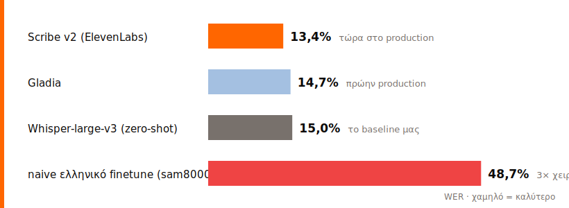
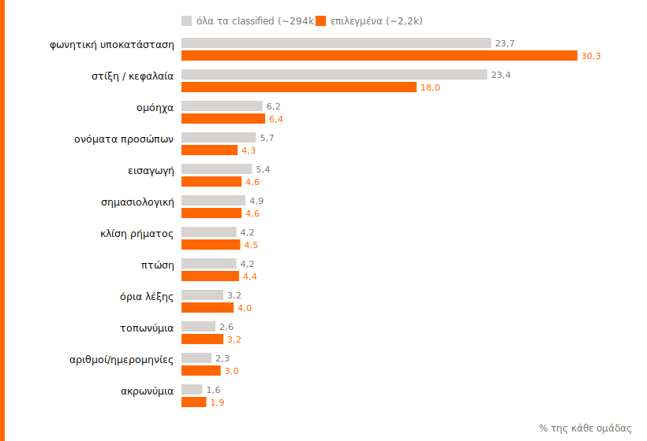

# Πώς μαθαίνουμε μια μηχανή να ακούει ένα ελληνικό δημοτικό συμβούλιο

*Μέρος 1 από 3 · Ιούνιος 2026*

Πήραμε ένα Whisper που είχε ήδη εκπαιδευτεί στα ελληνικά, τα πήγαινε μια χαρά σε
καθαρή ανάγνωση, και το βάλαμε να γράψει πρακτικά δημοτικού συμβουλίου. Έβγαλε
48,7% λάθος. Το ίδιο μοντέλο, χωρίς καμία ειδική εκπαίδευση στα ελληνικά, έκανε
15,0%. Η «ελληνική» έκδοση τα πήγε τρεις φορές χειρότερα από τη γενική.

Όλο το πρόβλημα χωράει σ' αυτές τις δύο γραμμές. Δεν λείπουν τα ελληνικά· λείπουν
*αυτά* τα ελληνικά. Θόρυβος αίθουσας, κόσμος που μιλάει ο ένας πάνω στον άλλον,
νομικίστικη ορολογία, ονόματα, αριθμοί αποφάσεων, ΚΕΔΕ και ΦΕΚ. Εκεί σκοντάφτει
κάθε γενικό σύστημα, κι εκεί πιάνει δουλειά το fine-tuning.

## Πώς δουλεύει σήμερα το OpenCouncil

Το OpenCouncil παίρνει τον ήχο μιας συνεδρίασης και βγάζει μεταγραφή, ομιλητές και
θέματα, ώστε να μπορεί κανείς να ψάξει τι ειπώθηκε και ποιος το είπε. Η μεταγραφή
περνάει από τρία στάδια. Πρώτα ένα μοντέλο ASR γράφει το αρχικό κείμενο. Μετά ένα
LLM το καθαρίζει: φτιάχνει ονόματα, ομόηχα, στίξη και τους κανόνες γραφής, χωρίς να
αγγίζει το νόημα. Στο τέλος ένας άνθρωπος διορθώνει ό,τι ξέφυγε, πριν δημοσιευτεί.

Το καθάρισμα με LLM βοηθάει, αλλά έχει ένα όριο που με απασχόλησε εξαρχής: δεν
ακούει τον ήχο, διορθώνει κείμενο. Αν το ASR άκουσε λάθος ένα όνομα κι έγραψε κάτι
άσχετο, το LLM δεν έχει από πού να το πιάσει. Το πραγματικό κέρδος είναι να
βελτιώσουμε το ίδιο το αυτί. Γι' αυτό φτιάχνουμε δικό μας dataset.

## Τι μετράμε

Για να ξέρουμε αν όντως βελτιώθηκε κάτι, θέλουμε έναν αριθμό που να συγκρίνεται.
Είναι το WER, το ποσοστό των λέξεων που βγαίνουν λάθος· όσο πιο χαμηλό, τόσο
καλύτερα. Είναι ατελές, μετράει το «και» αντί «κι» όσο κι ένα λάθος επώνυμο, αλλά
το αναφέρουν όλοι, οπότε μπορούμε να συγκριθούμε με κάθε μοντέλο και πάροχο. Κι
επειδή το test θα αλλάζει καθώς μπαίνουν νέα συμβούλια, ο πιο τίμιος δείκτης δεν
είναι ένα γυμνό νούμερο· είναι πόσο βελτιώνεται το fine-tuned μοντέλο σε σχέση με
το αρχικό.

## Ένα εργαλείο που διαλέγει, δεν διορθώνει

Για εκπαίδευση χρειάζεσαι καθαρά ζευγάρια ήχου και σωστού κειμένου. Τα έχουμε ήδη
μέσα στο OpenCouncil, αλλά ανακατεμένα. Άλλες διορθώσεις είναι πραγματικά ακουστικά
λάθη, άλλες απλώς θέμα στυλ ή στίξης, κι άλλες τις έκανε το LLM χωρίς να τις δει
άνθρωπος.

Έφτιαξα ένα εργαλείο που δεν πειράζει μεταγραφές· τις φιλτράρει. Ακούω τρία
δευτερόλεπτα, βλέπω το πριν και το μετά, και πατάω include ή exclude. Κρατάω τα
καθαρά ακουστικά λάθη (ονόματα, ομόηχα, ορολογία) και πετάω ό,τι είναι μόνο στυλ.
Κάθε τόσο χρειάζεται και να συγχρονίσω τον ήχο: ένα δευτερόλεπτο μετατόπιση, ή μια
συλλαβή από την επόμενη ατάκα που μπήκε μέσα και θέλω να κόψω.

## Τι έδειξε το benchmark

Πριν κάνουμε οτιδήποτε, χρειαζόμασταν baseline. Στις 10 Ιουνίου τρέξαμε ένα
benchmark παρόχων σε ένα παγωμένο δείγμα, με αναφορά τις ανθρώπινα διορθωμένες
μεταγραφές.

| Πάροχος | WER | CER |
|---|---|---|
| Scribe v2 (ElevenLabs) | 13,4% | 9,3% |
| Gladia | 14,7% | 8,5% |
| Whisper-large-v3, χωρίς εκπαίδευση | 15,0% | 8,8% |
| naive ελληνικό finetune (sam8000) | 48,7% | 43,6% |

Το benchmark είχε αμέσως πρακτικό αντίκρισμα: το OpenCouncil άλλαξε πάροχο και
τρέχει πλέον το Scribe v2 της ElevenLabs. Για εμάς το πιο ελπιδοφόρο είναι ότι το
δωρεάν, ανοιχτό Whisper βρίσκεται ήδη μία ανάσα πιο πίσω, 15,0 έναντι 13,4. Εκεί
ποντάρουμε με τη δική μας έκδοση.

## Τι ξέρουμε σίγουρα μέχρι τώρα

Το review τρέχει καθημερινά. Μέχρι στιγμής πάνω από 5.000 διορθώσεις έχουν περάσει
από ανθρώπινη κρίση, και πάνω από 2.000 μπήκαν στο training set. Έχουμε 254 ώρες
αξιόπιστα ελεγμένου ήχου, 544 ομιλητές, 10 δημόσιες πόλεις.

Το dataset έχει κάτι που σπάνια βρίσκεις ανοιχτό: πραγματικές ανθρώπινες διορθώσεις
από production ροή, όχι crowd-sourced αναγνώσεις σε στούντιο. Κανένα ανοιχτό
ελληνικό σύνολο δεν καλύπτει τοπική αυτοδιοίκηση μ' αυτόν τον τρόπο.

Κι αυτό που κρατάμε δεν είναι τυχαίο. Τις φωνητικές υποκαταστάσεις τις κρατάμε,
γιατί είναι καθαρά ακουστικό λάθος. Τη στίξη τη χαρίζουμε, γιατί δεν διδάσκει το
αυτί τίποτα.

## Γιατί ανοιχτό

Σχεδιάζουμε να βγουν open-source μαζί το dataset, το μοντέλο και η συνταγή, με στόχο
να δημοσιεύσουμε το dataset μέσα στο πρώτο δεκαπενθήμερο του Ιουλίου. Ανοιχτά
δεδομένα σημαίνει ότι μπορεί κανείς να ελέγξει, να αναπαράγει και να βελτιώσει τη
δουλειά. Για τα ελληνικά, που είναι φτωχά σε τέτοιους πόρους, μετράει. Και υπάρχει
κι ένα πρακτικό όφελος: όσο πέφτει το error rate, τόσο λιγότερο διορθώνει ο
άνθρωπος, άρα τόσο περισσότερα συμβούλια χωράνε στην πλατφόρμα.

## Spoiler: ένα πρώτο, πρώιμο fine-tune

Τρέξαμε ήδη ένα πρώτο fine-tune, νωρίς και πρόχειρα: whisper-large-v3 με LoRA, που
εκπαιδεύει μόλις το 0,5% των βαρών και χωράει σε μία κάρτα, πάνω στις επιλεγμένες
διορθώσεις, με δύο ολόκληρες πόλεις κρυμμένες για τεστ. Τα πρώτα σημάδια ήταν
αρκετά καλά ώστε να συνεχίσουμε, και στις δύσκολες διορθώσεις και, κάπως απρόσμενα,
στην καθημερινή ομιλία.

Δεν θα ρίξω νούμερα εδώ. Το δείγμα ήταν μικρό και θέλει ένα σωστό, παγωμένο test
πριν το πω αποτέλεσμα. Αλλά το πρώτο σήμα είναι θετικό.

## Τι έρχεται

Δημοσίευση του dataset στο HuggingFace μέσα στο πρώτο δεκαπενθήμερο του Ιουλίου.
Πάγωμα του επίσημου split, με μια ολόκληρη αόρατη πόλη ως τεστ, για να απαντάμε στο
«δουλεύει σε δήμο που θα μπει αύριο;». Στόχος γύρω στις 30 με 50 ώρες διορθωμένου
υλικού, αρκετές για ένα πρώτο χρήσιμο μοντέλο. Και μέτρηση που μετράει: WER
συνολικά, WER στα ονόματα, και κυρίως το ποσοστό βελτίωσης πάνω στο baseline.

Κάτι ακόμα που θέλω να δοκιμάσω: να μας δίνει το Whisper τις πιθανές εναλλακτικές
του όταν δεν είναι σίγουρο, μαζί με βαθμό εμπιστοσύνης, αντί να διαλέγει στα τυφλά.
Στο επόμενο μέρος: το πρώτο παγωμένο test και νούμερα που αντέχουν.

---

*Τεχνικές σημειώσεις. Το benchmark είναι εσωτερικό run της 10ης Ιουνίου 2026.
Σχετικά ανοιχτά σύνολα ελληνικού λόγου: HParl, Greek Podcast Corpus, Common Voice,
FLEURS, VoxPopuli. Υπάρχουν και άλλα διαθέσιμα γραφήματα (χάρτης πόλεων, σύνθεση
dataset, σκάλα ωρών) στο αρχείο prompts, αν χρειαστούν.*
