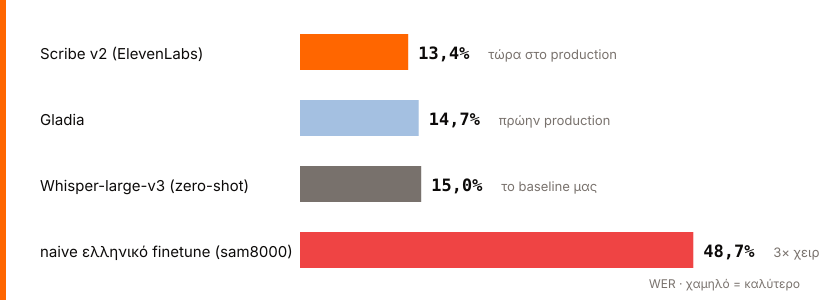
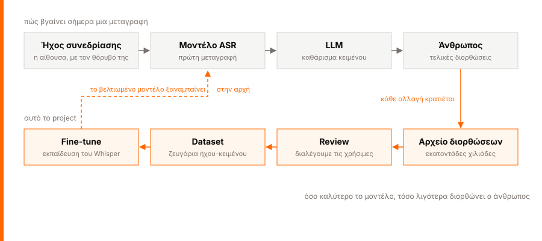
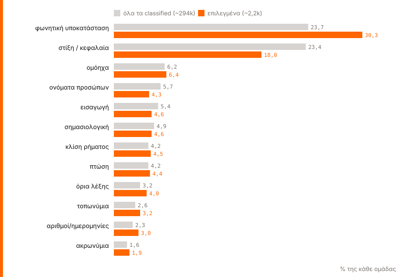
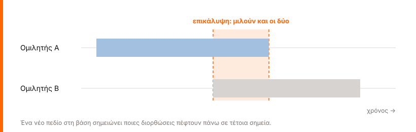

# Μαθαίνοντας μια μηχανή να ακούει ένα Ελληνικό Δημοτικό Συμβούλιο

*Μέρος 1 από 3 · Ιούνιος 2026*

Το OpenCouncil κάνει απομαγνητοφώνηση συνεδριάσεων Δημοτικών Συμβούλιων
χρησιμοποιώντας AI μοντέλα ειδικά για αυτό το σκοπό (Automatic Speech
Recognition - ASR), και ύστερα διορθώνοντας χειροκίνητα τα λάθη του AI. Η ομάδα
ξοδεύει αρκετές ώρες ανά συμβούλιο για αυτές τις διορθώσεις, ώστε να υπάρχει ένα
πιστό στον ήχο αποτέλεσμα. Επομένως δημιουργείται ο εξής προβληματισμός: Πώς
μπορούμε να χρησιμοποιήσουμε ένα πιο ειδικό μοντέλο για την απομαγνητοφώνηση,
ώστε να μειώσουμε το χρόνο που απαιτείται για διόρθωση των λαθών του; Είμαι ο
Άγγελος, και ασχολούμαι με αυτό το πρόβλημα στο project μου για το Google Summer
of Code.

Το Google Summer of Code δίνει ευκαιρία σε φοιτητές ή νέους προγραμματιστές να
κάνουν μια καλοκαιρινή πρακτική σε ένα project ανοιχτού κώδικα. Η διαδικασία
συμμετοχής είναι η εξής: διαλέγεις από τη λίστα συνεργαζόμενων οργανισμών αυτόν
που σε ενδιαφέρει (έως και 3), προτείνεις ένα έργο ή περιγράφεις με μια γραπτή
πρόταση το πώς θα μπορούσε να επιλυθεί ένα πρόβλημα του εκάστοτε οργανισμού, και
ο οργανισμός προτείνει τους υποψήφιους που προτιμάει να συνεργαστεί και η Google
εγκρίνει στο τέλος τα project. Έχοντας εγκριθεί λοιπόν, εξασφάλισα μια τρίμηνη
εξ αποστάσεως πρακτική, η οποία μου δίνει την ευκαιρία να μάθω και να
συνεργαστώ με μέντορες τους maintainers του οργανισμού – την ομάδα του
OpenCouncil.

## Τι υπάρχει ήδη

Υπάρχουν ελεύθερα (ανοιχτού κώδικα) και κλειστά μοντέλα που μπορούν να
χρησιμοποιηθούν για ASR. Έπειτα από δοκιμές σε παλιότερα δημοτικά συμβούλια όπου
είναι γνωστό και διορθωμένο το κείμενο του ήχου της συνεδρίασης, επιλέχθηκε να
χρησιμοποιείται ένα κλειστό μοντέλο, το Scribe v2 της Eleven Labs, καθώς αυτό
απέδωσε καλύτερα, δηλαδή έκανε λιγότερα λάθη απομαγνητοφώνησης (παρακάτω
εξηγείται πιο αναλυτικά πώς βγαίνει το ποσοστό λαθών).

Το καλύτερο ελεύθερο ASR μοντέλο λέγεται Whisper και είναι της OpenAI. Αυτό,
χωρίς ειδική εκπαίδευση στα ελληνικά, παράγει ένα μέτριο αποτέλεσμα. Ένα
ελληνικό πιο ειδικά εκπαιδευμένο (fine-tune) που δοκιμάσαμε δεν ανταποκρίθηκε
στον δικό μας ήχο: 3 φορές χειρότερα από το Whisper.

Το Whisper όμως, βρίσκεται ήδη πολύ κοντά στα κλειστά μοντέλα των ξένων
εργαστηρίων, (έχουν μόλις 2pp διαφορά στα λάθη). Αυτή η απόσταση είναι που μας
ενδιαφέρει να μειώσουμε. Δεν του λείπουν, λοιπόν, τα ελληνικά· λείπουν αυτά τα
ελληνικά: θόρυβος αίθουσας, κόσμος που μιλάει ο ένας πάνω στον άλλον,
νομικίστικη ορολογία, ονόματα, αριθμοί αποφάσεων, ΚΕΔΕ και ΦΕΚ. Εκεί σκοντάφτει
κάθε γενικό σύστημα, κι εκεί έρχεται το project μου, το fine-tuning.

## Πώς δουλεύει σήμερα το OpenCouncil

Το OpenCouncil παίρνει τον ήχο μιας συνεδρίασης και βγάζει απομαγνητοφώνηση,
ομιλητές και θέματα, ώστε να μπορεί κανείς να ψάξει τι ειπώθηκε και ποιος το
είπε. Η διαδικασία περνάει από τρία στάδια:

1. **Μοντέλο ASR:** Γράφει το αρχικό κείμενο.
2. **Καθάρισμα με LLM:** Πιάνονται κοινά λάθη στη γραμματική, τη σύνταξη και τη
   στίξη, φτιάχνονται τα ομόηχα και διορθώνονται ονόματα δημοτικών συμβούλων
   (αν το προηγούμενο μοντέλο τα έγραψε λάθος), με στόχο να μην αλλάζει το
   νόημα.
3. **Ανθρώπινη Διόρθωση:** Στο τέλος, ένας άνθρωπος διορθώνει ό,τι ξέφυγε.

Το καθάρισμα με LLM βοηθάει, αλλά έχει ένα όριο που με απασχόλησε εξαρχής: δεν
ακούει τον ήχο, βλέπει το παραγόμενο κείμενο και το διορθώνει. Αν το ASR άκουσε
λάθος ένα όνομα κι έγραψε κάτι άσχετο, το LLM δεν έχει από πού να το πιάσει. Το
πραγματικό κέρδος είναι να βελτιώσουμε το ίδιο το «αυτί».

Και εδώ είναι το ωραίο: όλες αυτές οι αλλαγές (του LLM και των ανθρώπων)
κρατιούνται σε αρχείο. Έχουν μαζευτεί γύρω στις 300.000 διορθώσεις. Από αυτές
αποφασίσαμε να προσπαθήσουμε να εκπαιδεύσουμε το υπάρχον ελεύθερο μοντέλο, ώστε
να προσαρμοστεί και να τις αποδίδει πιο σωστά από μόνο του. Γι' αυτό φτιάχνουμε
δικό μας dataset.

## Πώς αξιολογούνται τα μοντέλα

Για να ξέρουμε αν όντως βελτιώθηκε κάτι, θέλουμε έναν αριθμό που να συγκρίνεται.
Αυτός είναι το WER (Word Error Rate), δηλαδή το ποσοστό των λέξεων που βγαίνουν
λάθος (όσο πιο χαμηλό, τόσο καλύτερα).

Είναι ατελές —μετράει το «και» αντί «κι» όσο κι ένα λάθος επώνυμο— αλλά
χρησιμοποιείται ευρέως στη βιβλιογραφία, επομένως μπορούμε να συγκρίνουμε άμεσα
κάθε μοντέλο και πάροχο. Κι επειδή κάθε φορά θα εξετάζουμε την απόδοση του
μοντέλου σε νέα, πιο πρόσφατα, δημοτικά συμβούλια, αυτό το ποσοστό είναι
αναμενόμενο να βγαίνει διαφορετικό σε κάθε τρέξιμο. Επομένως, ο πιο τίμιος
δείκτης δεν είναι ένα σκέτο νούμερο· είναι πόσο βελτιώνεται το fine-tuned
μοντέλο σε σχέση με το αρχικό.

## Πώς θα εκπαιδεύσουμε το μοντέλο

Για εκπαίδευση χρειάζεσαι πολλά, καθαρά ζευγάρια ήχου και σωστού κειμένου.
Πρακτικά θέλω έναν ήχο και ένα κείμενο που να λέει στο μοντέλο «έτσι θέλω να μου
το αποδώσεις». Τα έχουμε ήδη μέσα στο OpenCouncil, αλλά ανακατεμένα.

Στην πορεία φτιάξαμε και χρησιμοποιήσαμε, όλη η ομάδα, ένα μικρό εργαλείο, μια
web εφαρμογή που τη δουλεύαμε καθημερινά ως εξής: ακούμε λίγα δευτερόλεπτα ήχου,
βλέπουμε δίπλα-δίπλα το πριν και το μετά της διόρθωσης, και πατάμε Συμπερίληψη ή
Αποκλεισμός.

<!-- TODO(εικόνα): screenshot του review UI εδώ — diff πριν/μετά, κατηγορία λάθους, κουμπιά include/exclude -->

Για να μη χαρακτηρίζονται όλες οι διορθώσεις ως ίδιες, τις χωρίσαμε σε
κατηγορίες:

- **Καθαρά ακουστικά λάθη:** Το μοντέλο άκουσε μια λέξη σαν άλλη, του ξέφυγε μια
  λέξη, ή έγραψε μία που δεν ειπώθηκε ποτέ.
- **Ονόματα:** Πρόσωπα, περιοχές, φορείς, ακρωνύμια όπως η ΔΕΥΑ. Για ένα
  δημοτικό συμβούλιο είναι σημαντικά και επαναλαμβανόμενα.
- **«Γραφιστικές» διορθώσεις:** Στίξη, κεφαλαία, μικροαλλαγές ύφους που δεν
  αλλάζουν τι ειπώθηκε.

Σημείωση: Οι πρώτες δύο ομάδες μαθαίνουν στο μοντέλο να ακούει καλύτερα. Οι
«γραφιστικές» όχι (περίπου το 1/3 των διορθώσεων αφορούσε στίξη ή
κεφαλαιοποίηση), οπότε τις δώσαμε λιγότερη σημασία, γιατί δεν διδάσκουν το αυτί
τίποτα.

Κάποιες διορθώσεις ήταν λίγο ασυγχρόνιστες. Κάναμε λοιπόν και μικρές
χειροκίνητες διορθώσεις στον συγχρονισμό, ώστε ο ήχος να ταιριάζει ακριβώς στο
κείμενο. Έτσι ανακαλύψαμε και διάφορες περιπτώσεις προφοράς που σίγουρα θα
βοηθήσουν το μοντέλο.

## Τα αποτελέσματα των αξιολογήσεων

- Το review έτρεχε για ένα μήνα καθημερινά. Πάνω από 10.000 διορθώσεις έχουν
  περάσει από ανθρώπινη κρίση.
- Κρατήσαμε τις καλύτερες, γύρω στις 5.000.
- Πάνω από 2.000 από αυτές μπήκαν ήδη στο πρώτο δοκιμαστικό training set.
- Το υλικό καλύπτει 544 ομιλητές σε 10 διαφορετικές πόλεις.
<!-- TODO: σύνολο ωρών ελεγμένου ήχου — τρέχει υπολογισμός στο minipc, να συμπληρωθεί όταν βγει -->

Το dataset έχει κάτι που δεν βρίσκεις συχνά ελεύθερα: πραγματικές ανθρώπινες
διορθώσεις, όχι crowd-sourced αναγνώσεις σε στούντιο.

## Γιατί ανοιχτό;

Σχεδιάζουμε να δημοσιευτούν δημόσια μαζί το dataset, το μοντέλο και τα σχετικά
scripts κώδικα που χρησιμοποιήθηκαν. Οι πρώτες 5.000 επιλεγμένες διορθώσεις
είναι έτοιμες και θα ανέβουν σύντομα στο Hugging Face.

Ανοιχτά δεδομένα σημαίνει ότι μπορεί κανείς να ελέγξει, να αναπαράγει και να
βελτιώσει τη δουλειά. Για τα ελληνικά, που είναι φτωχά σε τέτοιους πόρους,
μετράει. Και υπάρχει κι ένα πρακτικό όφελος: όσο πέφτει το error rate, τόσο
λιγότερο διορθώνει ο άνθρωπος, άρα τόσο περισσότερα συμβούλια χωράνε στην
πλατφόρμα.

## Spoiler: Ένα πρώτο, πρώιμο fine-tune

Τρέξαμε ήδη ένα πρώτο fine-tune, νωρίς και πρόχειρα: whisper-large-v3 με τεχνική
LoRA (που εκπαιδεύει μόλις το 0,5% των βαρών και χωράει σε μία κάρτα γραφικών),
πάνω στις επιλεγμένες διορθώσεις, με δύο ολόκληρες πόλεις κρυμμένες για τεστ.

Τα πρώτα σημάδια ήταν αρκετά ενθαρρυντικά ώστε να συνεχίσουμε. Δεν θα μοιραστώ
νούμερα ακόμη, καθώς το δείγμα ήταν μικρό, αλλά το πρώτο σήμα είναι θετικό. Τον
Ιούλιο επικεντρώνομαι στη διαδικασία του fine-tuning.

## Τι ακολουθεί

- **Χωρισμός δεδομένων:** Το τελικό test θα είναι τα πρόσφατα συμβούλια (από
  Ιούνιο και μετά, ενώ το project ξεκίνησε τον Μάιο). Έτσι το test μένει
  καθαρό, χωρίς κίνδυνο να ξαναδεί το μοντέλο κάτι που είδε στην εκπαίδευση.
- **Ισορροπία Dataset:** Στις 5.000 επιλεγμένες δύσκολες διορθώσεις θα
  προσθέσουμε άλλες τόσες διασκορπισμένες μέσα από το δείγμα, και γύρω στις
  20.000 κανονικές ομιλίες που δεν είχαν λάθη, ώστε το μοντέλο να μη "ξεχάσει"
  την καθημερινή ομιλία.
- **Diarization («Ποιος μιλάει πότε»):** Ερευνούμε αν ο καλύτερος διαχωρισμός
  ομιλητών βοηθάει και την ίδια την απομαγνητοφώνηση.
- **Επικάλυψη ομιλίας:** Προσθέτουμε πεδίο για τις στιγμές που ακούγεται
  δεύτερος άνθρωπος από πίσω. Πώς εκπαιδεύεται το Whisper εκεί; Είναι ένα
  ανοιχτό ερώτημα.
- **Εναλλακτικές επιλογές:** Αν περισσέψει χρόνος, θέλουμε το Whisper να κρατάει
  2-3 εναλλακτικές εκδοχές του τι άκουσε σε μια δύσκολη λέξη μαζί με έναν βαθμό
  σιγουριάς, ώστε το επόμενο στάδιο (LLM) να ξέρει πού να κοιτάξει.

---

*Τεχνικές σημειώσεις. Το benchmark είναι εσωτερικό run της 10ης Ιουνίου 2026.
CER (Character Error Rate - Λάθη σε επίπεδο χαρακτήρα): Scribe v2 9,3%, Gladia
8,5%, Whisper-large-v3 8,8%, sam8000 43,6%. Σχετικά ανοιχτά σύνολα ελληνικού
λόγου: HParl, Greek Podcast Corpus, Common Voice, FLEURS, VoxPopuli.*
