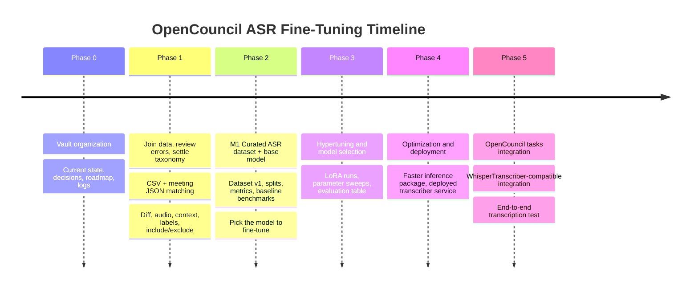

# Roadmap

## Timeline

Keep this timeline synchronized with the phase sections below.

## PRD Task Notation

Use markdown todos for actionable work:

- `[ ]` not started
- `[x]` done
- `[~]` in progress or partially done
- `[?]` blocked or needs decision

Keep acceptance criteria close to the tasks they validate.

## Phase 0 - Vault Organization

Status: `[x]` complete

Goal: keep the project readable by humans and LLMs.

Deliverables:

- [x] [CURRENT.md](../CURRENT.md): current state and next action.
- [x] [decisions/](decisions/_index.md): accepted decisions and open questions, split by theme.
- [x] [roadmap.md](roadmap.md): phased plan.
- [x] [reference/](reference): stable technical references.
- [x] [logs/](logs): dated meeting/work logs.
- [x] [CLAUDE.md](../CLAUDE.md): assistant instructions (`AGENTS.md` symlinks to it).
- [x] Mermaid diagrams for current flow, timeline, join path, and review loop.
- [x] Normalized meeting notes under [meetings](meetings/_index.md).
- [x] Specs moved under [specs](specs).
- [x] Stable references moved under [reference](reference).
- [x] Raw/superseded material moved under `archive/`.
- [x] `opencouncil-meeting-notes` skill created for future meeting-note normalization.

Acceptance criteria:

- [x] A new human or LLM can start from `CURRENT.md` and understand what matters now.
- [x] Decisions and open questions have one canonical home.
- [x] Major project flow diagrams are linked from the relevant docs.
- [x] Meetings, specs, references, logs, and archive each have distinct responsibilities.

## Phase 1 - Join Data, Review Errors, Settle Taxonomy

Status: `[~]` in progress

Goal: connect the CSV corrections to meeting JSON and make the errors easy to inspect.

Tasks:

- [ ] Define correction-to-utterance matching rules.
- [ ] Identify meeting JSON URLs for a representative subset of CSV rows.
- [x] Restore or replace full CSV ingest.
- [ ] Cache meeting JSON files locally.
- [ ] Build a matched records table with confidence flags.
- [x] Decide final local label storage: SQLite plus JSONL history.
- [x] Ingest raw CSV corrections into local SQLite with content categorisation.
- [x] Generate basic stats from local correction/review-label records.
- [ ] Generate matched/ambiguous/unmatched stats from meeting JSON matches.
- [x] Review UI shows `before_text` / `after_text` diff, audio controls, labels, status buttons, notes, and JSONL export.
- [ ] Add matched context utterances, meeting/city IDs, speaker/person metadata, and confidence filters to the UI.
- [ ] Validate the first error taxonomy against manually reviewed rows.
- [ ] Use the exploration UI to mark include/exclude/uncertain decisions on a representative sample.

Output:

- A local review dataset the UI can load quickly.
- A report showing matched, ambiguous, and unmatched correction rows.
- A taxonomy that separates ASR fine-tuning, LLM post-correction, rule-based cleanup, and review/exclusion rows.

Acceptance criteria:

- [ ] Each matched correction has `edit_id`, `utterance_id`, meeting metadata, city metadata, speaker context when available, and match confidence.
- [ ] Ambiguous and unmatched rows are preserved for review, not silently dropped.
- [x] Local labels can be updated without rewriting the large source CSV.
- [x] A history trail exists for review-label changes.
- [x] A reviewer can classify a correction without opening raw CSV/JSON.
- [x] A reviewer can listen to the relevant audio span from the same screen.
- [ ] Reviewed labels are sufficient to choose which rows are candidates for ASR fine-tuning experiments.

## Phase 2 - M1: Curated ASR Dataset and Base Model

Status: `[ ]` not started

Goal: reach midterm with the data and metrics ready, plus a base model chosen for the tuning runs.

Tasks:

- [ ] Export curated v1 ASR fine-tuning candidates with audio spans and corrected text.
- [ ] Define train/validation/test split policy, including municipality/date leakage checks.
- [ ] Implement Greek-aware WER and CER evaluation scripts.
- [ ] Implement Domain WER focused on municipal terms, names, acronyms, and other domain-critical words.
- [ ] Define the base-model benchmark sample.
- [ ] Benchmark candidate base models on the same sample.
- [ ] Select the base model for hypertuning.
- [ ] Write a short M1 report covering dataset quality, taxonomy, metrics, benchmark results, and the base-model choice.

Candidate base models:

- [ ] Whisper large-v3.
- [ ] Whisper large-v3-turbo.
- [ ] Whisper large-v2, if it remains a plausible baseline.
- [ ] Greek/community fine-tuned Whisper model, if available and runnable.
- [ ] Any mentor-approved alternative that fits the same evaluation harness.

Acceptance criteria:

- [ ] M1 deliverable is a curated v1 dataset good enough for fine-tuning experiments, not a dataset frozen forever.
- [ ] Every exported candidate can be traced back to source CSV rows and matched utterances.
- [ ] Metrics run reproducibly on the benchmark sample.
- [ ] Base-model choice is backed by measured quality, domain-term behavior, runtime, and integration constraints.

## Phase 3 - Hypertuning and Model Selection

Status: `[ ]` not started

Goal: run the tuning experiments and pick the checkpoint worth deploying.

Tasks:

- [ ] Run initial LoRA fine-tuning on the selected base model.
- [ ] Sweep a small set of parameters: rank, alpha, learning rate, dataset subset, and segment length/concatenation strategy.
- [ ] Evaluate each run on the fixed validation/test split.
- [ ] Compare WER, CER, Domain WER, hallucination/truncation behavior, runtime, and resource cost.
- [ ] Select the best fine-tuned checkpoint for deployment work.
- [ ] Document failed runs and dataset issues found during training.

Acceptance criteria:

- [ ] Training runs are reproducible from committed scripts/configs.
- [ ] The selected checkpoint has a documented evaluation table against the base model and current baseline.
- [ ] Any dataset changes after M1 are recorded and justified.

## Phase 4 - Optimization and Deployment

Status: `[ ]` not started

Goal: get the selected fine-tuned model running somewhere OpenCouncil can use it.

Tasks:

- [ ] Prepare the selected checkpoint or LoRA adapter for inference.
- [ ] Convert or package the model with faster-whisper/CTranslate2 if feasible.
- [ ] Benchmark inference speed and memory use.
- [ ] Define the deployment target with mentors.
- [ ] Deploy a transcriber service or model artifact that can be called from the pipeline.
- [ ] Document deployment commands, model artifacts, and rollback/fallback path.

Acceptance criteria:

- [ ] The deployed transcriber can process held-out audio.
- [ ] Runtime and resource requirements are documented.
- [ ] Deployment does not depend on hidden local state.

## Phase 5 - OpenCouncil Tasks Integration

Status: `[ ]` not started

Goal: wire the deployed fine-tuned transcriber into the OpenCouncil task pipeline.

Tasks:

- [ ] Implement an OpenCouncil-compatible transcriber adapter, likely `WhisperTranscriber`.
- [ ] Preserve the existing task pipeline transcript output shape.
- [ ] Add configuration for choosing the deployed fine-tuned transcriber versus the current provider.
- [ ] Run an end-to-end transcription test on at least one held-out council meeting.
- [ ] Write final documentation covering dataset, training, evaluation, deployment, and integration.

Final target:

- [ ] **Final: Deployed Fine-Tuned ASR Transcriber for OpenCouncil**.

Acceptance criteria:

- [ ] OpenCouncil tasks can call the fine-tuned transcriber for transcription.
- [ ] End-to-end output can be compared with the existing transcription baseline.
- [ ] Final report states remaining quality, infra, and production-hardening risks.
