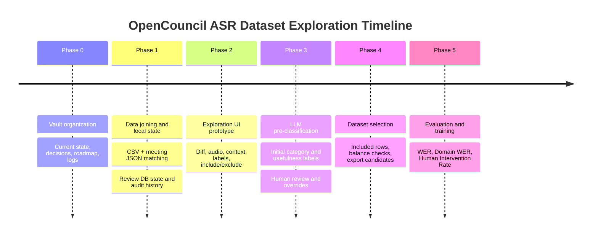

# Roadmap

## Timeline

Keep this timeline synchronized with the phase sections below.

## PRD Task Notation

Use markdown todos for actionable work:

- `[ ]` not started
- `[x]` done
- `[~]` in progress or partially done
- `[?]` blocked or needs decision

Keep acceptance criteria close to the tasks they validate.

## Phase 0 - Vault Organization

Status: `[x]` complete

Goal: keep the project readable by humans and LLMs.

Deliverables:

- [x] [CURRENT.md](../CURRENT.md): current state and next action.
- [x] [decisions/](decisions/_index.md): accepted decisions and open questions, split by theme.
- [x] [roadmap.md](roadmap.md): phased plan.
- [x] [reference/](reference): stable technical references.
- [x] [logs/](logs): dated meeting/work logs.
- [x] [CLAUDE.md](../CLAUDE.md): assistant instructions (`AGENTS.md` symlinks to it).
- [x] Mermaid diagrams for current flow, timeline, join path, and review loop.
- [x] Normalized meeting notes under [meetings](meetings/_index.md).
- [x] Specs moved under [specs](specs).
- [x] Stable references moved under [reference](reference).
- [x] Raw/superseded material moved under `archive/`.
- [x] `opencouncil-meeting-notes` skill created for future meeting-note normalization.

Acceptance criteria:

- [x] A new human or LLM can start from `CURRENT.md` and understand what matters now.
- [x] Decisions and open questions have one canonical home.
- [x] Major project flow diagrams are linked from the relevant docs.
- [x] Meetings, specs, references, logs, and archive each have distinct responsibilities.

## Phase 1 - Data Joining and Local State

Status: `[~]` in progress

Goal: combine CSV corrections with OpenCouncil meeting JSON.

Tasks:

- [ ] Define correction-to-utterance matching rules.
- [ ] Identify meeting JSON URLs for a representative subset of v2 CSV rows.
- [x] Restore or replace full CSV ingest.
- [ ] Cache meeting JSON files locally.
- [ ] Build a matched records table with confidence flags.
- [x] Decide review-label storage.
- [x] Ingest raw CSV corrections with content categorisation.
- [x] Ingest v2 CSV corrections into Supabase Postgres with normalised meetings.
- [x] Reduce live DB to latest edit per utterance while preserving the CSV as source of truth.
- [x] Generate basic stats from local correction/review-label records.
- [ ] Generate matched/ambiguous/unmatched stats from meeting JSON matches.

Output:

- A local dataset the UI can read quickly.
- A report showing matched, ambiguous, and unmatched correction rows.

Acceptance criteria:

- [ ] Each matched correction has `edit_id`, `utterance_id`, meeting metadata, city metadata, speaker context when available, and match confidence.
- [ ] Ambiguous and unmatched rows are preserved for review, not silently dropped.
- [x] Local labels can be updated without rewriting the large source CSV.
- [x] A history trail exists for review-label changes.

Experimental side-track (branch `codex/file-backed-review-ui`, 2026-05-20): the runtime DB dependency is removed in favour of a generated `ui/.cache/groups.v1.json` (built by `bun ui/scripts/build-cache.ts`) and sidecar `ui/.state/review-{events.jsonl,labels.snapshot.json}`. Review unit becomes the **utterance group**. Local-only — incompatible with serverless deploy. See [decisions/storage.md](decisions/storage.md#2026-05-20---file-backed-prototype-on-codexfile-backed-review-ui-experimental-local-only) and [specs/local-data-model.md](specs/local-data-model.md#file-backed-prototype-codexfile-backed-review-ui-2026-05-20).

## Phase 2 - Exploration UI Prototype

Status: `[~]` in progress

Goal: inspect and label corrections quickly.

Primary screen:

- [x] Red/green diff for `before_text` and `after_text`.
- [x] Audio playback around the utterance span.
- [x] Editable start/end timestamps.
- [x] Previous/next corrected utterance navigation.
- [ ] Context utterances.
- [x] Error-category select.
- [x] Include/exclude/uncertain controls.
- [x] Reviewer notes.

Stats screen:

- [x] Counts by error category.
- [x] Counts by include/exclude/uncertain.
- [~] Distributions by city, meeting, duration, and editor type.
- [ ] Separate stats for all corrections and included corrections.
- [x] Export included rows as JSONL.

Acceptance criteria:

- [x] A reviewer can classify a correction without opening raw CSV/JSON.
- [x] A reviewer can listen to the relevant audio span from the same screen.
- [x] Include/exclude changes persist and are visible in stats.
- [~] The UI can filter to unreviewed, ambiguous, included, and excluded rows.

## Phase 3 - LLM Pre-Classification

Goal: reduce manual review load.

Tasks:

- [ ] Define LLM classification prompt/schema.
- [ ] Run LLM classification over correction pairs.
- [ ] Assign initial error category and usefulness label.
- [ ] Store model label, confidence, and rationale separately from human label.
- [ ] Use the UI to review and override labels.

Acceptance criteria:

- [ ] LLM labels never overwrite human labels.
- [ ] Low-confidence or unclear rows are easy to filter.
- [ ] Human overrides are recorded in the history log.

## Phase 4 - Dataset Selection

Goal: create a candidate dataset for evaluation and training.

Tasks:

- [ ] Filter included corrections by category and confidence.
- [ ] Check category distribution.
- [ ] Check city/meeting distribution.
- [ ] Balance across cities/meetings if needed.
- [ ] Export candidate rows with audio spans and corrected text.
- [ ] Keep excluded and uncertain rows available for analysis.

Acceptance criteria:

- [ ] Exported candidates can be traced back to source CSV rows and matched utterances.
- [ ] Dataset composition is visible before training.
- [ ] Exclusions have reasons or categories.

## Phase 5 - Evaluation and Training

Goal: only after exploration, define benchmark and training experiments.

Possible metrics:

- [ ] WER
- [ ] Domain WER
- [ ] Human Intervention Rate
- [ ] CER if it adds signal

Training is intentionally deferred until the dataset quality is understood.

Acceptance criteria:

- [ ] Evaluation set is separated from training candidates.
- [ ] Metrics are computed on clearly defined references.
- [ ] Training starts only after dataset selection and evaluation definitions are reviewed.
