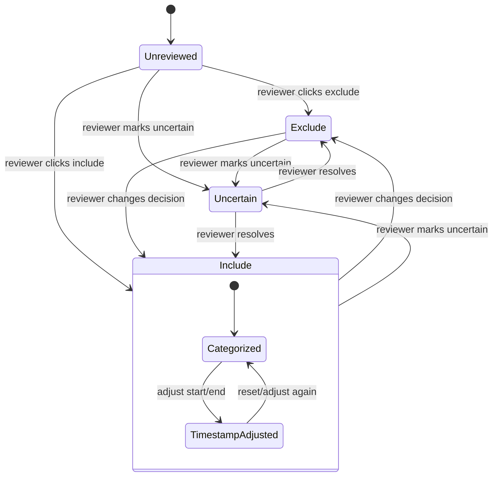

# Exploration UI Spec

Purpose: a local prototype for reviewing correction pairs with audio and transcript context.

This is not production annotation software.

## Review Loop



Every transition should update current review state and append an audit event.

## Core Objects

### Correction

Comes from `data-1779206108158.csv`; the earlier `utterance-edits-may12-26.csv` remains as the v1 reference export.

Fields:

- `edit_id`
- `utterance_id`
- `meeting_id`
- `edit_timestamp`
- `edit_updated_at`
- `before_text`
- `after_text`
- `edited_by`
- `utterance_start`
- `utterance_end`
- `ingest_category`
- `latest_per_utterance`

Meeting and audio metadata are currently normalised into the `meetings` table:

- `meeting_name`
- `meeting_date`
- `city_id`
- `audio_url`
- `audio_cdn_url`
- `youtube_url`

### Matched Utterance

Comes from the large meeting JSON after matching.

Fields:

- `city_id`
- `city_name`
- `meeting_id`
- `meeting_name`
- `meeting_date`
- `speaker_segment_id`
- `speaker_tag_id`
- `speaker_label`
- `person_id`
- `person_name`
- `utterance_id`
- `utterance_text`
- `utterance_start`
- `utterance_end`
- `context_before`
- `context_after`
- `match_confidence`

### Review Label

Created locally by the UI or LLM classifier.

Fields:

- `edit_id`
- `error_category`
- `include_status`: `unreviewed`, `include`, `exclude`, `uncertain`
- `adjusted_start`
- `adjusted_end`
- `reviewer_notes`
- `llm_category`
- `llm_include_suggestion`
- `llm_confidence`
- `human_updated_at`

## Main Review Screen

Top metadata:

- city
- meeting name
- meeting date
- speaker/person if matched
- editor type: `user` or `task`

Correction panel:

- `before_text` shown as removed/red text;
- `after_text` shown as added/green text;
- optional word-level diff;
- original matched `utterance.text`, when available.

Audio panel:

- play/pause;
- seek to `utterance_start`;
- play correction span;
- editable start/end inputs;
- small padding controls, for example `-1s`, `+1s`.

Navigation:

- previous corrected utterance;
- next corrected utterance;
- jump to ambiguous/unreviewed rows;
- filter by category/include status.

Context:

- previous utterances;
- current utterance;
- next utterances;
- speaker labels where available.

Label controls:

- error-category select;
- include;
- exclude;
- uncertain;
- reviewer notes.

## Stats Screen

Show distributions for:

- all corrections by error category;
- included corrections by error category;
- include/exclude/uncertain counts;
- counts by city;
- counts by meeting;
- counts by editor type;
- duration buckets;
- matched vs ambiguous vs unmatched rows.

## Error Categories Draft

- `asr_phonetic`
- `domain_term`
- `named_entity`
- `legal_admin_term`
- `punctuation`
- `capitalization`
- `formatting_only`
- `semantic_context`
- `speaker_or_attribution`
- `timestamp_alignment`
- `same_or_no_meaningful_change`
- `malformed_or_unclear`

## Storage Recommendation

Use the review database for UI state and stats. The current hosted implementation is Supabase Postgres; the earlier local prototype used SQLite/JSONL.

Reasons:

- fast filtering and aggregation;
- easy updates from UI controls;
- supports matched records plus labels;
- avoids rewriting a huge CSV on every review action.

Keep an append-only audit log for history:

```json
{"ts":"2026-05-12T12:00:00Z","edit_id":"...","field":"include_status","old":"unreviewed","new":"include","actor":"human"}
```

This gives simple history tracking and makes it possible to reconstruct changes.
