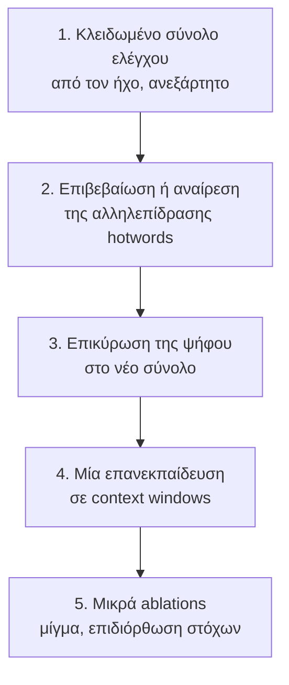

# Πώς βγαίνει το GSoC από εδώ

2026-08-04. Σχέδιο μετά τη [σύνοψη των επτά πειραμάτων](../reports/2026-08-04-what-we-learned.md).
Το Codex το εξέτασε σε high effort· ό,τι άλλαξε από την κριτική του είναι σημειωμένο
`[codex]`.

## Το πρόβλημα με τον στόχο όπως ήταν γραμμένος

Ο δηλωμένος στόχος είναι «ένα fine-tuned μοντέλο ελληνικού ASR για δημοτικά συμβούλια», και
η επιτυχία μετριόταν σε WER. Αυτό δεν στέκει πια, γιατί το WER μετράει συμφωνία με το
δημοσιευμένο transcript, το οποίο παραλείπει τουλάχιστον 1.7% των λέξεων που ειπώθηκαν.

Ένα μοντέλο μπορεί να κερδίσει σε αυτή τη μετρική **μαθαίνοντας να παραλείπει καλύτερα**.
`[codex]` Αυτός είναι ο πιο πιθανός τρόπος να καταλήξουμε με αποτέλεσμα που φαίνεται καλό
και είναι λάθος, και έχουμε ήδη καεί μία φορά ακριβώς έτσι.

## Ο στόχος ξαναγραμμένος

Παραδοτέο: **ένα αναπαραγώγιμο σύστημα ASR για ελληνικά δημοτικά συμβούλια**, με
ανεξάρτητα ελεγμένο σύνολο αξιολόγησης, per-meeting συμφραζόμενη πρόκληση ονομάτων, έναν
fine-tuned adapter αξιολογημένο για **αυτή** τη συγκεκριμένη ικανότητα, και προαιρετικά τον
αποκωδικοποιητή συναίνεσης.

Το fine-tune παραμένει στο κέντρο. Αλλάζει ο ισχυρισμός γι' αυτό: όχι «χαμηλώνει το γενικό
WER» αλλά **«κάνει τη συμφραζόμενη πρόκληση να δουλεύει χωρίς να καταστρέφει το υπόλοιπο
κείμενο»**. Στενότερο, και υποστηρίζεται από μέτρηση.

Τρεις μετρικές, πάντα ξεχωριστά ονομασμένες: `[codex]`

- **συμφωνία-με-OpenCouncil** (το σημερινό WER): συμβατότητα με το προϊόν·
- **πιστότητα-στον-ήχο**: WER έναντι μεταγραφής φτιαγμένης απευθείας από τον ήχο·
- **απόδοση σε οντότητες**: ανάκληση, ακρίβεια και ψευδείς εισαγωγές ονομάτων.

Κανένας ισχυρισμός με τις λέξεις «πιο ακριβές» ή «νικάει το baseline» δεν γίνεται δεκτός αν
δεν στέκει στη δεύτερη. `[codex]`

## Τι έχουμε ήδη που στηρίζει αυτόν τον στόχο

Σε 59 utterances με 114 ονόματα:

| αρμός | WER | ανάκληση ονομάτων |
|---|---|---|
| base | 0.341 | 27.2% |
| base + hotwords | 0.346 | 36.0% |
| δικό μας | 0.334 | 33.3% |
| **δικό μας + hotwords** | **0.307** | **37.7%** |

Η διαφορά-των-διαφορών στο WER είναι **−0.032**. Η ανάγνωση που είχα κάνει ήταν λάθος και
το Codex την ακρίβωσε: το base **ανταποκρίνεται περισσότερο** σε ανάκληση, +8.8 μονάδες
έναντι +4.4. Ανταποκρίνεται όμως **άσχημα**, η ανάκληση ανεβαίνει και το WER χειροτερεύει.
Το fine-tune κάνει την πρόκληση **χρήσιμη** αντί για ανταλλαγή ονομάτων με παράπλευρα λάθη.

Και ένας έλεγχος που έτρεξε σήμερα, γιατί ο μεγαλύτερος κίνδυνος ήταν η ψήφος συναίνεσης να
σβήνει συστηματικά τη δευτερεύουσα ομιλία: από τις 79 λέξεις που ο ακροατής επιβεβαίωσε ότι
ειπώθηκαν, η ψήφος κρατάει τις **78**. Δεν διαγράφει. Προσοχή όμως στο πόσο βαραίνει αυτό:
οι υποψήφιες λέξεις ορίστηκαν ως λέξεις που βγάζουν **και** το Scribe **και** το Soniox, άρα
όποιον από τους δύο κι αν διαλέξει η ψήφος, η λέξη επιβιώνει. Απαντά στον συγκεκριμένο φόβο,
δεν είναι γενική απόδειξη πιστότητας.

## Ποια δεδομένα για τι

Ο κανόνας είναι γραμμένος χωριστά, στο
[evaluation-data-policy](../decisions/evaluation-data-policy.md), επειδή παραβιάστηκε κατά
λάθος όταν το σύνολο αναφοράς τράβηξε 28 συνεδριάσεις από τη δεξαμενή ελέγχου του Ιουνίου.
Περίληψη: οι 48 συνεδριάσεις του συνόλου αναφοράς είναι πλέον δεξαμενή **ανάπτυξης**, οι
υπόλοιπες είναι το τελικό benchmark και δεν αγγίζονται, και κάθε νέο σύνολο ανάπτυξης
χτίζεται πρώτα από τις 21 συνεδριάσεις του Μαΐου. **Αναθεώρηση 2026-08-09:** οι δύο αυτοί
κανόνες συγκρούονταν, γιατί ο Μάιος ήταν και στις δύο ομάδες. Ο Μάιος πήγε στην ανάπτυξη
και το τελικό benchmark είναι **88** συνεδριάσεις, όλες Ιούνιο και μετά.

## Η σειρά

**1. Το ανεξάρτητο σύνολο ελέγχου. Μη διαπραγματεύσιμο.** `[codex]` Χωρίς αυτό κανένας
κεντρικός ισχυρισμός ακρίβειας δεν είναι αξιόπιστος, και όλη η δουλειά των τελευταίων ημερών
δείχνει γιατί. Μεταγραφή από τον ήχο, από κάποιον που δεν έχει δει καμία έξοδο συστήματος,
με **όλους** όσους ακούγονται. Ένα κομμάτι του παγώνει από την αρχή ως τελικό test και δεν
αγγίζεται, αλλιώς θα γίνει κι αυτό benchmark ανάπτυξης.

**2. Η αλληλεπίδραση των hotwords.** Καινούριο, κλειδωμένο σύνολο 80 έως 120 utterances με
ονόματα, από **20 με 30 συνεδριάσεις που δεν έχουν χρησιμοποιηθεί**. Ο αριθμός συνεδριάσεων
μετράει περισσότερο από τον αριθμό utterances, γιατί το roster ανατίθεται ανά συνεδρίαση.
`[codex]` Έξι αρμοί: base και fine-tune, επί κανένα roster, σωστό roster, roster με
παραπλανητικά ονόματα.

Πρωτεύον: F1 ονομάτων. Συμπρωτεύον: ποσοστό λάθους **εκτός** ονομάτων, δηλαδή η παράπλευρη
ζημιά. Ασφάλεια: ψευδείς εισαγωγές ονομάτων ανά ώρα. Τα gold ονόματα ορίζονται με τυφλή
ακρόαση, όχι από το transcript.

Επιβεβαιώνεται αν το σωστό roster δίνει στο fine-tune καλύτερη χρησιμότητα ονομάτων με
ουσιαστικά λιγότερη ζημιά, και το φαινόμενο **εξαφανίζεται** με παραπλανητικό roster.
Ακυρώνεται αν η αλληλεπίδραση χάνεται με ομαδοποίηση ανά συνεδρίαση, αν το παραπλανητικό
roster αποδίδει το ίδιο, ή αν τα κέρδη πληρώνονται με ισοδύναμα λάθη αλλού.

Τα 59 utterances **δεν** ξαναχρησιμοποιούνται: αυτά γέννησαν την υπόθεση. `[codex]`

**3. Η ψήφος στο νέο μέτρο.** Το 1.1 μονάδων κέρδος είναι σήμερα «καλύτερη συμφωνία με το
δικό μας κείμενο». Αν επιβιώσει στην πιστότητα-στον-ήχο, γίνεται αποτέλεσμα συστήματος και
μπαίνει στο παραδοτέο.

**4. Μία επανεκπαίδευση, όχι αναζήτηση αρχιτεκτονικής.** Σε context windows αντί για
μεμονωμένα κομμένα utterances, που στοχεύει κατευθείαν στην υπόθεση του onset-drop. Το
παλιό αρνητικό αποτέλεσμα δεν είναι οριστικό: όλες οι παλιές εκτελέσεις είχαν το σφάλμα του
label prefix, εκπαιδεύονταν σε μετατοπισμένους στόχους.

**5. Μικρά ablations στο τέλος.** Δύο ή τρεις προδηλωμένες αναλογίες μίγματος, όχι σάρωμα.
Και η επιδιόρθωση στόχων με τη μέθοδο των δύο συστημάτων ως ablation, με τους αρχικούς
στόχους να διατηρούνται χωριστά.

## Τι κόβεται

`[codex]` Μεγαλύτερο LoRA rank ή ξεπάγωμα encoder, εκτός αν μια σωστή εκτέλεση σε context
windows δείξει πρώτα underfitting. Η χωρητικότητα δεν είναι το διαγνωσμένο πρόβλημα και
είναι η ακριβότερη κατεύθυνση με τα λιγότερο ερμηνεύσιμα αποτελέσματα.

Μεγάλο σάρωμα αναλογιών. Μαζική επιδιόρθωση ψευδο-ετικετών πριν από μικρό ελεγμένο
ablation. Οτιδήποτε άλλο γύρω από επικάλυψη ή όρια ομιλητών. Και το LLM post-editing ως
κύρια διαδρομή, αφού ο φόρος υπερ-επεξεργασίας έχει ήδη μετρηθεί τρεις φορές.

## Είναι εφικτό;

Ναι, με τον στόχο όπως ξαναγράφτηκε. Το εμπόδιο **δεν είναι η GPU**, είναι η αξιόπιστη
αξιολόγηση, και αυτή κοστίζει ώρες ακρόασης όχι ευρώ. `[codex]`

Αν η αλληλεπίδραση των hotwords επιβεβαιωθεί, υπάρχει fine-tune με μετρημένη, αμυντικά
διατυπωμένη αξία. Αν δεν επιβεβαιωθεί, το παραδοτέο είναι το σύνολο αξιολόγησης, ο αγωγός
hotwords και το σύστημα συναίνεσης, και το fine-tuning αναφέρεται τίμια ως αρνητικό
αποτέλεσμα. Και τα δύο είναι ολοκληρωμένα GSoC. Το δεύτερο είναι λιγότερο ευχάριστο και
εξίσου χρήσιμο.

Στο τελικό πακέτο μπαίνουν και τα αρνητικά: η επικάλυψη, η τμηματοποίηση, και όποια
επανεκπαίδευση δεν πετύχει. Ένα project που ξέρει τι **δεν** δουλεύει και γιατί, με
προδηλωμένες πύλες που το αποδεικνύουν, είναι ισχυρότερο από ένα με έναν αριθμό χωρίς
ιστορία.
